# Finding Areas and Perimeters in the Coordinate Plane

Source: https://www.mathacademy.com/topics/2449?courseId=31
Topic ID: 2449

## Prerequisites

- [Finding Areas of Polygons Using Decomposition](./576-finding-areas-of-polygons-using-decomposition.md)
- [Polygons in the Coordinate Plane](./2448-polygons-in-the-coordinate-plane.md)
- [Areas and Perimeters of Parallelograms](./2473-areas-and-perimeters-of-parallelograms.md)

## Lesson

### Introduction

We can find the areas and perimeters of shapes if we are given the coordinates of the vertices. All we need to do is find the lengths of the sides and then apply the appropriate formula.

For example, suppose that a rectangle has vertices

$$

A(1,1), \qquad B(3,1), \qquad C(3,2), \qquad D(1,2).

$$

How can we find its perimeter?

**Step 1:** Plot the vertices. We start by plotting the given coordinates on a plane.

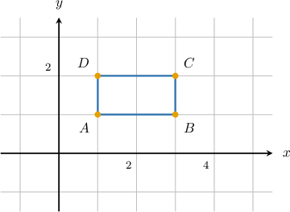

**Step 2:** Find the side lengths.

- The length of a horizontal segment is the difference between the $x$-coordinates. For the base $AB$ between $A(1,1)$ and $B(3,1)$, we subtract the smaller $x$-coordinate from the larger one:

- The length of a vertical segment is the difference between the $y$-coordinates. For the height $BC$ between $B(3,1)$ and $C(3,2)$, we subtract the smaller $y$-coordinate from the larger one:

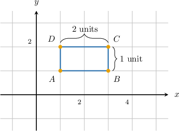

**Step 3:** Calculate the perimeter.

Now we use the formula for the perimeter of a rectangle:

$$

\begin{aligned}Perimeter & =2×(base+height) \\ & =2×(2+1) \\ & =2×3 \\ & =6\end{aligned}

$$

Therefore, the perimeter of the rectangle is $6$ units.

### Example: Finding the Perimeter Given a Graph

#### Question

What is the perimeter of the rectangle $ABCD?$

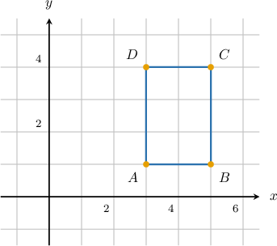

#### Explanation

The rectangle has vertices $A(3,1),$ $B(5,1),$ $C(5,4),$ and $D(3,4).$

Its base is $2$ and its height is $3.$

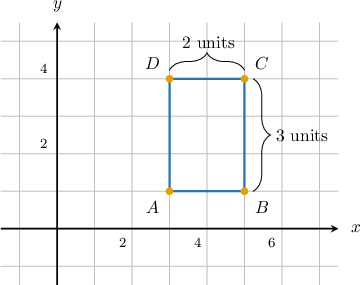

Therefore, the perimeter of the rectangle is:

$$

\begin{aligned}Perimeter & =2×(base+height) \\ & =2×(2+3) \\ & =2×5 \\ & =10\end{aligned}

$$

### Finding the Areas

Similarly, we can find areas of figures.

For example, let's find the area of the parallelogram with vertices

$$

A(-3,2), \qquad B(2,2), \qquad C(4,-1), \qquad D(-1,-1).

$$

**Step 1:** Plot the vertices and determine the base and height.

We start by plotting the coordinates. We can choose the horizontal side $AB$ as the *base*. The *height* is the perpendicular distance from the base to the opposite side $DC.$

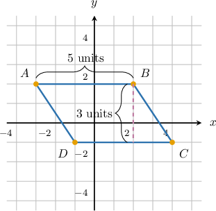

- The length of the base $AB$ is the difference between the x-coordinates of $B$ and $A$:

- Since the base is horizontal, the height is the vertical distance between the lines $y=2$ and $y=-1$:

**Step 2:** Calculate the area.

The area of a parallelogram is given by the formula:

$$

\begin{aligned}Area & =base×height \\ & =5×3 \\ & =15\end{aligned}

$$

Therefore, the area of the parallelogram is $15$ square units.

### Example: Finding the Area Given a Graph

#### Question

Find the area of the triangle $BCD.$

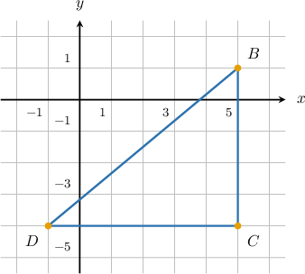

#### Explanation

The triangle has vertices $B(5,1),$ $C(5,-4),$ and $D(-1,-4).$

Its base is $6$ and its height is $5.$

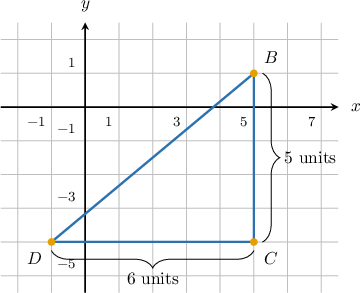

Therefore, the area of the triangle is:

$$

\begin{aligned}Area & =\frac{1}{2}×base×height \\ & =\frac{1}{2}×6×5 \\ & =15\end{aligned}

$$

### Example: Finding the Perimeter or the Area Given Coordinates

#### Question

A parallelogram $ABCD$ has vertices at $A(2,-1),$ $B(5,-1),$ $C(4,-4),$ and $D(1,-4).$ What is its area?

#### Explanation

First, we plot the parallelogram:

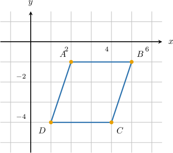

The parallelogram has a base of $3$ and a height of $3.$

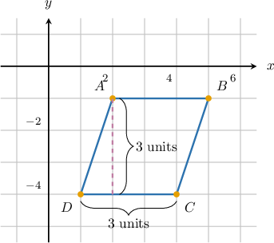

Therefore, the area of the parallelogram is:

$$

\begin{aligned}Area & =base×height \\ & =3×3 \\ & =9\end{aligned}

$$

### Example: Finding the Perimeter or the Area Given a Graph: Word Problem

#### Question

Sophia's garden is shaped like the figure shown above. To water her garden, she uses $5\,\text{l}$ of water for every square meter. How much water does Sophia use to water her entire garden?

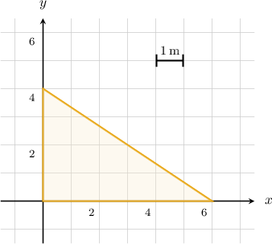

#### Explanation

We can see that the garden is shaped like a right triangle with a base of $6\,\text{m}$ and a height of $4\,\text{m}.$

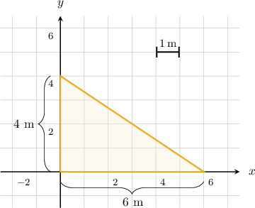

So, the area of the garden is

$$

\begin{aligned}Area & =\frac{1}{2}×base×height \\ & =\frac{1}{2}×6×4 \\ & =12.\end{aligned}

$$

Now, let's find the units. Since base and height are measured in meters, the area is measured in square meters. Therefore,

$$

\text{Area} = 12 \, \text{m}^2.

$$

Since Sophia needs $5$ liters of water to water every square meter of her garden, the total amount of water she will need to water her garden is

$$

5 \times 12 = 60 \, \text{l}.

$$
