# Solving Problems in the Coordinate Plane

Source: https://www.mathacademy.com/topics/2450?courseId=31
Topic ID: 2450

## Prerequisites

- [Distances Between Points in the Coordinate Plane](./573-distances-between-points-in-the-coordinate-plane.md)
- [Coordinate Planes as Maps](../../../elementary-school/lessons/grade-5/2414-coordinate-planes-as-maps.md)
- [Speed as a Unit Rate](./3593-speed-as-a-unit-rate.md)

## Lesson

### Introduction

When a coordinate plane represents a map, we can determine the distance between two locations by calculating the *length of the line segment* that connects the points.

Let's find the distance between the school and the candy store in the diagram below.

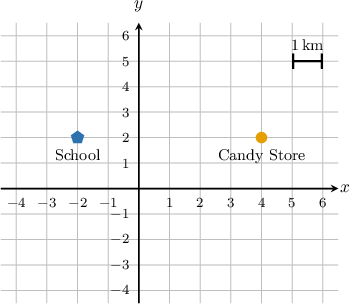

By counting the grid units between the School and the Candy Store, we find that the length of the connecting segment is $6$ units.

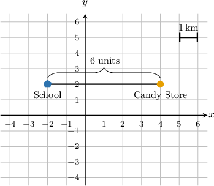

According to the scale, one unit represents $1$ kilometer. Therefore, the total distance is:

$$

6 \times 1 \,\text{km} = 6 \,\text{km}

$$

### An Alternative Method of Finding Distances

Now, let's consider an alternative method.

From the diagram, we can see that the school has coordinates $(-2,2)$ and the candy store has coordinates $(4,2).$

We can find the distance between the two points in this case by finding the distance of each point from the $y$-axis and then adding.

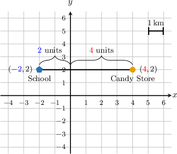

The point $({\color{blue}{-2}},2)$ is at a distance of $\color{blue}{2}$ from the $y$-axis, and the point $({\color{red}{4}},2)$ is at a distance of $\color{red}{4}$ from the $y$-axis.

Therefore, the distance between the two points is ${\color{blue}{2}} + {\color{red}{4}} = 6.$

One unit is $1$ kilometer, so the total distance is

$$

6 \times 1 \,\text{km} = 6 \,\text{km}.

$$

### Example: Finding the Distance Between Two Points On a Map

#### Question

The diagram shows a map of a district. What is the distance between the church and the TV station?

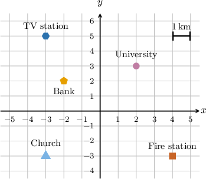

#### Explanation

****

The distance between two points is the length of the line segment that connects them.

From the diagram, we see that the length of the segment connecting the church and the TV station is $8$ units.

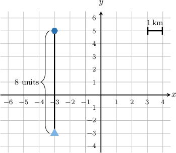

One unit is $1$ kilometer, so the distance is

$$

8 \times 1 \,\text{km} = 8 \,\text{km}.

$$

****

From the diagram, we can see that the church has coordinates $(-3,-3)$ and the TV station has coordinates $(-3,5).$

We can find the distance between the two points in this case by finding the distance of each point from the $x$-axis and then adding.

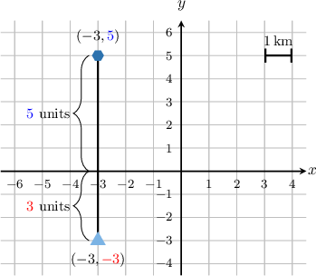

The point $(-3,{\color{red}{-3}})$ is at a distance of $\color{red}{3}$ from the $x$-axis, and the point $(-3,{\color{blue}{5}})$ is at a distance of $\color{blue}{5}$ from the $x$-axis.

Therefore, the distance between the two points is ${\color{red}{3}} + {\color{blue}{5}} = 8.$

One unit is $1$ kilometer, so the total distance is

$$

8 \times 1 \,\text{km} = 8 \,\text{km}.

$$

### Solving Problems Involving Quadrants

Some math problems will involve the quadrants in the coordinate plane. Remember that the quadrants are as follows:

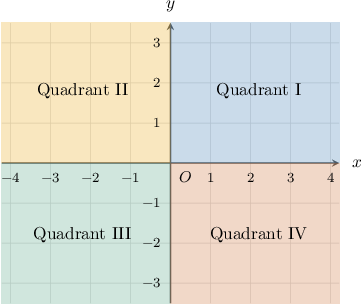

### Example: Identifying the Quadrant Containing Some Desired Points

#### Question

The graph shows the average daily temperature $T$ (measured in $^{\circ}\text{C}$) and the deviation from the normal pressure $P$ (measured in $\text{mbar}$) in Anchorage for several days. Which quadrant contains data for the days that are with a negative deviation from the normal pressure but with a positive average daily temperature?

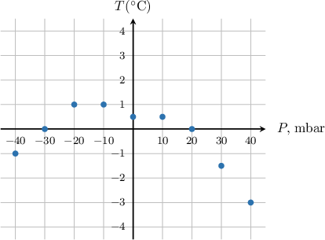

#### Explanation

In the given coordinate plane,

- the horizontal $x$-axis corresponds to the deviation from the normal pressure, and

- the vertical $y$-axis corresponds to the average daily temperature.

So, we need to find the quadrant containing points that have negative $x$-coordinates and positive $y$-coordinates.

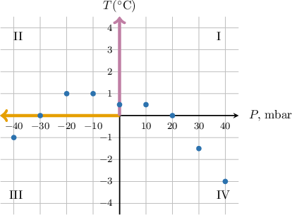

From the graph, we see that this data is represented by points in the second quadrant.

### Plotting Journeys from Coordinates

We can use a coordinate plane to plot different journeys.

Suppose Vanessa went for a bike ride and recorded her position using a GPS navigator. The navigator recorded her coordinates every $30$ minutes, obtaining the following ordered pairs:

$$

(0,0), \quad (-4, -4),\quad (4, -3),\quad (3,2),\quad (0,0)

$$

Plotting these on the map, we get:

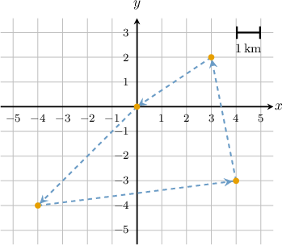

### Example: Identifying Parts of a Journey

#### Question

A plane took off from JFK airport (New York, USA) bound for Madrid, Spain. Every $90$ minutes the GPS navigator recorded the coordinates of the plane's position on a map. The data that it collects is shown in the table below. The coordinate system is set up so that the positive horizontal axis is aligned with the East, and the positive vertical axis is aligned with the North.

During what period of time did the plane travel strictly East?

#### Explanation

Plotting the coordinates from the table on the map, we get:

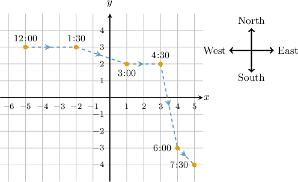

From the graph, we can see that the plane traveled East from $12\!\mathbin:\!00$ to $1\!\mathbin:\!30$ and from $3\!\mathbin:\!00$ to $4\!\mathbin:\!30.$

### Example: Finding Distance and Speed from Plots

#### Question

Orlando works delivering newspapers every morning. Every minute he recorded his coordinates on a map using a GPS navigator. The results are given in the table below. The coordinates that he records are set up so that a difference of one unit corresponds to $1$ meter.

Assuming that Orlando traveled at a constant speed from $7\!\mathbin{:}\!02$ am to $7\!\mathbin{:}\!03$ am, what was his speed during this time interval?

#### Explanation

Plotting the coordinates from the table on the map, we get:

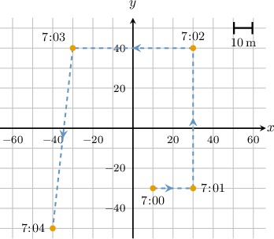

In the interval from $7\!\mathbin{:}\!02$ am to $7\!\mathbin{:}\!03$ am, Orlando traveled $60$ units. Since one unit corresponds to $1$ meter, then Orlando traveled $60 \, \text{m}.$

Therefore, Orlando traveled at a speed of $60$ meters per minute during this time period.
