# Identifying Three-Dimensional Shapes

Source: https://www.mathacademy.com/topics/2467?courseId=31
Topic ID: 2467

## Prerequisites

- [Rectangles, Rhombuses, and Squares](../../../elementary-school/lessons/grade-5/3751-rectangles-rhombuses-and-squares.md)

## Lesson

### Introduction

A **polyhedron** is a $3$-dimensional shape where each side is a polygon. These flat polygonal sides are called **faces**.

**Prisms** are polyhedrons made of two identical polygonal faces (called **bases**) connected by equal parallel line segments. If these line segments are perpendicular to the bases, we have a **right** prism.

Let's take a look at some common prisms.

- A **triangular (right) prism** consists of two identical triangular faces connected by equal parallel line segments.

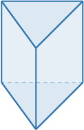

- A **rectangular (right) prism** consists of two identical rectangular faces connected by equal parallel line segments. Notice that each face is a rectangle.

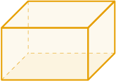

- A **cube** is a special case of a rectangular prism that consists of six equal square faces.

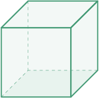

By adding more sides to the polygonal base, we can make more prisms. For example, the following shape is a pentagonal prism.

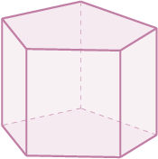

We can also construct hexagonal prisms, heptagonal prisms, etc.

### Pyramids

**Pyramids** are polyhedrons made of a polygonal base, with the other triangular faces meeting at a single point.

Let's take a look at some common pyramids.

- A **triangular pyramid** has a triangular base with $3$ other triangular faces that meet at a single point.

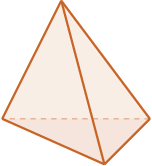

- A **rectangular pyramid** has a rectangular base with $4$ triangular faces that meet at a single point. If the base is a square, we call this a **square pyramid.**

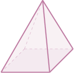

- A **pentagonal pyramid** has a pentagonal base with $5$ triangular faces that meet at a single point.

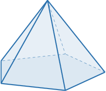

Similarly to prisms, we can add more sides to the polygonal base to make more types of pyramids.

### Example: Naming Prisms

#### Question

What is the name of the polyhedron shown below?

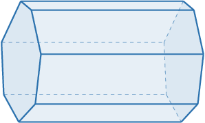

#### Explanation

The polyhedron is a **** since it has two identical heptagonal faces connected by equal parallel line segments.

Also, notice that:

- The solid is not an octagonal (pentagonal or hexagonal) prism since it does not have an octagonal (pentagonal or hexagonal) base.

- The solid is not a cube since not all of its faces are squares.

### Example: Naming Pyramids

#### Question

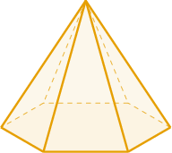

What is the name of the polyhedron shown above?

1. Hexagonal prism

2. Hexagonal pyramid

3. Rectangular prism

#### Explanation

The solid is a **** since its base is a hexagon and all other $6$ faces meet at a single point

Also, notice that:

- The solid is not a hexagonal prism since it doesn't have two identical hexagonal faces connected by equal parallel lines.

- The solid is not a rectangular prism since not all of its faces are rectangles.

### Other Three-Dimensional Shapes

Not all three-dimensional shapes are polyhedrons. Let's see some examples.

- A **sphere** is the set of points with the same distance to a fixed point called the **center.** A sphere is a $3$-dimensional analog of a circle. A **hemisphere** is half of a sphere.

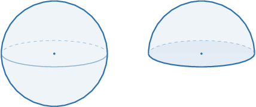

- A **cylinder** is a solid shape with two parallel circular bases. There are two types of cylinders. A cylinder is **right** if the axis that passes through the centers of the circular bases is perpendicular to the bases. Otherwise, the cylinder is **oblique.**

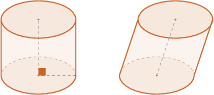

- A **cone** is a solid shape with one circular base and one vertex called the **apex**. There are two types of cones. A cone is **right** if the axis that passes through the center of the circular base and the vertex is perpendicular to the base. Otherwise, the cone is **oblique.**

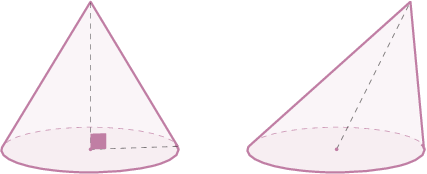

### Example: Identifying Spheres, Hemispheres, Cones, and Cylinders

#### Question

What is the name of the solid shown below?

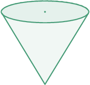

#### Explanation

The solid is a ****.

Notice the following:

- The solid has one circular base and one vertex. So, it's a cone.

- The axis that passes through the center of the circle and the vertex is perpendicular to the base. So, it's right.

### Example: Identifying Non-Polyhedra

#### Question

Which of the following is **** a polyhedron?

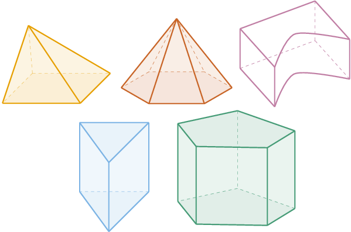

#### Explanation

Each face in a polyhedron must be a polygon. Therefore, the only option that is **** a polyhedron is:

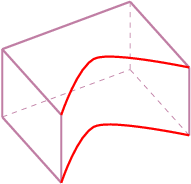

Notice that one of its faces is not a polygon (it has curved sides).
