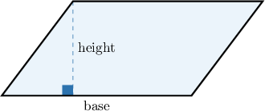
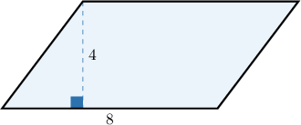
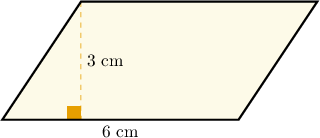
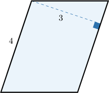
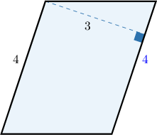
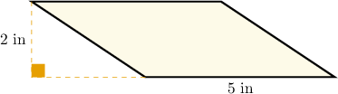
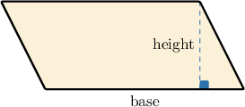
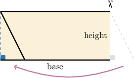

# Areas and Perimeters of Parallelograms

Source: https://www.mathacademy.com/topics/2473?courseId=31
Topic ID: 2473

## Prerequisites

- [Areas of Rectangles](./6766-areas-of-rectangles.md)
- [Perimeters of Shapes](../../../elementary-school/lessons/grade-5/7743-perimeters-of-shapes.md)

## Lesson

### Introduction

How do we calculate the area of a parallelogram, like the one below?

We can do this with the following formula:

$$

\text{Area} = \text{base} \times \text{height}

$$

Note that the height needs to be at a right angle to the base. This is very important.

Let's use this formula to determine the area of the parallelogram below.

First, we write down the base and height of the parallelogram:

$$

\begin{aligned}base & =8 \\ height & =4\end{aligned}

$$

Substituting the values of the base and height into the formula, we get:

$$

\begin{aligned}Area & =base×height \\ & =8×4 \\ & =32\end{aligned}

$$

We'll show how to derive the formula at the end of the lesson.

### Example: Finding the Area of a Parallelogram with a Horizontal Base

#### Question

Determine the area of the parallelogram.

#### Explanation

First, we find the base and the height of the parallelogram:

$$

\begin{aligned}base & =6 \\ height & =3\end{aligned}

$$

The area of the parallelogram can be found by the following formula:

$$

\text{Area} = \text{base} \times \text{height}

$$

Substituting the values of the base and height, we get:

$$

\begin{aligned}Area & =6×3=18\end{aligned}

$$

Now, let's find the units. Since base and height are measured in centimeters, the area is measured in square centimeters. Therefore:

$$

\text{Area} = 18 \, \text{cm}^2

$$

### Example: Finding the Area of a Parallelogram with a Diagonal Base

#### Question

What is the area of the parallelogram?

#### Explanation

First, we find the height and base of the parallelogram.

Recall that two opposite sides of a parallelogram have the same length. So we can label another side, as follows:

Remember that the base is the length of a side of the parallelogram, while the height is at a right angle to the base. Therefore:

$$

\begin{aligned}base & =4 \\ height & =3\end{aligned}

$$

Now, the area of the parallelogram can be found by the following formula:

$$

\text{Area} = \text{base} \times \text{height}

$$

Substituting the values of the base and height, we get:

$$

\begin{aligned}Area & =4×3=12\end{aligned}

$$

### Example: Finding the Area of a Parallelogram with the Height Shown Outside the Parallelogram

#### Question

Find the area of the parallelogram.

#### Explanation

First, we find the base and height of the parallelogram:

$$

\begin{aligned}base & =5 \\ height & =2\end{aligned}

$$

The area of the parallelogram can be found by the following formula:

$$

\text{Area} = \text{base} \times \text{height}

$$

Substituting the values of the base and height, we get:

$$

\begin{aligned}Area & =5×2=10\end{aligned}

$$

Now, let's find the units. Since base and height are measured in inches, the area is measured in square inches. Therefore:

$$

\text{Area} = 10 \, \text{in}^2

$$

### Example: Finding the Perimeter of a Parallelogram Given the Area

#### Question

What the perimeter of the parallelogram given that its area is $48?$

#### Explanation

Let's write down what we know:

$$

\begin{aligned} & Area=48 \\ & base=\,? \\ & height=4 \\ & side=5\end{aligned}

$$

The area of the parallelogram can be found by the following formula:

$$

\text{Area} = \text{base} \times \text{height}

$$

Substituting the values of the area and height, we get

$$

\begin{aligned}48 & =base×4.\end{aligned}

$$

Using the relationship between multiplication and division, we can solve for the base:

$$

\text{base} = 48 \div 4 = 12

$$

Finally, the perimeter of the parallelogram is

$$

\begin{aligned}Perimeter & =(base+side)×2 \\ & =(12+5)×2 \\ & =17×2 \\ & =34.\end{aligned}

$$

### Deriving the Area Formula

We'll now derive the formula for the area of a parallelogram. Consider a parallelogram shown above.

Let's now

- cut the small triangle along the height on the right-hand side, and

- place it on the other side of the original figure.

We now have a rectangle with the same base and height as our parallelogram. The area of this rectangle equals the area of our parallelogram:

$$

\text{Area of Parallelogram} = \text{Area of Rectangle} = \text{base} \times \text{height}

$$
