# Box Plots

Source: https://www.mathacademy.com/topics/2482?courseId=31
Topic ID: 2482

## Prerequisites

- [Range, Quartiles, and IQR](./2480-range-quartiles-and-iqr.md)

## Lesson

### Introduction

A **box plot** (sometimes called a **box-and-whisker plot**) is a visual representation of a data set created using its quartile information.

Suppose a particular data set has the following features:

To draw a box plot, we start by drawing a horizontal axis and a box (rectangle) that runs from the lower quartile to the upper quartile.

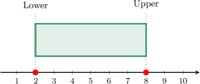

Then, we put a vertical bar within the box at the median.

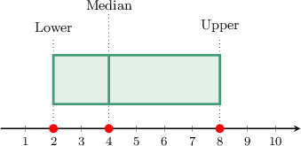

Finally, we put two vertical bars outside the box at the smallest and greatest values and connect them to the box with horizontal segments.

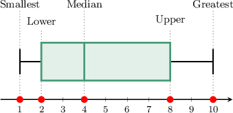

Note the following:

- The spaces to the box's right and left (i.e., the "whiskers") represent the top and bottom quarter of the data, respectively.

- The box itself represents the middle half of the data.

- The vertical bar inside the box gives the center of the distribution.

### Example: Finding an Attribute of a Data Set Using a Box Plot

#### Question

The box plot below represents the distribution of the daily wages of the workers in a fast-food restaurant. What is the median of the data set?

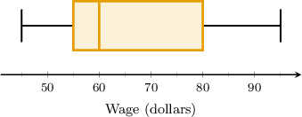

#### Explanation

The median is represented by the vertical line that goes through the box.

In our case, the median line corresponds to $60$, as shown below.

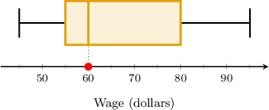

Therefore, the median daily wage of the workers is $ 60.$

### Example: Creating or Identifying a Box Plot From Quartile Data

#### Question

A certain data set has the features listed in the table below.

Draw a box plot for this data.

#### Explanation

Using the data from the table, we obtain the following boxplot:

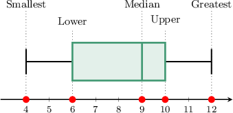

### Example: Creating a Boxplot From a Data Set

#### Question

The data set below shows the number of vanilla ice creams sold by a particular ice cream parlor every day during a certain week.

$$

4, \: 5, \: 6, \: 12, \: 13, \: 13, \: 15

$$

Which of the following gives the box plot for this data?

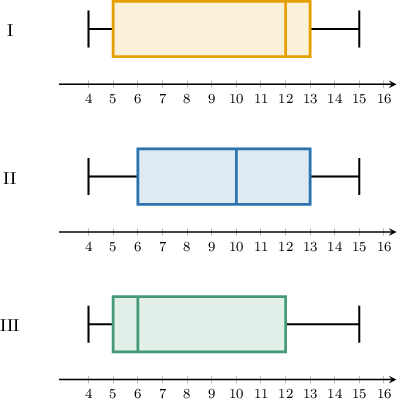

#### Explanation

Notice that our data set is already arranged from smallest to greatest, where we have

$$

\begin{aligned}smallest value=4,\,greatest value=15.\end{aligned}

$$

Since the number of data points is odd ($7$), the median of the data set is the middle number. Therefore,

$$

\text{median} = \color{blue}12.

$$

Now, let's find the quartiles by considering the lower and upper halves of the distribution:

$$

\underbrace{4, \: 5, \: 6,}_{\text{lower half}} \: {\color{blue}12}, \: \underbrace{13, \: 13, \: 15}_{\text{upper half}}

$$

The lower quartile is the median of the lower half. In this case, it's the middle number:

$$

\text{lower quartile} = 5

$$

The upper quartile is the median of the upper half. In this case, it's the middle number:

$$

\text{upper quartile} = 13

$$

Finally, we draw the corresponding boxplot, as shown below.

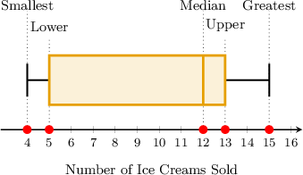

Therefore, the boxplot representing this data is diagram $\textrm I.$

### The Skew of a Boxplot

Let's consider the box plot below.

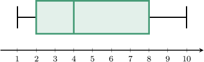

We can identify the **tails** of the data by finding the distance between the median and the quartiles:

- The *left* tail is the distance between the median and the *lower* quartile.

- The *right* tail is the distance between the median and the *upper* quartile.

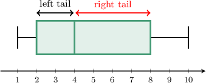

We can use the tails of a box plot to state the **skew** of the data set.

- If the right tail is longer than the left, we say the data is **right-skewed** (or **positively skewed**).

- If the left tail is longer than the right, we say the data is **left-skewed** (or **negatively skewed**).

- A data set is **symmetric** if it's symmetric about the median.

The box plot in our example is right-skewed because the right tail is longer than the left.

### Example: Identifying the Shape of a Box Plot

#### Question

The boxplot below shows the distribution of the weekly waste produced by families in a residential building. Describe the skewness of the distribution.

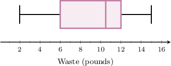

#### Explanation

Notice that the median is closer to the upper quartile than the lower quartile. So, we have a longer tail on the left, as shown below.

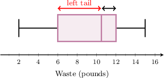

Therefore, the distribution is **.
