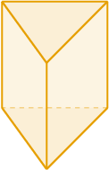
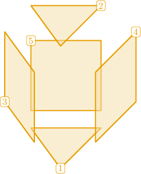
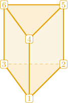
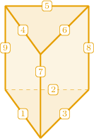
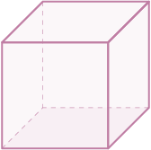
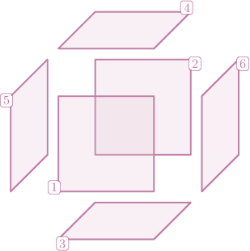
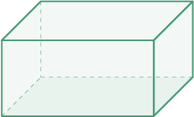
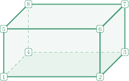
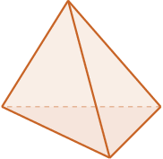
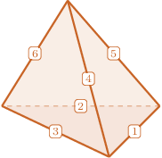

# Faces, Vertices, and Edges of Polyhedrons

Source: https://www.mathacademy.com/topics/2484?courseId=31
Topic ID: 2484

## Prerequisites

- [Identifying Three-Dimensional Shapes](./2467-identifying-three-dimensional-shapes.md)

## Lesson

### Introduction

The **faces** of a polyhedron are the polygonal sides that construct it.

Let's consider the triangular prism below.

Our triangular prism has $5$ faces:

The **vertices** of a polyhedron are its corners. Our triangular prism has $6$ vertices:

The **edges** of a polyhedron are the straight line segments that connect its vertices. Our triangular prism has $9$ edges:

### Example: Counting the Number of Faces of a Polyhedron

#### Question

How many faces does the cube shown below have?

#### Explanation

The cube has $6$ square faces:

### Example: Counting the Number of Vertices of a Polyhedron

#### Question

How many vertices does the rectangular prism shown below have?

#### Explanation

The vertices of a polyhedron are the corners where edges meet.

The rectangular prism has $8$ vertices in total, as shown below.

### Example: Counting the Number of Edges of a Polyhedron

#### Question

How many edges does the triangular pyramid shown below have?

#### Explanation

Edges are straight line segments that connect the vertices of a polyhedron.

The triangular pyramid has $6$ edges in total, as shown below.

