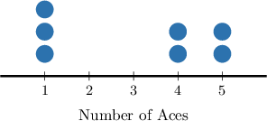
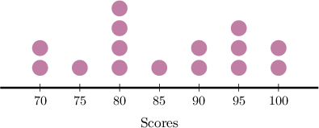
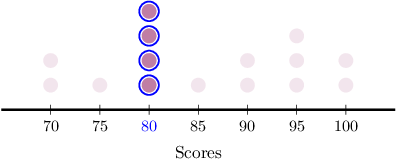
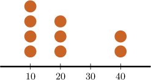
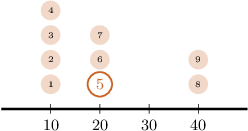
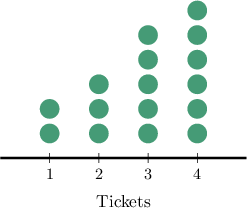
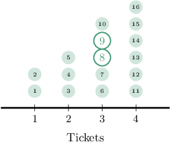

# Measuring Centrality From Dot Plots

Source: https://www.mathacademy.com/topics/2500?courseId=31
Topic ID: 2500

## Prerequisites

- [Dot Plots](./2499-dot-plots.md)
- [The Mode of a Data Set](./3579-the-mode-of-a-data-set.md)
- [The Median of a Data Set](./3749-the-median-of-a-data-set.md)

## Lesson

### Introduction

We can compute a data set's mean, median, and mode from its dot plot.

Let's compute the mean of the distribution represented by the dot plot below.

The dot plot tells us the following:

- there are $\color{blue}4$ values in the data set equal to $10$

- there are $\color{blue}3$ values in the data set equal to $20$

- there are $\color{blue}2$ values in the data set equal to $40$

Therefore, we have the following data:

$$

10, \: 10, \: 10, \: 10, \: 20, \: 20, \: 20, \: 40, \: 40

$$

Now, we can calculate the mean of the data set:

$$

\begin{aligned}mean & =\frac{(10×4)+(20×3)+(40×2)}{9} \\ & =\frac{40+60+80}{9} \\ & =\frac{180}{9} \\ & =20\end{aligned}

$$

Therefore, the mean of the distribution is $20.$

### Example: Finding the Mean of a Data Set Using a Dot Plot

#### Question

The dot plot above shows the number of aces scored by each participant in a tennis tournament. Each dot represents a single competitor. What is the mean number of aces the competitors scored?

#### Explanation

The dot plot tells us the following:

- $\color{blue}3$ competitors scored $1$ ace

- $\color{blue}2$ competitors scored $4$ aces

- $\color{blue}2$ competitors scored $5$ aces

So, we get the following data:

$$

1, \: 1, \: 1, \: 4, \: 4, \ 5, \ 5

$$

Finally, we calculate the mean:

$$

\begin{aligned}mean & =\frac{(1×3)+(4×2)+(5×2)}{7} \\ & =\frac{3+8+10}{7} \\ & =\frac{21}{7} \\ & =3\end{aligned}

$$

Therefore, the mean number of aces is $3.$

### Example: Finding the Mode of a Data Set Using a Dot Plot

#### Question

The dot plot below shows the distribution of scores on a language quiz. Each dot represents a single student. What is the modal score?

#### Explanation

The mode is the value that occurs most often in the data set.

According to our plot, the value $\color{blue}80$ appears more frequently than the others ($\color{red}4$ times in total).

Therefore, the modal score is $80.$

### Finding Medians Using Dot Plots

Consider the dot plot below.

Let's compute the median of the distribution. To do this, we have two methods. We'll go through both methods, but the first is usually the fastest.

**Method 1 - Analyzing the Dot Plot**

Since we have an odd number of data points ($9$ in total), the median is the middle value ($\color{blue}5$th).

Therefore, the median is $\color{blue}20.$

**Method 2 - Restoring the Data Set From the Dot Plot**

The dot plot tells us the following:

- there are $\color{blue}4$ values in the data set equal to $10$

- there are $\color{blue}3$ values in the data set equal to $20$

- there are $\color{blue}2$ values in the data set equal to $40$

Therefore, we have the following data:

$$

10, \: 10, \: 10, \: 10, \: {\color{blue}\underline{20}}, \: 20, \: 20, \: 40, \: 40

$$

Since we have an odd number of data points ($9$ in total), the median is the middle value ($\color{blue}5$th). Therefore, the median is $\color{blue}20.$

The process is slightly different if there are an even number of data points. Let's see an example.

### Example: Finding the Median of a Data Set Using a Dot Plot

#### Question

The dot plot below shows the number of circus tickets bought by families in a particular neighborhood. Each dot represents a single family. What is the median of the distribution?

#### Explanation

****

Since we have an even number of data points ($16$ in total), the median is the mean of the two middle values (the $\color{blue}8$th and $\color{blue}9$th, respectively).

Therefore, the median is

$$

\text{median} = \dfrac{3+3}{2} = \dfrac62 = 3.

$$

****

The dot plot tells us the following:

- $\color{blue}2$ families purchased $1$ ticket

- $\color{blue}3$ families purchased $2$ tickets

- $\color{blue}5$ families purchased $3$ tickets

- $\color{blue}6$ families purchased $4$ tickets

This gives the following data:

$$

1, \: 1, \: 2, \: 2, \: 2, \: 3, \: 3, \: {\color{blue}\underline{3}}, \: {\color{blue}\underline{3}}, \: 3, \: 4, \: 4, \: 4, \: 4, \: 4, \: 4

$$

Since we have an even number of data points ($16$ in total), the median is the mean of the two middle values (the $\color{blue}8$th and $\color{blue}9$th, respectively).

Therefore, the median is

$$

\text{median} = \dfrac{3+3}{2} = \dfrac62 = 3.

$$
