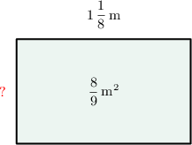

# Dividing Mixed Numbers: Word Problems

Source: https://www.mathacademy.com/topics/2520?courseId=31
Topic ID: 2520

## Prerequisites

- [Dividing Mixed Numbers](./2387-dividing-mixed-numbers.md)
- [Dividing Fractions: Word Problems](./6739-dividing-fractions-word-problems.md)

## Lesson

### Introduction

There are plenty of real-world scenarios in which we may need to divide fractions.

For example, suppose that a shipment of $6\,\dfrac{3}{4}$ pounds of saffron has arrived at a supermarket, packed into $9$ bags of equal weight. How much does each bag weigh?

To find out how many pounds each bag weighs, we need to divide $6\,\dfrac{3}{4}$ by $9.$

**Step 1:** Convert to an improper fraction.

First, we write $6 \,\dfrac{3}{4}$ as an improper fraction:

$$

6\,\dfrac{3}{4}=\dfrac{(6 \times 4) + 3}{4}= \dfrac{27}{4}

$$

**Step 2:** Set up the division.

Our problem now is to work out the following:

$$

\dfrac{27}{4} \div 9

$$

**Step 3:** Multiply by the reciprocal.

Dividing a fraction by a whole number is equivalent to multiplying the fraction by the reciprocal of the whole number.

The reciprocal of $9$ is $\dfrac{1}{9}.$ So, we have:

$$

\dfrac{27}{4} \div 9 = \dfrac{27}{4} \times \dfrac{1}{9}

$$

**Step 4:** Multiply and simplify.

Now, we multiply the numerators and the denominators:

$$

\dfrac{27}{4} \times \dfrac{1}{9} = \dfrac {27 \times 1} {4\times 9} = \dfrac{27}{36}

$$

Finally, we simplify the fraction:

$$

\dfrac{27}{36} = \dfrac{27 \div 9}{36 \div 9} = \dfrac{3}{4}

$$

Therefore, each bag of saffron weighs $\dfrac{3}{4}$ pounds.

Next, let's see an example with division by a fraction, which is very similar to dividing by a whole number.

### Example: Dividing a Mixed Number by a Whole Number or Fraction in Context

#### Question

A store clerk wants to split $2 \,\dfrac{2}{5}\,\textrm{lb}$ of candy into several $\dfrac{3}{10}\,\textrm{lb}$ packages. How many of these packages will he make?

#### Explanation

To find out the number of $\dfrac{3}{10}\,\textrm{lb}$ packages the clerk will make, we need to divide $2 \,\dfrac{2}{5}$ by $\dfrac{3}{10}.$

First, we express $2 \,\dfrac{2}{5}$ as an improper fraction:

$$

2 \,\dfrac{2}{5}=\dfrac{(2 \times 5) + 2}{5}= \dfrac{12}{5}

$$

Therefore, our problem now is to work out the following:

$$

\dfrac{12}{5}\div \dfrac{3}{10}

$$

Dividing one fraction by another is equivalent to multiplying the first fraction by the reciprocal of the second fraction.

The reciprocal of $\dfrac{\color{blue}3}{\color{red}10}$ is $\dfrac{\color{red}10}{\color{blue}3}.$ So, we have:

$$

\dfrac{12}{5} \div \dfrac{\color{blue}3}{\color{red}10} = \dfrac{12}{5} \times \dfrac{\color{red}10}{\color{blue}3}

$$

Notice that the first fraction's denominator ($5$) and the second fraction's numerator ($\color{red}10$) have a common factor of $5.$

Therefore, we can simplify our problem by first swapping the denominators:

$$

\dfrac{12}{\color{blue}3} \times \dfrac{\color{red}10}{5}

$$

Next, we reduce the second fraction to its lowest terms by dividing the numerator and denominator by $5.$

$$

\begin{aligned}\frac{12}{3}×\frac{10÷5}{5÷5} & =\frac{12}{3}×\frac{2}{1}\end{aligned}

$$

Now, we reduce the first fraction to its lowest terms by dividing the numerator and denominator by $3.$

$$

\begin{aligned}\frac{12÷3}{3÷3}×\frac{2}{1} & =\frac{4}{1}×\frac{2}{1}\end{aligned}

$$

To multiply two fractions, we multiply the numerators, and we multiply the denominators:

$$

\dfrac{4}{1} \times \dfrac{2}{1} = \dfrac{4 \times 2}{1 \times 1} = 8

$$

Therefore, the store clerk will make $8$ packages, each containing $\dfrac{3}{10}\,\textrm{lb}$ of candy.

### Example: Dividing a Whole Number by a Mixed Number in Context

#### Question

Each day at college, Marie spends a total amount of $5$ hours in class. Each of her courses lasts $1\,\dfrac{1}{4}$ hours. How many courses is Marie taking?

#### Explanation

To find the number of courses, we need to divide $5$ by $1 \,\dfrac{1}{4}.$

First, we write $1 \,\dfrac{1}{4}$ as an improper fraction:

$$

1 \,\dfrac{1}{4}=\dfrac{(1 \times 4) + 1}{4}= \dfrac{5}{4}

$$

We also write $5$ as an improper fraction:

$$

5=\dfrac{5}{1}

$$

Therefore, our problem now is to work out the following:

$$

\dfrac{5}{1}\div \dfrac{5}{4}

$$

Dividing one fraction by another is equivalent to multiplying the first fraction by the reciprocal of the second fraction.

The reciprocal of $\dfrac{\color{blue}5}{\color{red}4}$ is $\dfrac{\color{red}4}{\color{blue}5}.$ So, we have:

$$

\dfrac{5}{1} \div \dfrac{\color{blue}5}{\color{red}4} = \dfrac{5}{1}\times \dfrac{\color{red}4}{\color{blue}5}

$$

Notice that the first fraction's numerator ($5$) and the second fraction's denominator ($\color{blue}5$) have a common factor of $5.$

Therefore, we can simplify our problem by first swapping the denominators:

$$

\dfrac{5}{\color{blue}5} \times \dfrac{4}{1}

$$

Next, we reduce the first fraction to its lowest terms by dividing the numerator and denominator by $5.$

$$

\begin{aligned}\frac{5÷5}{5÷5}×\frac{4}{1} & =\frac{1}{1}×\frac{4}{1}\end{aligned}

$$

Now, we multiply the fractions. We multiply the numerators, and we multiply the denominators:

$$

\dfrac{1}{1} \times \dfrac{4}{1} = \dfrac{1 \times 4}{1 \times 1} = 4

$$

Therefore, Marie is enrolled in $4$ courses.

### Example: Dividing a Fraction by a Mixed Number in Context

#### Question

The area of a rectangular blackboard is $\dfrac 89\, \text{m}^2$ and its length is $1\, \dfrac{1}{8} \, \text{m}.$ What is the width of the blackboard?

#### Explanation

To find out the width of the blackboard, we need to divide $\dfrac{8}{9}$ by $1 \,\dfrac{1}{8}.$

First, we express $1 \,\dfrac{1}{8}$ as an improper fraction:

$$

1 \,\dfrac{1}{8} = \dfrac{(1 \times 8) + 1}{8} = \dfrac{9}{8}

$$

Therefore, our problem now is to work out the following:

$$

\dfrac{8}{9} \div \dfrac{9}{8}

$$

Dividing one fraction by another is equivalent to multiplying the first fraction by the reciprocal of the second fraction.

The reciprocal of $\dfrac{\color{blue}9}{\color{red}8}$ is $\dfrac{\color{red}8}{\color{blue}9}.$ So, we have:

$$

\dfrac{8}{9} \div \dfrac{\color{blue}9}{\color{red}8} = \dfrac{8}{9} \times \dfrac{\color{red}8}{\color{blue}9}

$$

Notice that the first fraction's numerator ($8$) and the second fraction's denominator ($\color{blue}9$) do not have a common factor greater than $1.$

Also, the first fraction's denominator ($9$) and the second fraction's numerator ($\color{red}8$) do not have a common factor greater than $1.$

So, we cannot simplify by swapping the denominators first.

Next, we multiply the fractions. We multiply the numerators, and we multiply the denominators:

$$

\dfrac{8}{9} \times \dfrac{8}{9} = \dfrac{8 \times 8}{9 \times 9} = \dfrac{64}{81}

$$

Therefore, the width of the board is $\dfrac{64}{81}\,\text{m}.$

### Example: Dividing Two Mixed Numbers in Context

#### Question

Joe, the school carpenter, needs to split a $10 \dfrac 12\,\textrm{ft}$ wooden slat into several $1 \dfrac 18\,\textrm{ft}$ pieces. How many complete pieces will he get?

#### Explanation

To find out the number of pieces Joe will get, we need to divide $10 \,\dfrac{1}{2}$ by $1 \,\dfrac{1}{8}.$

First, we express both mixed numbers as improper fractions:

$$

10 \,\dfrac{1}{2}=\dfrac{(10 \times 2) + 1}{2}= \dfrac{21}{2}

$$

$$

1 \,\dfrac{1}{8}=\dfrac{(1 \times 8) + 1}{8}= \dfrac{9}{8}

$$

Therefore, our problem now is to work out the following:

$$

\dfrac{21}{2} \div \dfrac{9}{8}

$$

Dividing one fraction by another is equivalent to multiplying the first fraction by the reciprocal of the second fraction.

The reciprocal of $\dfrac{\color{blue}9}{\color{red}8}$ is $\dfrac{\color{red}8}{\color{blue}9}.$ So, we have:

$$

\dfrac{21}{2} \div \dfrac{\color{blue}9}{\color{red}8} = \dfrac{21}{2} \times \dfrac{\color{red}8}{\color{blue}9}

$$

Notice that the first fraction's denominator ($2$) and the second fraction's numerator ($\color{red}8$) have a common factor of $2.$

Therefore, we can simplify our problem by first swapping the denominators:

$$

\dfrac{21}{\color{blue}9} \times \dfrac{\color{red}8}{2}

$$

Next, we reduce the second fraction to its lowest terms by dividing the numerator and denominator by $2.$

$$

\begin{aligned}\frac{21}{9}×\frac{8÷2}{2÷2} & =\frac{21}{9}×\frac{4}{1}\end{aligned}

$$

Now, we reduce the first fraction to its lowest terms by dividing the numerator and denominator by $3.$

$$

\begin{aligned}\frac{21÷3}{9÷3}×\frac{4}{1} & =\frac{7}{3}×\frac{4}{1}\end{aligned}

$$

To multiply two fractions, we multiply the numerators, and we multiply the denominators:

$$

\dfrac{7}{3} \times \dfrac{4}{1} = \dfrac{7 \times 4}{3 \times 1} = \dfrac{28}{3}

$$

Finally, we write this improper fraction as a mixed number:

$$

28 \div 3 = 9 \,\textrm{R}\,1 = 9 \,\dfrac{1}{3}

$$

Therefore, Joe will get $9$ complete $1 \,\dfrac{1}{8}\,\textrm{ft}$ pieces.
