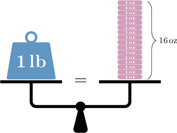

# Converting Units of Mass to Larger Units

Source: https://www.mathacademy.com/topics/3975?courseId=31
Topic ID: 3975

## Prerequisites

- [Multi-Digit by Two-Digit Division Using Partial Quotients](../../../elementary-school/lessons/grade-5/541-multi-digit-by-two-digit-division-using-partial-quotients.md)
- [Dividing Decimals Using Place Value Strategies](./551-dividing-decimals-using-place-value-strategies.md)
- [Converting Units of Mass to Smaller Units](../../../elementary-school/lessons/grade-4/2428-converting-units-of-mass-to-smaller-units.md)

## Lesson

### Introduction

In previous lessons, we explored converting larger units of mass to smaller ones. In this lesson, we will learn how to convert smaller units of mass to larger ones.

To convert between customary units of mass, we use the following unit conversions:

- $1$ ton $= 2,000$ pounds

- $1$ pound $=16$ ounces

We can think of unit conversions of mass concretely by picturing a set of weighing scales.

For example, if we placed a $1\,\text{lb}$ mass on one scale and sixteen $1\,\text{oz}$ masses on the other, the scales would balance perfectly.

Similarly, we can picture a set of weighing scales showing the equivalence between $1$ ton and $2,000\,\text{lb}.$

Let's get some practice at converting between customary units of mass.

### A Worked Example

For example, suppose we want to convert $320$ ounces to pounds. We start with the unit conversion between pounds and ounces:

$$

1\, \text{pound} =16\, \text{ounces}

$$

Since we are converting *from* ounces *to* pounds, we divide both sides of the above equation by $16$ and obtain the following:

$$

\dfrac{1}{16} \, \text{pounds} = 1 \, \text{ounce}

$$

The right-hand side reads $1\,\text{ounce},$ and we want to know how many pounds are in $\color{blue}320$ ounces. So, we multiply *both* sides of this equation by ${\color{blue}{320}}.$

$$

\begin{aligned}320×\frac{1}{16}\,pounds & =320×1\,ounce \\ \frac{320}{16}\,pounds & =320\,ounces \\ \frac{320÷4}{16÷4}\,pounds & =320\,ounces \\ \frac{80}{4}\,pounds & =320\,ounces \\ 20\,pounds & =320\,ounces\end{aligned}

$$

Therefore, $320$ ounces equals $20$ pounds.

### Example: Converting From Ounces to Pounds

#### Question

What is $132\,\text{oz}$ in $\text{lb}?$

#### Explanation

We need to convert $132$ ounces to pounds.

We start with the unit conversion between pounds and ounces:

$$

1\, \text{lb} =16\, \text{oz}

$$

Now, we divide both sides by $16$ and obtain the following:

$$

\dfrac{1}{16} \, \text{lb} = 1 \, \text{oz}

$$

We want to figure out how many pounds are in $132$ ounces. So, we multiply both sides of the above equation by $132{:}$

$$

\begin{aligned}132×\frac{1}{16}\,lb & =132×1\,oz \\ \frac{132}{16}\,lb & =132\,oz \\ \frac{132÷2}{16÷2}\,lb & =132\,oz \\ \frac{66}{8}\,lb & =132\,oz \\ 8\,\frac{2}{8}\,lb & =132\,oz \\ 8\,\frac{1}{4}\,lb & =132\,oz\end{aligned}

$$

Therefore, $132\,\text{oz}$ equals $8\,\dfrac{1}{4}\,\text{lb}.$

### Example: Converting From Pounds to Tons

#### Question

How many tons are in $1,600\,\text{lb}?$

#### Explanation

We need to convert $1,600$ pounds to tons.

We start with the unit conversion between tons and pounds:

$$

1\, \text{ton} =2,000\, \text{pounds}

$$

Now, we divide both sides by $2,000$ and obtain the following:

$$

\dfrac{1}{2,000} \, \text{tons} =1\, \text{pound}

$$

We want to figure out how many tons are in $1,600$ pounds. So, we multiply both sides of the above equation by $1,600{:}$

$$

\begin{aligned}1,600×\frac{1}{2,000}\,tons & =1,600×1\,pound \\ \frac{1,600}{2,000}\,tons & =1,600\,pounds \\ \frac{1,600÷100}{2,000÷100}\,tons & =1,600\,pounds \\ \frac{16}{20}\,tons & =1,600\,pounds \\ \frac{16÷4}{20÷4}\,tons & =1,600\,pounds \\ \frac{4}{5}\,tons & =1,600\,pounds\end{aligned}

$$

Therefore, $1,600$ pounds is equal to $\dfrac{4}{5}$ tons.

### Converting Between Metric Units of Mass

For metric units of mass, there are two primary conversions that we need to be aware of:

- $1$ kilogram $=1,000$ grams

- $1$ gram $=1,000$ milligrams

Let's get some practice at converting between metric units of mass.

### Example: Converting From Grams to Kilograms

#### Question

What is $15,100\,\text{g}$ measured in $\text{kg}?$

#### Explanation

We need to convert $15,100$ grams to kilograms.

We start with the unit conversion between kilograms and grams:

$$

1 \,\text{kg} = 1,000 \,\text{g}

$$

Now, we divide both sides by $1,000$ and obtain the following:

$$

\dfrac{1}{1,000} \,\text{kg} = 1 \,\text{g}

$$

We want to figure out how many kilograms are in $15,100$ grams. So, we multiply both sides of the above equation by $15,100{:}$

$$

\begin{aligned}15,100×\frac{1}{1,000}\,kg & =15,100×1\,g \\ (15,100÷1,000)\,kg & =15,100\,g \\ 15.1\,kg & =15,100\,g\end{aligned}

$$

Therefore, $15,100 \, \text{g}$ equals $15.1 \, \text{kg}.$

### Example: Converting From Milligrams to Grams

#### Question

Express $47\,\text{mg}$ in grams.

#### Explanation

We need to convert $47$ milligrams to grams.

We start with the unit conversion between grams and milligrams:

$$

1 \,\text{g} = 1,000 \,\text{mg}

$$

Now, we divide both sides by $1,000$ and obtain the following:

$$

\dfrac{1}{1,000} \,\text{g} = 1 \,\text{mg}

$$

We want to figure out how many grams are in $47$ milligrams. So, we multiply both sides of the above equation by $47{:}$

$$

\begin{aligned}47×\frac{1}{1,000}\,g & =47×1\,mg \\ (47÷1,000)\,g & =47\,mg \\ 0.047\,g & =47\,mg\end{aligned}

$$

Therefore, $47\, \text{mg}$ equals $0.047 \, \text{g}.$
