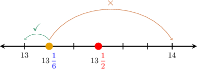

# Dividing Numbers by One-Digit Numbers With Rounding

Source: https://www.mathacademy.com/topics/4025?courseId=31
Topic ID: 4025

## Prerequisites

- [Four-Digit by One-Digit Division](./540-four-digit-by-one-digit-division.md)
- [Using Fractions to Represent Division of Whole Numbers](./2412-using-fractions-to-represent-division-of-whole-numbers.md)
- [Rounding Up Whole Numbers](../../../elementary-school/lessons/grade-4/3884-rounding-up-whole-numbers.md)
- [Comparing Fractions Using One-Half Benchmarks](../../../elementary-school/lessons/grade-4/3936-comparing-fractions-using-one-half-benchmarks.md)

## Lesson

### Introduction

When we **round a number to the nearest whole number**, we find the closest whole number to our number.

Rounding a number to the nearest whole number is often useful when dividing two whole numbers with remainders.

To demonstrate, let's round the result of the following division problem to the nearest whole number:

$$

79 \div 6

$$

We start by going through the long division procedure as usual:

So, $79 \div 6 = 13 \, \text{R} \, 1.$ Writing this result as a mixed number, we obtain

$$

79 \div 6 = 13 \, {\color{blue}\dfrac{1}{6}}.

$$

We need to round this result *to the nearest whole number*. So, we need to decide whether to round down or round up.

Note that,

- rounding the answer *down* gives $13,$ while

- rounding the answer *up* gives $14.$

To decide whether to round down or up, we need to decide which of these two options $(13$ or $14)$ is closest to $13 \, {\color{blue}\dfrac{1}{6}}.$ To do this, we compare the fractional part of our answer to ${\color{red}\dfrac12}.$

Now, since

$$

{\color{blue}\dfrac{1}{6}} < {\color{red}\dfrac{1}{2}},

$$

this tells us that $13 \, {\color{blue}\dfrac{1}{6}}$ is *closer* to $13$ than to $14.$

Therefore, we need to round *down*:

$$

13 \, {\color{blue}\dfrac{1}{6}} \to 13

$$

Therefore, $79 \div 6$ rounded to the nearest whole number is $13.$

### Rules for Rounding Division Problems

When rounding the result of a division to the nearest whole number, we apply the following rules:

- When the fractional part is *smaller* than $\dfrac12,$ we round *down*.

- When the fractional part is *greater* than *or equal to* $\dfrac12,$ we round *up*.

Let's see another example.

### Example: Rounding the Division of a Two-Digit Number

#### Question

Round $83 \div 5$ to the nearest whole number.

#### Explanation

We start by going through the long division procedure as usual:

So, $83 \div 5 = 16 \, \text{R} \, 3.$ Writing this as a mixed number, we obtain

$$

83 \div 5 = 16 \, {\color{blue}\dfrac{3}{5}}.

$$

Finally, since ${\color{blue}\dfrac{3}{5}} > \dfrac{1}{2},$ we need to round up, as follows:

$$

16 \, {\color{blue}\dfrac{3}{5}} \to 17

$$

Therefore, $83 \div 5$ rounded to the nearest whole number is $17.$

### Example: Rounding the Division of a Three-Digit Number

#### Question

Round $679 \div 6$ to the nearest whole number.

#### Explanation

We start by going through the long division procedure as usual:

So, $679 \div 6 = 113 \, \text{R} \, 1.$ Writing this as a mixed number, we obtain

$$

679 \div 6 = 113 \, {\color{blue}\dfrac{1}{6}}.

$$

Finally, since ${\color{blue}\dfrac{1}{6}} < \dfrac{1}{2},$ we need to round down, as follows:

$$

113 \, {\color{blue}\dfrac{1}{6}} \to 113

$$

Therefore, $679 \div 6$ rounded to the nearest whole number is $113.$

### Example: Rounding the Division of a Four-Digit Number

#### Question

Round $4,444 \div 7$ to the nearest whole number.

#### Explanation

We start by going through the long division procedure as usual:

So, $4,444 \div 7 = 634 \, \text{R} \, 6.$ Writing this as a mixed number, we obtain

$$

4,444 \div 7 = 634\, {\color{blue}\dfrac{6}{7}}.

$$

Finally, since ${\color{blue}\dfrac{6}{7}} > \dfrac{1}{2},$ we need to round up, as follows:

$$

634 \, {\color{blue}\dfrac{6}{7}} \to 635

$$

Therefore, $4,444 \div 7$ rounded to the nearest whole number is $635.$
