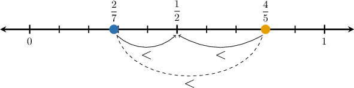

# Comparing Ratios

Source: https://www.mathacademy.com/topics/559?courseId=31
Topic ID: 559

## Prerequisites

- [Writing Ratios Using Fractions](./552-writing-ratios-using-fractions.md)
- [Comparing Fractions Using One-Half Benchmarks](../../../elementary-school/lessons/grade-4/3936-comparing-fractions-using-one-half-benchmarks.md)
- [Comparing Fractions Using Common Denominators](../../../elementary-school/lessons/grade-4/4204-comparing-fractions-using-common-denominators.md)

## Lesson

### Introduction

When we compare two ratios, we are comparing how much one quantity is associated with another quantity.

One way to compare ratios is to write each ratio as a fraction and simplify.

For example, suppose Store A has $12$ pens and $3$ notebooks, and Store B has $15$ pens and $5$ notebooks.

The ratio of pens to notebooks at Store A is $12:3,$ which can be written as

$$

\dfrac{12}{3}.

$$

We can simplify this ratio by dividing the numerator and denominator by $3{:}$

$$

\dfrac{12 \div 3}{3 \div 3} = \dfrac{4}{1} = 4

$$

So the ratio $12:3$ is equivalent to $4:1.$

The ratio of pens to notebooks at Store B is $15:5,$ which can be written as

$$

\dfrac{15}{5}.

$$

We can simplify this ratio by dividing the numerator and denominator by $5{:}$

$$

\dfrac{15 \div 5}{5 \div 5} = \dfrac{3}{1} = 3

$$

So the ratio $15:5$ is equivalent to $3:1.$

Since $4 > 3,$ Store A has a larger ratio of pens to notebooks than Store B.

### Example: Comparing Ratios

#### Question

In two science clubs, Club A has $4$ mentors and $20$ students, while Club B has $6$ mentors and $18$ students. Fill in the missing details in the explanations below.

$\quad$ The ratio of students to mentors in Club A is $\boxed{\phantom{5:1}}.$

$\quad$ The ratio of students to mentors in Club B is $\boxed{\phantom{3:1}}.$

$\quad$ Therefore, Club A has a $\boxed{\phantom{\textrm{smaller}}}$ ratio of students to mentors compared to Club B.

#### Explanation

The ratio of students to mentors in Club A is $20:4.$ We can write this ratio as a fraction:

$$

\dfrac{20}{4}

$$

We can simplify this fraction by dividing both the numerator and the denominator by $4{:}$

$$

\dfrac{20 \div 4}{4 \div 4} = \dfrac{5}{1} = 5

$$

This is equivalent to the ratio ${\color{blue}5:1}.$

The ratio of students to mentors in Club B is $18:6.$ We can write this ratio as a fraction:

$$

\dfrac{18}{6}

$$

We can simplify this fraction by dividing both the numerator and the denominator by $6{:}$

$$

\dfrac{18 \div 6}{6 \div 6} = \dfrac{3}{1} = 3

$$

This is equivalent to the ratio ${\color{blue}3:1}.$

Since $5 > 3,$ the ratio of students to mentors in Club A is **

However, because the question asks which club has the ** ratio of students to mentors, Club B has fewer students per mentor.

Therefore, Club A has the ** ratio of students to mentors.

The complete statements are as follows:

$\quad$ The ratio of students to mentors in Club A is $\boxed{5:1}.$

$\quad$ The ratio of students to mentors in Club B is $\boxed{3:1}.$

$\quad$ Therefore, Club A has a $\boxed{\textrm{larger}}$ ratio of students to mentors compared to Club B.

### Comparing Ratios Using Fractions

Sometimes it is helpful to compare two ratios by writing them as fractions.

To do this, write each ratio as a fraction, simplify, and then compare the simplified fractions.

For example, suppose Jar A has $3$ blue marbles and $24$ red marbles, and Jar B has $5$ blue marbles and $20$ red marbles.

The ratio of blue marbles to red marbles in Jar A is $3:24,$ which can be written as

$$

\dfrac{3}{24}.

$$

We can simplify this fraction by dividing both the numerator and the denominator by $3{:}$

$$

\dfrac{3 \div 3}{24 \div 3} = \dfrac{1}{8}

$$

The ratio of blue marbles to red marbles in Jar B is $5:20,$ which can be written as

$$

\dfrac{5}{20}.

$$

We can simplify this fraction by dividing both the numerator and the denominator by $5{:}$

$$

\dfrac{5 \div 5}{20 \div 5} = \dfrac{1}{4}

$$

To compare $\dfrac{1}{8}$ and $\dfrac{1}{4},$ we look at the denominators. Since $8$ is larger than $4,$ the fraction $\dfrac{1}{8}$ represents a smaller portion.

Since $\dfrac{1}{8} < \dfrac{1}{4},$ Jar A has a smaller ratio of blue marbles to red marbles than Jar B.

### Example: Comparing Ratios With Common Numerators

#### Question

In two classrooms, Classroom A has $32$ students and $8$ laptops, while Classroom B has $18$ students and $6$ laptops. Fill in the missing details in the explanations below.

$\quad$ The number of laptops relative to students for Classroom A is $\boxed{\phantom{1/4}}.$

$\quad$ The number of laptops relative to students for Classroom B is $\boxed{\phantom{1/3}}.$

$\quad$ Therefore, Classroom A has a $\boxed{\phantom{\textrm{larger}}}$ fraction of laptops relative to students compared to Classroom B.

#### Explanation

The number of laptops relative to students for Classroom A is the fraction:

$$

\dfrac{8}{32}

$$

We can simplify this fraction by dividing both the numerator and the denominator by $8{:}$

$$

\dfrac{8 \div 8}{32 \div 8} = \dfrac{1}{4}

$$

The number of laptops relative to students for Classroom B is the fraction:

$$

\dfrac{6}{18}

$$

We can simplify this fraction by dividing both the numerator and the denominator by $6{:}$

$$

\dfrac{6 \div 6}{18 \div 6} = \dfrac{1}{3}

$$

To compare $\dfrac{1}{4}$ and $\dfrac{1}{3},$ we look at the denominators. Since $4$ is larger than $3,$ the fraction $\dfrac{1}{4}$ represents a smaller portion of the whole.

Since $\dfrac{1}{4} < \dfrac{1}{3},$ the fraction for Classroom A is **

The complete statements are as follows:

$\quad$ The number of laptops relative to students for Classroom A is $\boxed{\dfrac{1}{4}}.$

$\quad$ The number of laptops relative to students for Classroom B is $\boxed{\dfrac{1}{3}}.$

$\quad$ Therefore, Classroom A has a $\boxed{\textrm{smaller}}$ fraction of laptops relative to students compared to Classroom B.

### Example: Comparing Ratios With With Common Denominators

#### Question

At two music schools, School A has $8$ instructors and $24$ students, while School B has $18$ instructors and $27$ students. Fill in the missing details in the explanations below.

$\quad$ The number of instructors relative to students for School A is $\boxed{\phantom{1/3}}.$

$\quad$ The number of instructors relative to students for School B is $\boxed{\phantom{2/3}}.$

$\quad$ Therefore, School A has a $\boxed{\phantom{\textrm{smaller}}}$ fraction of instructors relative to students compared to School B.

#### Explanation

The number of instructors relative to students for School A is the fraction:

$$

\dfrac{8}{24}

$$

We can simplify this fraction by dividing both the numerator and the denominator by $8{:}$

$$

\dfrac{8 \div 8}{24 \div 8} = \dfrac{1}{3}

$$

The number of instructors relative to students for School B is the fraction:

$$

\dfrac{18}{27}

$$

We can simplify this fraction by dividing both the numerator and the denominator by $9{:}$

$$

\dfrac{18 \div 9}{27 \div 9} = \dfrac{2}{3}

$$

To compare $\dfrac{1}{3}$ and $\dfrac{2}{3},$ we look at the numerators since the denominators are the same.

Since $1 < 2,$ the fraction for School A is **

The complete statements are as follows:

$\quad$ The number of instructors relative to students for School A is $\boxed{\dfrac{1}{3}}.$

$\quad$ The number of instructors relative to students for School B is $\boxed{\dfrac{2}{3}}.$

$\quad$ Therefore, School A has a $\boxed{\textrm{smaller}}$ fraction of instructors relative to students compared to School B.

### Further Comparing Ratios

When comparing two ratios, we can sometimes use $\dfrac12$ as a benchmark to compare the ratios as fractions.

First, we recall the following facts:

- If the numerator of a fraction is less than half of the denominator, then the fraction is less than $\dfrac12.$

- On the other hand, if the numerator is greater than half of the denominator, then a fraction is greater than $\dfrac12.$

If one fraction is less than $\dfrac12$ and the other fraction is greater than $\dfrac12,$ then the fraction less than $\dfrac12$ is always the smaller fraction.

Let's apply this to a concrete example.

### A Concrete Example

Let's compare the following two fractions. Which of them is larger?

$$

\dfrac27, \quad \dfrac45

$$

First, we compare each to $\dfrac12.$

- To compare $\dfrac27$ to $\dfrac12,$ we check whether $2$ is less than half of $7.$ Since half of $7$ is $3.5,$ we have $2 < 3.5,$ so

- Similarly, to compare $\dfrac45$ to $\dfrac12,$ we check whether $4$ is more than half of $5.$ Since half of $5$ is $2.5,$ we have $4 > 2.5,$ so

Since $\dfrac27$ is less than $\dfrac12$ and $\dfrac45$ is greater than $\dfrac12,$ we conclude that

$$

\dfrac27 < \dfrac45

$$

So, $\dfrac27$ represents the *smaller* ratio.

Let's now apply this to a real-world example involving ratios.

### Example: Comparing Ratios Using Fractions by Comparing to One-Half

#### Question

At two construction sites, Site A uses $24$ bags of gravel and $15$ bags of cement, while Site B uses $18$ bags of gravel and $8$ bags of cement. Fill in the missing details in the explanation below.

$\quad$ The amount of cement relative to gravel for Site A is $\,\boxed{\phantom{0/0}}.$

$\quad$ The amount of cement relative to gravel for Site B is $\,\boxed{\phantom{0/0}}.$

$\quad$ Therefore, Site A has a $\boxed{\phantom{\textrm{larger}}}$ fraction of cement relative to gravel compared to Site B.

#### Explanation

The amount of cement relative to gravel for Site A is the fraction:

$$

\dfrac{15}{24}

$$

We can simplify this fraction by dividing both the numerator and the denominator by $3{:}$

$$

\begin{aligned}\frac{15÷3}{24÷3} & =\frac{5}{8}\end{aligned}

$$

The amount of cement relative to gravel for Site B is the fraction:

$$

\dfrac{8}{18}

$$

We can simplify this fraction by dividing both the numerator and the denominator by $2{:}$

$$

\begin{aligned}\frac{8÷2}{18÷2} & =\frac{4}{9}\end{aligned}

$$

To compare $\dfrac58$ and $\dfrac49,$ we can compare both to $\dfrac12.$

Since $\dfrac58 > \dfrac12$ and $\dfrac49 < \dfrac12,$ we conclude that $\dfrac58 > \dfrac49.$ So, the fraction for Site A is **.

The complete statements are as follows:

$\quad$ The amount of cement relative to gravel for Site A is $\boxed{\dfrac58}.$

$\quad$ The amount of cement relative to gravel for Site B is $\boxed{\dfrac49}.$

$\quad$ Therefore, Site A has a $\boxed{\textrm{larger}}$ fraction of cement relative to gravel compared to Site B.
