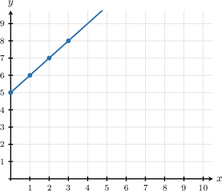
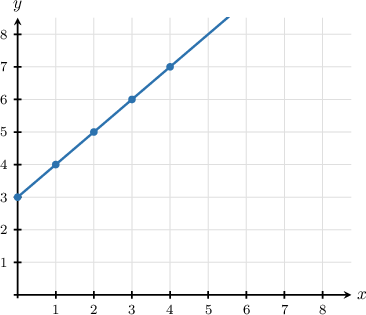
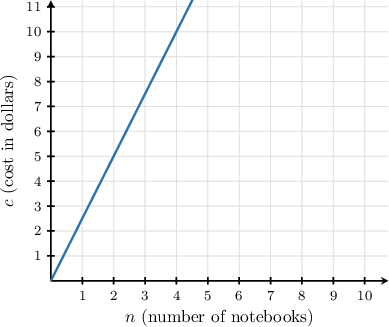
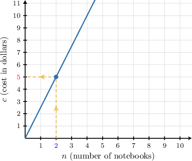
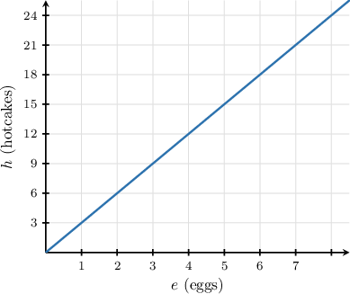
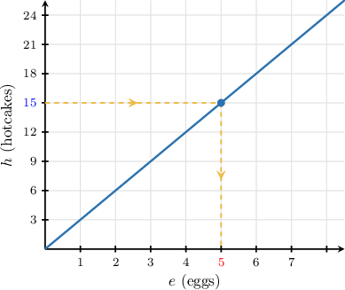
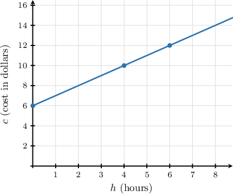
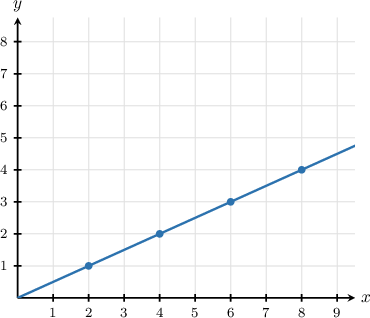
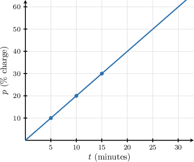

# Analyzing Two-Variable Equations Using Graphs

Source: https://www.mathacademy.com/topics/560?courseId=31
Topic ID: 560

## Prerequisites

- [Graphing Patterns](../../../elementary-school/lessons/grade-5/2433-graphing-patterns.md)
- [Analyzing Two-Variable Equations Using Tables](./2518-analyzing-two-variable-equations-using-tables.md)

## Lesson

### Introduction

We can represent two-variable equations using graphs. For example, consider the following equation:

$$

y = x + 5

$$

A point $(x, y)$ is a solution to this equation if substituting the $x$-value into the equation gives the correct $y$-value.

To find some solution points, we can choose several $x$-values and compute the corresponding $y$-values. Notice that:

- If $x=0,$ then $y=0 + 5 = 5.$

- If $x=1,$ then $y=1 + 5 = 6.$

- If $x=2,$ then $y=2 + 5 = 7.$

- If $x=3,$ then $y=3 + 5 = 8.$

We can organize these results in the table below:

So, we have the following points:

$$

(0,5),\: (1,6),\: (2,7),\: (3,8)

$$

To graph the equation, we plot these points on the coordinate plane and draw a straight line through them.

Every point $(x,y)$ on the line satisfies the equation.

### Example: Constructing a Graph Given an Equation

#### Question

Sketch the graph that represents the equation $y = x + 3.$

#### Explanation

First, we create a table representing the equation $y = x + {\color{blue}3}.$ For some chosen values of $x,$ we evaluate $y{:}$

Now, we plot these points and connect them with a line. When we do this, we get the following plot.

### Reading Graphs

Graphs can help us solve word problems involving two quantities.

The graph below shows the relationship between the number of notebooks purchased and the total cost.

- The horizontal axis shows the number of notebooks $n.$

- The vertical axis shows the total cost $c$ (in dollars).

The graph contains many points. Each point on the graph matches a value of $n$ with its corresponding value of $c.$

Suppose we want to find the total cost when $2$ notebooks are purchased. To do so, we:

- find $n={\color{blue}2}$ on the *horizontal* axis,

- move *vertically* from this point until we reach the graph, and

- move *horizontally left* from the graph, and read off the $c$-value.

The corresponding value on the vertical axis is $c = {\color{red}5}.$

Therefore, the cost for $2$ notebooks is $5.$

When reading a graph, be careful to match each axis to the correct quantity. This is because, if we are given a value on the *vertical* axis, we must work in the other direction to find the corresponding value on the *horizontal* axis.

Let's see an example of this in the next slide.

### Example: Solving a Word Problem Given a Graph

#### Question

The graph shows the number of hotcakes $h$ that Esther can make with $e$ eggs. How many eggs does Esther need to make $15$ hotcakes?

#### Explanation

Since Esther wants to make $15$ hotcakes, we have that $h = 15.$

We need to locate the $e$ value that corresponds to $h = 15$ on the graph. To do this, we:

- find $h = {\color{blue}15}$ on the vertical axis,

- move horizontally from this point until we reach the graph, and

- move vertically down from the graph and read off the $e$-value.

The corresponding value on the horizontal axis is $e = {\color{red}5}.$

Therefore, Esther needs $5$ eggs to make $15$ hotcakes.

### Determining the Equation Given a Graph

Sometimes we are given a graph and asked to find a value that is not shown directly on the graph. To solve this problem, we must first determine the equation of the graph.

To demonstrate, suppose a parking garage charges a flat entry fee plus a cost per hour. The total cost $c$ (in dollars) after $h$ hours is shown in the graph below.

Suppose we want to find the total cost after $4.5$ hours.

Since $h=4.5$ is not one of the labeled points on the graph, we cannot read the value directly. Instead, we will find the equation that relates $c$ and $h$.

From the graph, we can pick out the following coordinates:

$$

(0,6),\: (4,10),\: (6,12)

$$

Now, let's put these coordinates into a table:

Notice that each $c$-value is $6$ more than the corresponding $h$-value.

Hence, the equation that relates $c$ and $h$ is $c = h + {\color{blue}6}.$

So, for $h=4.5,$ we have

$$

\begin{aligned}𝑐 & =4.5+6=10.5.\end{aligned}

$$

Therefore, after $4.5$ hours, the total cost is $10.50.$

### Example: Identifying the Equation Given a Graph

#### Question

The graph below represents the relationship $0$ What is the missing number?

#### Explanation

From the graph, we can pick out the following coordinates:

$$

(2,1),\: (4,2),\: (6,3),\: (8,4)

$$

Now let's put these coordinates into the table:

Notice that for every $x$-value, we divide by $2$ to get the corresponding $y$-value.

Therefore, the equation is $y = \dfrac{x}{\boxed{\color{blue}2}}.$ So the missing number is ${\color{blue}{2}}.$

### Example: Solving a Word Problem by Identifying the Equation Given a Graph

#### Question

Moises charges his laptop. The percentage charge $p$ of the laptop's battery after $t$ minutes is shown in the graph. What will be the battery's charge percentage after $23$ minutes?

#### Explanation

Since the laptop charges for $23$ minutes, we have that $t=23.$

On the graph, we can't identify a point corresponding to $t=23,$ so we will need to find the equation relating $p$ and $t.$

From the graph, we can pick out the following coordinates:

$$

(5,10),\: (10,20),\: (15,30)

$$

Now, let's put these coordinates into a table:

Notice that for every $t$-value, we multiply by $2$ to get the corresponding $p$-value.

Hence, the equation that relates $p$ and $t$ is $p={\color{blue}2}t.$

So, for $t=23,$ we have

$$

\begin{aligned}𝑝 & =2⋅23=46.\end{aligned}

$$

Therefore, after $23$ minutes, the charge level will be $46\%.$
