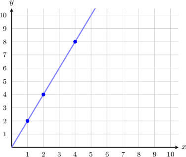
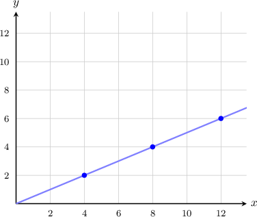
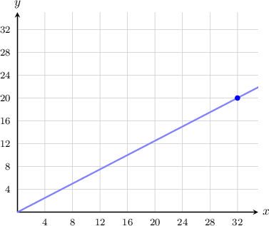
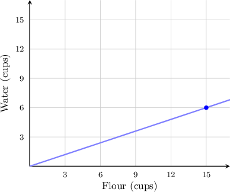

# Graphing Ratios

Source: https://www.mathacademy.com/topics/561?courseId=31
Topic ID: 561

## Prerequisites

- [Ratio Tables](./554-ratio-tables.md)
- [Graphing Patterns](../../../elementary-school/lessons/grade-5/2433-graphing-patterns.md)

## Lesson

### Introduction

Remember that we can place equivalent ratios in a ratio table, like the one below.

By setting the values in the left column as $\color{blue}x$-coordinates and the values in the right column as the corresponding $\color{red}y$-coordinates, we can graph the points to represent a relationship between the ratios.

In this case, we have the following ordered pairs: $({\color{blue}1},{\color{red}2}),$ $({\color{blue}2},{\color{red}4}),$ $({\color{blue}4},{\color{red}8}).$

Plotting these points on a coordinate plane, we get the following graph:

Connecting the points gives us a straight line! Plotting equivalent ratios will *always* give a straight line. Furthermore, the straight line will *always* pass through the origin $(0,0).$

### Example: Graphing Ratios

#### Question

By finding the missing values in the ratio table below, determine the graph that represents the given relationship.

#### Explanation

We start with the ratio ${\color{blue}4}:{\color{red}2}$ and write it as a fraction:

$$

\dfrac{{\color{blue}4}}{{\color{red}2}}

$$

We can generate equivalent ratios by finding equivalent fractions:

$$

\begin{aligned}\frac{4×2}{2×2} & =\frac{8}{4} \\ \frac{4×3}{2×3} & =\frac{12}{6}\end{aligned}

$$

We add these to our ratio table:

So, we have the following ordered pairs: $(4,2),$ $(8,4),$ $(12,6).$

Plotting these points on the coordinate plane and connecting them with a straight line, we get the following graph:

### Example: Determining a Ratio From a Graph

#### Question

What $x:y$ ratio is shown in the graph above?

#### Explanation

We see that the point $(32,20)$ lies on the graph. Let's write the ratio $32:20$ as a fraction:

$$

\dfrac{32}{20}

$$

We can simplify this fraction by dividing both the numerator and the denominator by $4\mathbin{:}$

$$

\begin{aligned}\frac{32÷4}{20÷4} & =\frac{8}{5}\end{aligned}

$$

So the graph shows the ratio $\dfrac{8}{5}.$

### Example: Determining a Ratio From a Graph: Word Problems

#### Question

Betty is making pizza. The amount of water she needs for a given amount of flour is shown in the graph above. In its simplest form, what is the ratio of flour to water?

#### Explanation

One of the points belonging to the graph is $(15,6).$

Let's write the ratio $15:6$ as a fraction:

$$

\dfrac{15}{6}

$$

We can simplify this fraction by dividing both the numerator and the denominator by $3\mathbin{:}$

$$

\begin{aligned}\frac{15÷3}{6÷3} & =\frac{5}{2}\end{aligned}

$$

So the ratio of flour to water is $5:2.$
