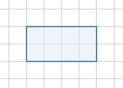
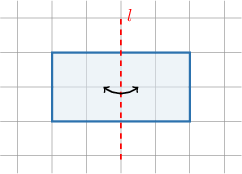
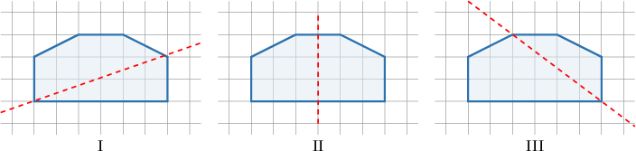
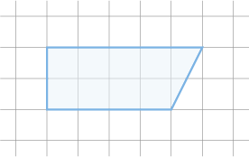
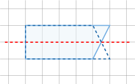
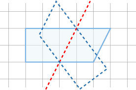
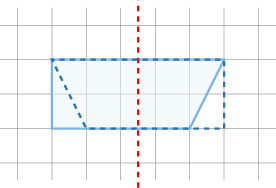

# Lines of Symmetry

Source: https://www.mathacademy.com/topics/6729?courseId=31
Topic ID: 6729

## Prerequisites

- [Polygons](../../../elementary-school/lessons/grade-5/2470-polygons.md)

## Lesson

### Introduction

A **line of symmetry** for a figure is a line such that folding the figure along the line produces two matching halves.

For example, let's consider the polygon below.

This polygon has a line of symmetry $l,$ shown below.

Notice how folding the figure along $l$ produces two perfectly matching halves.

### Example: Identifying Lines That Reflect a Polygon to Itself

#### Question

Which of the pictures below shows a line of symmetry for the figure?

#### Explanation

A line of symmetry for a figure is a line such that folding the figure along the line produces two matching halves.

Let's consider each of the lines in turn.

- By folding the polygon along line I, we do ** map the polygon onto itself.

- By folding the polygon along line II, we map the polygon onto itself.

- By folding the polygon along line III, we do ** map the polygon onto itself.

Therefore, the correct answer is "II only."

### Finding Lines of Symmetry

Some polygons don't have any lines of symmetry. For example, let's find how many lines of symmetry the polygon shown below has.

Recall that a *line of symmetry* for a figure is a line such that folding the figure along the line produces two matching halves.

No matter which lines we try, it is not possible to fold this polygon into matching parts. Therefore, the given polygon has no lines of symmetry.

To demonstrate, we can't consider all possible lines, but three attempts are shown below.

- Folding along a horizontal line does not map the polygon onto itself.

- Folding along a sloped line does not map the polygon onto itself either.

- Folding along a vertical line does not map the trapezoid onto itself either.

We could try other lines, but none of them will work.

### Example: Identifying the Lines of Symmetry of a Polygon

#### Question

How many lines of symmetry does the polygon shown below have?

#### Explanation

A line of symmetry for a figure is a line such that folding the figure along the line produces two matching halves.

The polygon has $2$ lines of symmetry, as shown below.

