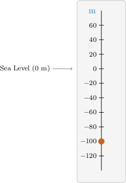
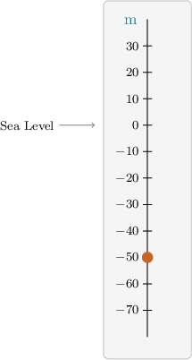

# Interpreting Absolute Value

Source: https://www.mathacademy.com/topics/6749?courseId=31
Topic ID: 6749

## Prerequisites

- [Interpreting Negative Numbers](./2443-interpreting-negative-numbers.md)
- [Comparing Negative Numbers](./6747-comparing-negative-numbers.md)

## Lesson

### Introduction

A negative number often means a measure in the *opposite direction*. The magnitude of the measure is given by the *absolute value* of the number.

For instance, suppose a fish is at a position of $-10\,\textrm{m}$ relative to sea level.

- The negative sign tells us the direction is *below sea level*, which is the opposite of *above sea level*.

- To find the actual distance the fish is below sea level (its *depth*), we take the absolute value of its position:

Therefore, the fish is $10\,\textrm{m}$ below sea level.

### Example: Interpreting the Absolute Value of a Negative Number

#### Question

A person's bank account has a balance of $-80$ dollars. Which of the following statements are true?

1. The number $-80$ is negative.

2. The person has an $80$ dollar debt to the bank.

3. The bank owes $80$ dollars to the person.

#### Explanation

For an account with a balance of $-80$ dollars, we have

$$

|-80| = 80,

$$

which represents the size of the **** in dollars.

Thus, we have the following:

- Statement I is true. The number $-80$ is negative.

- Statement II is true, while statement III is false. The person has an $80$ dollar **** to the bank.

Therefore, the correct answer is "I and II only".

### Interpreting the Absolute Values in Context

Let's consider another example of interpreting the absolute value in context.

Suppose an outdoor swimming pool opens only if the average temperature over the day is above $25^{\circ}\textrm{C}.$ The table below shows the daily average temperatures above $25^{\circ}\textrm{C}$ during a week.

Which of the following statements are true?

I. Monday's average temperature was $2$ degrees more than the minimum required for the pool to open. II. Thursday had the lowest average temperature. III. Tuesday's average temperature was greater than Wednesday's average temperature.

In this context, a negative number represents a deficit, and the absolute value of the deficit gives the number of degrees the temperature is below the minimum for the pool to open.

Let's go through each statement:

- Monday has a negative value, and so the average temperature has a deficit for the pool to open. The number of degrees the temperature is below the minimum for the pool to open is $|-2| = 2.$ Hence, statement I is false.

- The day with the lowest average temperature is the day whose temperature is most to the left on a number line. Clearly, Thursday's average temperature is most to the left, and so it had the lowest temperature. Hence, statement II is true.

- Tuesday's average temperature is $4,$ while Wednesday's is $1.$ Since $4 > 1,$ Tuesday's average temperature was greater than Wednesday's average temperature. Hence, statement III is true.

Therefore, the correct answer is "II and III only".

### Example: Identifying True Statements Given a Table: Word Problem

#### Question

A tour guide has created a list of various ancient artifacts located inside and outside a cave in a park. The distance is measured from the entrance of the cave, with positive values representing distances outside the cave and negative values representing distances inside the cave. The data is shown below.

Which of the following statements are true?

1. Point A is $10\,\textrm{m}$ inside the cave.

2. Point A is further inside the cave than point D.

3. Point A is further inside the cave than any other point.

#### Explanation

In this context,

- positive numbers represent distances outside the cave, and

- negative numbers represent distances inside the cave.

The absolute value gives the size of the distance from the cave entrance.

Let's examine each statement in turn:

- Statement I is true. Since point A has a location of $-10,$ and negative values represent positions inside the cave, point A is $10\,\textrm{m}$ inside the cave.

- Statement II is true. Point D has a location of $60,$ which means it is outside the cave. Since point A is inside the cave and point D is outside, point A is further inside the cave than point D.

- Statement III is false. Point A is $|-10| = 10\,\textrm{m}$ inside the cave, while point B is $|-50| = 50\,\textrm{m}$ inside the cave. Since $50 > 10,$ point B is further inside the cave than point A.

Therefore, the correct answer is "I and II only".

### Using Scales for More Measures

We can use vertical number lines, similar to thermometers, to represent measurements that have a *zero point*.

For instance, *sea level* is a common zero point for measuring altitude and depth.

- Locations *above* sea level have positive values.

- Locations *below* sea level have negative values.

Suppose a scientist finds a shipwreck **below sea level**. We can represent this depth as

The diagram below shows the location of the shipwreck.

### Example: Identifying True Statements Given a Scale: Word Problem

#### Question

A sea diver finds a huge sea animal deep in the sea. The diver records the location of the animal as

Which of the following statements are true?

1. In this context, represents the location of the sea level.

2. The absolute value of the location of the animal gives the depth at which the animal is found.

3. If the location of the second sea animal is then it is further to the sea level than the first one.

#### Explanation

The depth of the first sea animal can be represented using the diagram below.

Let's examine each statement in turn:

- Statement I is true. Since the diver records a location of to represent below sea level, the value must represent sea level.

- Statement II is true. Taking the absolute value, The absolute value gives the depth of the animal below sea level.

- Statement III is false. If the second sea animal is located at then and Since the second sea animal is closer to sea level than the first one.

Therefore, the correct answer is "I and II only".
