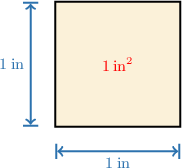
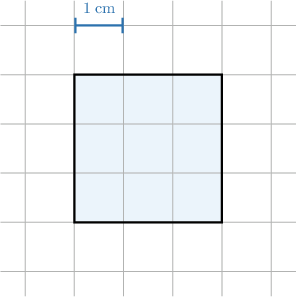
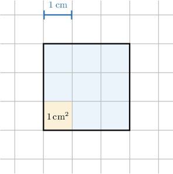
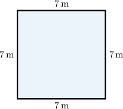
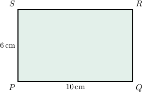
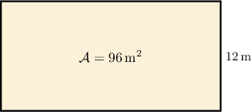
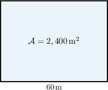

# Areas of Rectangles

Source: https://www.mathacademy.com/topics/6766?courseId=31
Topic ID: 6766

## Prerequisites

- [Units of Area and Volume](./3872-units-of-area-and-volume.md)
- [One-Step Multiplication Equations](./6757-one-step-multiplication-equations.md)

## Lesson

### Introduction

The **area** of a shape is a measure of the two-dimensional space it covers. For example, we use area to figure out how much paint is needed for a wall or how much carpet is needed for a floor.

To measure area, we use a **square unit**. A square unit is a square whose sides are 1 unit long. For instance, let's look at a square with a side length of $1\,\textrm{in}.$

The area of this square is ${\color{red}{1\,\textrm{in}^2}},$ which we read as "one square inch."

Other common square units include:

- One square centimeter ($1\,\textrm{cm}^2$)

- One square meter ($1\,\textrm{m}^2$)

- One square foot ($1\,\textrm{ft}^2$)

In the next slides, we will see how to find the area of larger shapes by counting how many square units fit inside them.

### The Area of a Square

Let's now suppose that we would like to compute the area of the square shown below. Notice that this time, the sides of the square span multiple unit lengths.

Inside the large blue square, there are $3$ rows containing $3$ grid squares each. So, the total number of grid squares is

$$

3 \times 3 = 9.

$$

Since each grid square has an area of $1\,\textrm{cm}^2,$ the total area of the large square is $9\,\textrm{cm}^2.$

### Formula for the Area of a Square

Another way to find the area is to use the formula for the *area of a square*:

$$

\textrm{Area} = (\textrm{Side Length})^2

$$

For our square, the side length is $3\,\textrm{cm}.$ Let's use the formula to calculate the area:

$$

\begin{aligned}Area & =(Side Length)^{2} \\ & =(3\,cm)^{2} \\ & =3\,cm×3\,cm \\ & =(3×3)\,(cm×cm) \\ & =9\,cm^{2}.\end{aligned}

$$

This matches the result we found by counting the grid squares!

### Example: Calculating the Area of a Square From a Diagram

#### Question

What is the area of the square shown below?

#### Explanation

The area of a square is given by

$$

\textrm{Area} = (\textrm{Side Length})^2.

$$

Note that each side of a grid cell measures $3\,\textrm{ft},$ and each side of the shaded square covers $4$ grid cells. So, the length of each side of the shaded square is

$$

\textrm{Side Length} = 4 \times 3\:\textrm{ft} = 12 \,\textrm{ft}.

$$

Therefore, the area of the square is

$$

\begin{aligned}Area & =(12\,ft)^{2} \\ & =12\,ft×12\,ft \\ & =(12×12)\,(ft×ft) \\ & =144\,ft^{2}.\end{aligned}

$$

### Example: Calculating the Area of a Square Using the Formula

#### Question

Maria is designing a square patio whose dimensions are shown in the figure above. What is the area of the patio?

#### Explanation

The area of a square is given by

$$

\textrm{Area} = (\textrm{Side Length})^2.

$$

From the figure, we obtain that

$$

\textrm{Side Length} = 7\,\textrm{m}.

$$

Therefore, the area of the square is

$$

\begin{aligned}Area & =(7\,m)^{2} \\ & =7\,m×7\,m \\ & =(7×7)\,(m×m) \\ & =49\,m^{2}.\end{aligned}

$$

### The Area of a Rectangle

In general, for a rectangle with sides of length $a$ and $b,$ the area of the rectangle is given by

$$

\mathcal{A} = a \cdot b.

$$

Let’s demonstrate this by finding the area of the rectangle $PQRS,$ shown below.

From the figure, we obtain that

$$

a = {PQ} = 10\,\textrm{cm}, \qquad b = {PS} = 6\,\textrm{cm}.

$$

Substituting these values into the area formula, we get

$$

\begin{aligned}A & =𝑎⋅𝑏 \\ & =10\,cm⋅6\,cm \\ & =(10×6)\,(cm×cm) \\ & =60\,cm^{2}.\end{aligned}

$$

It does not matter which side we call $a$ and which side we call $b.$ For example, if we instead set

$$

a = {QR} = 6\,\mathrm{cm}, \qquad b = {RS} = 10\,\mathrm{cm},

$$

then we still obtain

$$

\mathcal{A} = a \cdot b = 60\,\textrm{cm}^2,

$$

as before.

### Example: Calculating the Area of a Rectangle From a Diagram

#### Question

A cinema has a rectangular hall whose dimensions are shown in the figure below. What is the area of the hall?

#### Explanation

The area of a rectangle is given by

$$

\text{Area} = \text{Length} \times \text{Width}.

$$

From the figure, we obtain that

$$

\text{Length} = 4.5\:\text{m}, \qquad \text{Width} = 6\:\text{m}.

$$

Therefore, the area of the rectangle is

$$

\begin{aligned}Area & =4.5\,m×6\,m \\ & =(4.5×6)\,(m×m) \\ & =27\,m^{2}.\end{aligned}

$$

### Finding a Side Given Another Side and Area

How can we find the missing side of a rectangle if we know its area and one of its side lengths?

The *area of a rectangle* is given by the formula

$$

\mathcal{A} = a \cdot b,

$$

where $\mathcal{A}$ is the area, and $a$ and $b$ are the side lengths.

From the figure, we are given:

$$

\mathcal{A} = 96\,\mathrm{m}^2 \quad \text{and} \quad b = 12\,\mathrm{m}.

$$

We can substitute these values into the area formula:

$$

\begin{aligned}A & =𝑎⋅𝑏 \\ 96 & =𝑎⋅12\end{aligned}

$$

To find the value of $a,$ we divide both sides of the equation by $12:$

$$

\begin{aligned}\frac{96}{12} & =\frac{𝑎⋅12}{12} \\ 8 & =𝑎.\end{aligned}

$$

Therefore, the length of the missing side is $8\,\textrm{m}.$

### Example: Calculating the Length of a Side of a Rectangle Given Another Side and Its Area

#### Question

The area of the rectangular field shown below is $2,400\,\textrm{m}^2.$ If the length of the rectangle is $60\:\textrm{m},$ what is its width?

#### Explanation

The area of a rectangle is given by

$$

\mathcal{A} = a \cdot b,

$$

where $a$ is the length and $b$ is the width.

From the figure, we see that

$$

a = 60\,\mathrm{m}, \qquad \mathcal{A} = 2,400\,\mathrm{m}^2.

$$

Substituting these into the formula and solving for $b,$ we get the following:

$$

\begin{aligned}A & =𝑎⋅𝑏 \\ 2,400 & =60⋅𝑏 \\ \frac{2,400}{60} & =𝑏 \\ 40 & =𝑏\end{aligned}

$$

Therefore, the width is $40\:\textrm{m}.$
