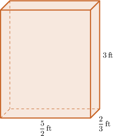
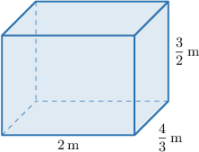
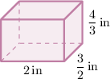
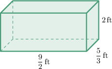

# Volumes of Rectangular Prisms With Fractional Edge Lengths: Word Problems

Source: https://www.mathacademy.com/topics/6805?courseId=31
Topic ID: 6805

## Prerequisites

- [Solving Problems Using Unit Rates](./558-solving-problems-using-unit-rates.md)
- [Multi-Digit by Two-Digit Multiplication](../../../elementary-school/lessons/grade-5/2288-multi-digit-by-two-digit-multiplication.md)
- [Volumes of Rectangular Prisms With Fractional Edge Lengths](./2447-volumes-of-rectangular-prisms-with-fractional-edge-lengths.md)

## Lesson

### Introduction

When a real-world object is shaped like a rectangular prism, we use the volume formula:

$$

V = \text{length} \times \text{width} \times \text{height}.

$$

If there are several identical objects, first find the volume of one object. Then multiply by the number of objects.

For example, suppose a storage box is $\dfrac{5}{2}\,\text{ft}$ long, $\dfrac{2}{3}\,\text{ft}$ wide, and $3\,\text{ft}$ high. Let's find the total volume of $3$ identical boxes.

First, find the volume of one box:

$$

\begin{aligned}𝑉 & =\frac{5}{2}×\frac{2}{3}×3 \\ & =\frac{5×2×3}{2×3×1} \\ & =\frac{30}{6} \\ & =5.\end{aligned}

$$

So, one box has a volume of $5\,\text{ft}^3.$

Since there are $3$ boxes,

$$

3 \times 5 = 15.

$$

The total volume of the boxes is $15\,\text{ft}^3.$ Remember to include cubic units when giving a volume.

### Example: Calculating the Volume of a Rectangular Prism

#### Question

Alessandro wants to build a concrete tank to store water. If he decides that the inner dimensions of this tank should be $2 \, \text{m}$ long, $\dfrac{4}{3} \, \text{m}$ wide, and $\dfrac{3}{2} \, \text{m}$ high, then how much water can this tank store?

#### Explanation

First, we make a drawing of the tank.

The volume of the tank is:

$$

\begin{aligned}𝑉 & =length×width×height \\ & =2×\frac{4}{3}×\frac{3}{2} \\ & =\frac{2}{1}×\frac{4}{3}×\frac{3}{2} \\ & =\frac{2×4×3}{1×3×2} \\ & =\frac{24}{6} \\ & =4\end{aligned}

$$

Therefore, the tank will be able to store $4 \, \text{m}^3$ of water.

### Unit Costs for Volumes

Sometimes we need to find the total cost of a rectangular prism when we know the cost per cubic unit.

To solve these problems:

1. Find the volume.

2. Multiply the volume by the cost per cubic unit.

Be sure the units match. Volume is measured in cubic units (such as $\text{ft}^3$ or $\text{in}^3$), and the rate is given "per cubic unit."

For example, suppose a block of soap is shaped like a rectangular prism that is $2\,\text{in}$ long, $\dfrac{3}{2}\,\text{in}$ wide, and $\dfrac{4}{3}\,\text{in}$ high, and each cubic inch of soap costs $4.$

To find the cost of the soap block, we first find the volume:

$$

\begin{aligned}𝑉 & =2×\frac{3}{2}×\frac{4}{3} \\ & =\frac{2×3×4}{1×2×3} \\ & =\frac{24}{6} \\ & =4\end{aligned}

$$

So, the block has a volume of $4\,\text{in}^3.$ Since each cubic inch costs $4,$ we get

$$

4 \times 4 = 16.

$$

Therefore, the total cost of the soap block is $16.$ Always find the volume first, then multiply by the unit cost.

### Example: Calculating Cost

#### Question

A planter box is made from a rectangular concrete block that is $\dfrac{9}{2} \, \text{ft}$ long, $\dfrac{5}{3} \, \text{ft}$ wide, and $2 \, \text{ft}$ high. If each cubic foot of concrete requires $8\,\text{lb}$ of sand, how much sand was used to make the planter box?

#### Explanation

First, we make a sketch of the planter box.

The volume of the planter box is

$$

\begin{aligned}𝑉 & =length×width×height \\ & =\frac{9}{2}×\frac{5}{3}×2 \\ & =\frac{9}{2}×\frac{5}{3}×\frac{2}{1} \\ & =\frac{9×5×2}{2×3×1} \\ & =\frac{90}{6}\end{aligned}

$$

We can simplify the above fraction by dividing the numerator and denominator by $6$:

$$

\dfrac{90 \div 6}{6 \div 6} = 15 \, \text{ft}^3

$$

Since each cubic foot of concrete requires $8\,\text{lb}$ of sand, we get

$$

8 \times 15 = 120.

$$

Therefore, $120\,\text{lb}$ of sand were used to make the planter box.
