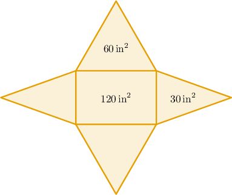
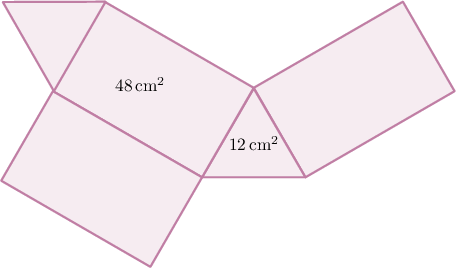
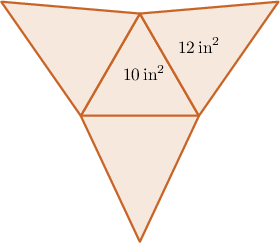
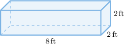
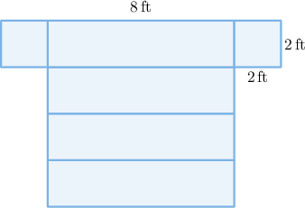
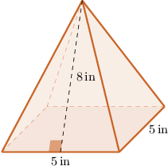
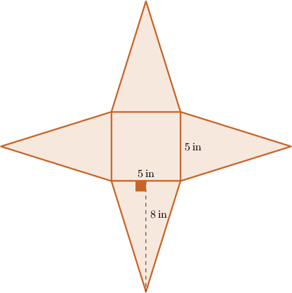
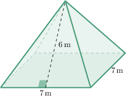
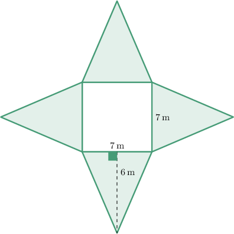

# Finding Surface Areas Using Nets

Source: https://www.mathacademy.com/topics/7208?courseId=31
Topic ID: 7208

## Prerequisites

- [Finding Areas of Polygons Using Decomposition](./576-finding-areas-of-polygons-using-decomposition.md)
- [Nets of Polyhedrons](./2468-nets-of-polyhedrons.md)

## Lesson

### Introduction

The **surface area** of a polyhedron is the combined area of all its faces.

To calculate the surface area of a polyhedron, we use nets.

Let's consider the net of the rectangular pyramid below. What is the surface area of this pyramid?

The surface area of our pyramid consists of one rectangle (the base) and four triangles (the side faces).

Also, notice that there are two different triangular faces:

- there are two triangular faces with an area of $60\,\text{in}^2,$ and

- there are two triangular faces with an area of $30\,\text{in}^2.$

Calculating the total area, we get

$$

\begin{aligned}Surface area & =1×120\,in^{2}+2×60\,in^{2}+2×30\,in^{2} \\ & =120\,in^{2}+120\,in^{2}+60\,in^{2} \\ & =300\,in^{2}.\end{aligned}

$$

Therefore, we conclude that the surface area of the pyramid is $300 \, \text{in}^2.$

### Example: Calculating the Surface Area of a Polyhedron Given the Areas of the Faces

#### Question

What is the surface area of the triangular prism represented by the net below?

#### Explanation

The surface area of our prism consists of $2$ triangles (base and top) and $3$ rectangles (side faces).

Adding the areas, we get

$$

\begin{aligned}Surface area & =2×(Area of base)+3×(Area of side) \\ & =2×12+3×48 \\ & =24+144 \\ & =168\,cm^{2}.\end{aligned}

$$

### Example: Solving Contextual Surface Area Problems Using Nets and Face Areas

#### Question

Maggy is building a pyramid from a cardboard net, shown below. What will be the total surface area of the pyramid?

#### Explanation

The net shown corresponds to a triangular pyramid. The surface area of our pyramid consists of $1$ triangular base and $3$ triangular sides.

Adding the areas, we get

$$

\begin{aligned}Surface area & =1×(Area of base)+3×(Area of side) \\ & =1×10+3×12 \\ & =10+36 \\ & =46\,in^{2}.\end{aligned}

$$

### Finding Surface Areas of Polyhedra Given Some Lengths

If we know a polyhedron's measurements, we can calculate its surface area by first drawing the net of the polyhedron. Then, we calculate the areas of its polygonal faces using known formulas and then sum the results.

To demonstrate, let's find the surface area of the rectangular prism shown below.

First, we consider the net of our prism.

From the diagram, we see that the prism is made up of squares and rectangles.

- The rectangles are $8\,\text{ft}$ long and $2\,\text{ft}$ high. So, the area of one rectangle is

- The squares have sides of length $2\, \text{ft}.$ So, the area of one square is

Finally, the surface area of the prism consists of $4$ rectangles and $2$ squares.

Adding the areas, we get

$$

\begin{aligned}Surface area & =4×(Area of rectangle)+2×(Area of square) \\ & =4×16+2×4 \\ & =64+8 \\ & =72\,ft^{2}.\end{aligned}

$$

### Example: Calculating the Surface Area of a Polyhedron Given Some Lengths

#### Question

Assuming that all of the side faces have the same height $(8\,\text{in}),$ find the total surface area of the square pyramid above by considering its net.

#### Explanation

The net of our pyramid is as follows:

First, notice that the base of the pyramid is a square with sides equal to $5 \, \text{in}.$ Therefore, we have

$$

\text{Area of square} = 5 \times 5 = 25 \, \text{in}^2.

$$

Each side face of our solid is a triangle, where the base is $5\,\text{in}$ and the height is $8\,\text{in}.$ Therefore, we have

$$

\text{Area of triangle} = \dfrac{1}{2} \times 5 \times 8 = 20 \, \text{in}^2.

$$

Finally, the surface area of the pyramid consists of $1$ square (the base) and $4$ triangles (the side faces).

Adding the areas, we get

$$

\begin{aligned}Surface area & =1×(Area of the square)+4×(Area of the triangle) \\ & =1×25+4×20 \\ & =25+80 \\ & =105\,in^{2}.\end{aligned}

$$

### Example: Solving Contextual Surface Area Problems Given Some Lengths

#### Question

Liam wants to cover a tent roof that has the form of a square pyramid, as shown above. Find the total surface area that he needs to cover if all four sides have the same surface area. Note that Liam does ** need to cover the base.

#### Explanation

The net of our pyramid is the following.

Each side face of our solid is a triangle, where the base is $7\,\text{m}$ and the height is $6\,\text{m}.$ Therefore

$$

\text{Area of the triangle} = \dfrac{1}{2} \times 7 \times 6 = 21 \, \text{m}^2.

$$

Now, the total area of the side surfaces consists of $4$ triangular faces.

Therefore, we get

$$

\begin{aligned}Surface area of the sides & =4×(Area of the triangle) \\ & =4×21 \\ & =84\,m^{2}.\end{aligned}

$$

So, Liam needs to cover $84 \, \text{m}^2$ of the tent roof.
