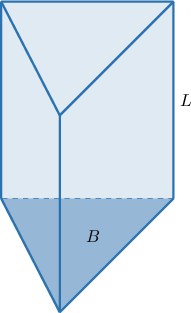
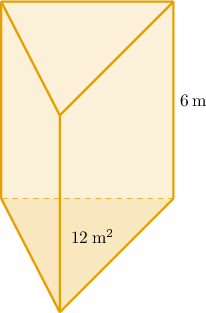
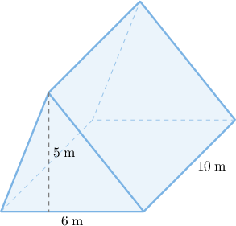
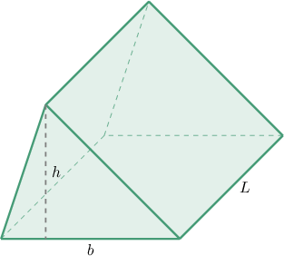
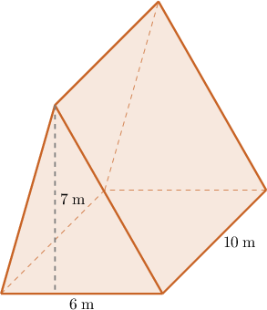
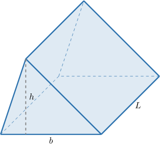
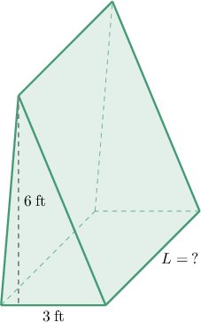
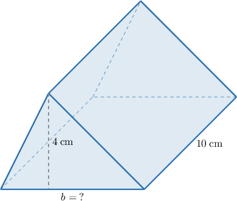

# Volumes of Triangular Prisms

Source: https://www.mathacademy.com/topics/1069?courseId=37
Topic ID: 1069

## Prerequisites

- [Areas of Triangles](./1397-areas-of-triangles.md)
- [Volumes of Right Rectangular Prisms: Word Problems](../../../elementary-school/lessons/grade-5/2411-volumes-of-right-rectangular-prisms-word-problems.md)
- [Identifying Three-Dimensional Shapes](../grade-6/2467-identifying-three-dimensional-shapes.md)
- [Working With Unit Prices](./6818-working-with-unit-prices.md)

## Lesson

### Introduction

Consider the triangular prism shown below, where

- the area of the base triangular face is $B,$ and

- the height (or length, depending on how we look at the prism) is $L$.

Then, the volume of the triangular prism is given by

$$

V = B \cdot L.

$$

For example, suppose $B=18\:\text{m}^2$ and $L=5\:\text{m}.$ Substituting these into the formula, we get

$$

V = 18 \cdot 5 = 90 \: \text{m}^3.

$$

Let's see some more examples.

### Example: Finding the Volume of a Triangular Prism When the Base Area is Given

#### Question

What is the volume $V$ of the triangular prism above?

#### Explanation

The volume of a triangular prism is given by

$$

V = BL,

$$

where $B$ is the area of the base and $L$ is the height (length) of the prism.

Substituting $B=12\:\text{m}^2$ and $L=6\:\text{m}$ into the formula, we get

$$

V = 12 \cdot 6 = 72 \: \text{m}^3.

$$

### Triangular Prisms in Different Orientations

Now, consider the prism below.

First of all, notice that it is still a triangular prism, just with a different orientation in space. What is the volume of this prism?

As we have seen from the beginning of the lesson, the volume of a triangular prism is given by

$$

V = BL,

$$

where $B$ is the area of the base and $L$ is the length (height) of the prism. But this time, we are not given the area of the triangular face directly. Despite this, we can still compute the volume!

Now, if $b$ and $h$ are the base and the height of the base triangle of the prism, respectively, then the area of the triangle is

$$

B=\dfrac{1}{2}bh.

$$

Thus, the formula for the volume of the triangular prism becomes

$$

V = \dfrac{1}{2}bhL.

$$

Therefore, substituting

$$

b=6\:\text{m}, \qquad h=5\:\text{m}, \qquad L=10\:\text{m}

$$

into the formula, we obtain

$$

V = \dfrac{1}{2} \cdot 6 \cdot 5 \cdot 10 = 150 \: \text{m}^3.

$$

### Example: Finding the Volume of a Triangular Prism

#### Question

A triangular face of a triangular prism has a base of $9\:\text{cm}$ and a height of $6\:\text{cm}.$ What is the volume of the prism, if the length of the prism is $5\:\text{cm}?$

#### Explanation

The volume of a triangular prism is given by

$$

V = BL,

$$

where $B$ is the area of the base and $L$ is the height (length) of the prism.

Now, if $b$ and $h$ are the base and the height for the base triangle of the prism, respectively (as shown above), then the area of the triangle is

$$

B=\dfrac{1}{2}bh.

$$

Thus, the formula for the volume of the triangular prism becomes

$$

V = \dfrac{1}{2}bhL.

$$

Therefore, substituting

$$

b=9\:\text{cm}, \qquad h=6\:\text{cm}, \qquad L=5\:\text{cm}

$$

into the formula, we obtain

$$

V = \dfrac{1}{2} \cdot 9 \cdot 6 \cdot 5 = 135 \: \text{cm}^3.

$$

### Volumes of Triangular Prisms in Context

Triangular prisms naturally arise in many real-world problems involving volume.

For example, suppose a grain silo is shaped like a triangular prism, as shown below. Grain is poured into the silo at a rate of $2$ cubic meters per second. How long will it take to completely fill the silo?

First, we find the volume. The volume of a triangular prism is given by

$$

V = BL,

$$

where $B$ is the area of the base and $L$ is the height (length) of the prism.

Now, if $b$ and $h$ are the base and the height for the base triangle of the prism, respectively, then the area of the triangle is

$$

B=\dfrac{1}{2}bh.

$$

Thus, the formula for the volume of the triangular prism becomes

$$

V = \dfrac{1}{2}bhL.

$$

Therefore, substituting

$$

b=6\:\text{m}, \qquad h=7\:\text{m}, \qquad L=10\:\text{m}

$$

into the formula, we obtain

$$

V = \dfrac{1}{2} \cdot 6 \cdot 7 \cdot 10 = 210 \: \text{m}^3.

$$

Now, we compute the total time needed to fill the silo. The filling rate is $2$ cubic meters per second, so we get

$$

210 \div 2 = 105.

$$

Let's check the units:

$$

 \text{m}^3 \div \dfrac{\text{m}^3}{\text{s}} = \text{m}^3 \cdot \dfrac{\text{s}}{\text{m}^3} = \text{s} \:\: {\color{darkgreen}\checkmark}

$$

Therefore, it takes $105$ seconds to fill the silo.

Let's see a different example.

### Example: Solving Problems Involving Volumes of Triangular Prisms

#### Question

The cost of a storage container depends on its volume, as the manufacturer charges $3$ per cubic meter. The container is shaped like a triangular prism. The triangular face has a base of $10\:\text{m}$ and a height of $6\:\text{m}$, and the container is $5\:\text{m}$ long. What is the total cost of this container?

#### Explanation

We first find the volume. The volume of a triangular prism is given by

$$

V = BL,

$$

where $B$ is the area of the base and $L$ is the length of the prism.

Now, if $b$ and $h$ are the base and height of the triangular face, then the area of the triangle is

$$

B=\dfrac{1}{2}bh.

$$

Thus, the formula for the volume becomes

$$

V = \dfrac{1}{2}bhL.

$$

Therefore, substituting

$$

b=10\:\text{m}, \qquad h=6\:\text{m}, \qquad L=5\:\text{m}

$$

into the formula, we obtain

$$

V = \dfrac{1}{2} \cdot 10 \cdot 6 \cdot 5 = 150 \: \text{m}^3.

$$

Now, we compute the total cost. The manufacturer charges $3$ per $\textrm{m}^3,$ so we get

$$

150 \cdot 3 = 450.

$$

Therefore, the total cost is $\,450.$

### Determining Dimensions Given the Volume

Finally, let's learn how to determine a missing dimension of a triangular prism given its volume and some other dimensions.

For example, consider the triangular prism below (not drawn to scale). The volume of this triangular prism is $54\:\text{ft}^3.$ What is the length of the prism?

The volume of a triangular prism is given by

$$

V = BL,

$$

where $B$ is the area of the base and $L$ is the height (length) of the prism.

Now, if $b$ and $h$ are the base and the height for the base triangle of the prism, respectively, then the area of the triangle is

$$

B=\dfrac{1}{2}bh.

$$

Thus, the formula for the volume of the triangular prism becomes

$$

V = \dfrac{1}{2}bhL.

$$

Therefore, substituting

$$

b=3, \qquad h=6, \qquad V=54

$$

into the formula, we obtain the following equations, which we solve for $L{:}$

$$

\begin{aligned}\frac{1}{2}⋅3⋅6⋅𝐿 & =54 \\ 9𝐿 & =54 \\ 𝐿 & =\frac{54}{9} \\ & =6\end{aligned}

$$

Therefore, the length of the triangular prism is $L=6\:\text{ft}.$

### Example: Finding a Dimension Given the Volume of a Triangular Prism

#### Question

Consider the triangular prism above (not drawn to scale). The volume of the prism is $120\:\text{cm}^3.$ What is the base $b$ of the triangular face?

#### Explanation

The volume of a triangular prism is given by

$$

V = BL,

$$

where $B$ is the area of the base and $L$ is the height (length) of the prism.

Now, if $b$ and $h$ are the base and the height for the base triangle of the prism, respectively, then the area of the triangle is

$$

B=\dfrac{1}{2}bh.

$$

Thus, the formula for the volume of the triangular prism becomes

$$

V = \dfrac{1}{2}bhL.

$$

Therefore, substituting

$$

h=4, \qquad L=10, \qquad V=120

$$

into the formula, we obtain the following equations, which we solve for $b{:}$

$$

\begin{aligned}\frac{1}{2}⋅𝑏⋅4⋅10 & =120 \\ 20𝑏 & =120 \\ 𝑏 & =\frac{120}{20} \\ & =6\end{aligned}

$$

Therefore, the base of the triangular face is $b=6\:\text{cm}.$
