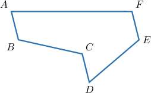
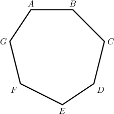
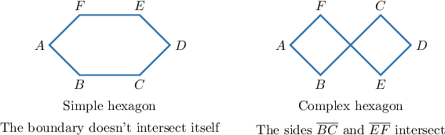
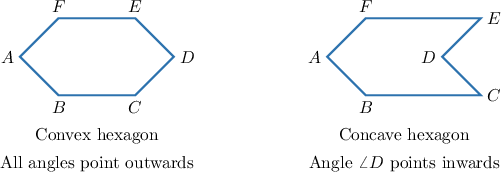
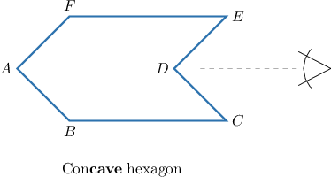
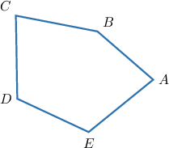
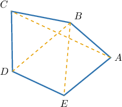
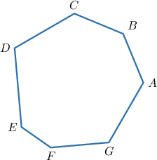
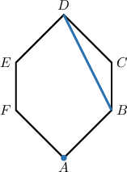

# Polygons

Source: https://www.mathacademy.com/topics/1317?courseId=37
Topic ID: 1317

## Prerequisites

- [Points, Lines, Rays, and Segments](../../../elementary-school/lessons/grade-4/1378-points-lines-rays-and-segments.md)

## Lesson

### Introduction

The shape below consists of $6$ line segments defined by the $6$ points $A$, $B$, $C$, $D$, $E$, and $F.$ These line segments form a loop.

A chain of straight line segments that form a loop is called a **polygon**.

The line segments are the **sides** of the polygon, and the endpoints of the sides are the **vertices**.

For this polygon:

- The $6$ vertices are $A$, $B$, $C$, $D$, $E$, and $F.$

- The $6$ sides are $\overline{AB}$, $\overline{BC}$, $\overline{CD}$, $\overline{DE}$, $\overline{EF}$, and $\overline{AF}.$

To denote a particular polygon, we start at one vertex and loop around the polygon, reading off the vertices in order. So, the polygon above can be denoted $ABCDEF.$

The singular form of the word *vertices* is **vertex**. So, $A$ is a vertex, $B$ is a vertex, etc.

### Naming Polygons

The name of a polygon is determined by the number of sides it has.

The polygon below has $6$ sides. A six-sided polygon is called a **hexagon**.

The names of the polygons with up to ten sides are given below:

### Example: Identifying a Polygon

#### Question

What type of polygon is the figure shown below?

#### Explanation

The given figure is a polygon with $7$ sides: $\overline{AB},\, \overline{BC},\, \overline{CD},\, \overline{DE},\, \overline{EF},\, \overline{FG},$ and $\overline{GA}.$

Because it has $7$ sides, it is a heptagon.

### Types of Polygons

We can categorize polygons in different ways.

A polygon is **simple** if its boundary does not intersect itself. Otherwise, the polygon is **complex**.

A polygon is **convex** if it has no angles pointing inwards. Otherwise, if the polygon has angles pointing inwards, we call it **concave**.

It might help to remember that a con**cave** polygon looks a bit like the entrance to a **cave** when viewed from the outside.

**Note**: A more technical way to define a convex polygon is to say that all of its *internal angles* are less than $180^\circ.$ If you're not sure what an internal angle is yet, don't worry! We'll learn more about the internal angles of a polygon in future lessons.

### Example: Determining the Type of a Polygon

#### Question

Is the polygon shown above (a) simple or complex, and (b) convex or concave?

#### Explanation

A polygon is **** if it has no internal angle larger than $180^\circ.$ In plain words, a convex polygon has no angles pointing inwards. Otherwise, the polygon is called ****.

A polygon is **** if its boundary does not intersect itself. Otherwise, the polygon is called ****.

In our case, the polygon is

- $\boxed{\color{blue}\text{simple}}$ since the boundary doesn't intersect itself, and

- $\boxed{\color{blue}\text{concave}}$ since it has an angle pointing inwards.

### The Parts of a Polygon

Consider the pentagon $ABCDE,$ shown below.

We have the following definitions:

- Two *sides* are **adjacent** (or **consecutive**) if they have a common vertex. For example, $\overline{BC}$ is adjacent to $\overline{AB}$ *and* ${\overline{CD}}.$

- Two *vertices* are **adjacent** if there is a side joining them. For example, the vertex $E$ is adjacent to the vertices $D$ and $A$.

- A **diagonal** is a line segment that joins two non-adjacent vertices. For example, ${{\overline{AC}}}, {{\overline{BD}}},$ and ${{\overline{BE}}}$ are diagonals of our pentagon.

### Example: Finding Adjacent Vertices and Sides

#### Question

Which vertex/vertices are adjacent to $A?$

#### Explanation

$A$ is the endpoint of the sides $\overline{AB}$ and $\overline{GA}.$ Therefore, the vertices $B$ and $G$ are adjacent to $A.$

### Example: Identifying Parts of a Polygon

#### Question

What are the elements $\overline{BD}$ and $A$ for the polygon below?

#### Explanation

The segment $\overline{BD}$ joins two non-adjacent vertices of the polygon. Therefore, $\overline{BD}$ is a diagonal.

The point $A$ is an endpoint of the sides $\overline{AB}$ and $\overline{FA}.$ Hence, $A$ is a vertex.
