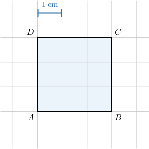
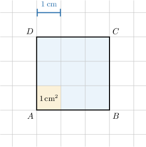
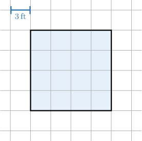
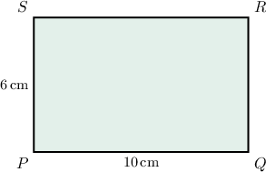
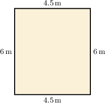
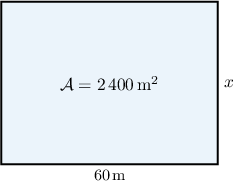

# Areas of Rectangles and Squares

Source: https://www.mathacademy.com/topics/1352?courseId=37
Topic ID: 1352

## Prerequisites

- [Properties of Rectangles and Squares](./1461-properties-of-rectangles-and-squares.md)
- [Squaring Rational Numbers](./2174-squaring-rational-numbers.md)
- [Units of Area and Volume](../../../elementary-school/lessons/grade-5/3872-units-of-area-and-volume.md)

## Lesson

### Introduction

The **area** of a shape is a measure of how much space is enclosed by a shape on a plane. Let's consider a square with sides of length of $1\,\text{in}.$

The area of this square is equal to ${\color{red}{1\,\text{in}^2}},$ which we say in words as "one square inch."

Similarly, if we have three squares with sides of length $1\,\text{cm},$ $1\,\text{m},$ and $1\,\text{ft}$ respectively, then their respective areas will be

$$

1\,\text{cm}^2, \qquad 1\,\text{m}^2, \qquad 1\,\text{ft}^2.

$$

### The Area of a Square

Let's now suppose that we would like to compute the area of the square $ABCD,$ shown below. Notice that, this time, the sides of the square span multiple unit lengths.

The length of one side of a grid square is equal to $1\,\text{cm}.$ So, the area of one grid square is $1\,\text{cm}^2.$

Now, we need to find how many grid squares are contained inside $ABCD.$

Inside the large blue square, there are $3$ rows containing $3$ grid squares each, so we can fit exactly $3 \times 3 = 3^2 = 9$ grid squares inside $ABCD.$

Each grid square has area $1\,\text{cm}^2,$ so the area $\mathcal A$ of $ABCD$ is

$$

\mathcal{A} = (3\,\text{cm})^2 = 9\,\text{cm}^2.

$$

In general, if we have a square with a side of length $a$, then the area of the square is given by

$$

\mathcal{A} = a^2.

$$

### Example: Calculating the Area of a Square From a Diagram

#### Question

What is the area of the square shown below?

#### Explanation

The area of a square with sides of length $a$ is given by

$$

\mathcal{A} = a^2.

$$

Note that each side of a grid cell measures $3\,\text{ft},$ and each side of the shaded square covers $4$ grid cells. So, the length of each side of the shaded square is

$$

a = 3 \times 4 = 12 \, \text{ft} .

$$

Therefore, the area of the shaded square is

$$

\begin{aligned}A & =𝑎^{2}=12^{2}=144\,ft^{2}.\end{aligned}

$$

### The Area of a Rectangle

In general, for a rectangle with sides of length $a$ and $b,$ the area of the rectangle is given by

$$

\mathcal{A} = a \cdot b.

$$

Let's demonstrate by finding the area of the rectangle $PQRS,$ shown below.

From the figure, we see that the rectangle has the following side lengths:

$$

a = {PQ} = 10\,\mathrm{cm}, \qquad b = {PS} = 6\,\mathrm{cm}.

$$

Therefore,

$$

\begin{aligned}A & =𝑎⋅𝑏 \\ & =10\,cm⋅6\,cm \\ & =60\,cm^{2}.\end{aligned}

$$

It does not matter which side we call $a$ and which side we call $b.$ In the above example, if we set

$$

a = {QR} = 6\,\mathrm{cm}, \qquad b = {RS} = 10\,\mathrm{cm},

$$

then we get

$$

\begin{aligned}A & =𝑎⋅𝑏 \\ & =10\,cm⋅6\,cm \\ & =60\,cm^{2},\end{aligned}

$$

as before.

### Example: Calculating the Area of a Rectangle From a Diagram

#### Question

A cinema has a rectangular hall whose dimensions are shown in the figure below. What is the area of the hall?

#### Explanation

The area of a rectangle is given by

$$

\mathcal{A} = a \cdot b,

$$

where $a$ and $b$ are the lengths of the sides.

From the figure, we obtain that

$$

a = 4.5\,\mathrm{m}, \qquad b = 6\,\mathrm{m}.

$$

Therefore, the area of the hall is

$$

\begin{aligned}A & =𝑎⋅𝑏=4.5⋅6=27\,m^{2}.\end{aligned}

$$

### Example: Calculating the Length of a Side of a Rectangle Given Another Side and Its Area

#### Question

The area of the rectangular field shown below is $2\,400\,\text{m}^2.$ What is the value of $x?$

#### Explanation

The area of a rectangle is given by

$$

\mathcal{A} = a \cdot b,

$$

where $a$ and $b$ are the lengths of the sides.

From the figure, we obtain that

$$

\mathcal{A} = 2\,400\mathrm{m}^2, \qquad a = 60\,\mathrm{m}, \qquad b=x .

$$

Therefore,

$$

\begin{aligned}A & =𝑎⋅𝑏 \\ 2\,400 & =60⋅𝑥 \\ 𝑥 & =\frac{2\,400}{60} \\ 𝑥 & =40\,m.\end{aligned}

$$

### Example: Calculating the Area of a Rectangle or a Square Given Its Perimeter

#### Question

Find the area of the rectangle $ABCD$ if its perimeter is $40$ and ${BC} = 12.$

#### Explanation

We can find the length of ${AB}$ by using the formula for the perimeter, as follows:

$$

\begin{aligned}𝑝 & =𝐴𝐵+𝐵𝐶+𝐶𝐷+𝐷𝐴 \\ 𝑝 & =2𝐴𝐵+2𝐵𝐶 \\ 40 & =2𝐴𝐵+2(12) \\ 40 & =2𝐴𝐵+24 \\ 2𝐴𝐵 & =16 \\ 𝐴𝐵 & =8\end{aligned}

$$

Therefore, the area of the rectangle $ABCD$ is

$$

\begin{aligned}A & =𝐴𝐵⋅𝐵𝐶 \\ & =8⋅12 \\ & =96.\end{aligned}

$$
