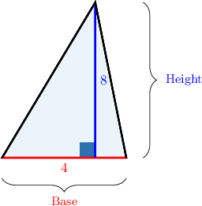
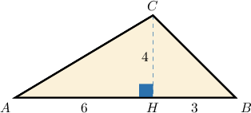
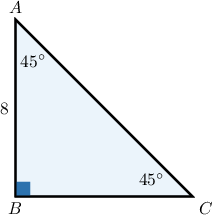
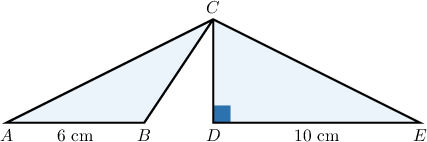
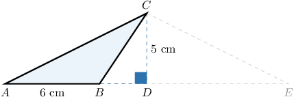
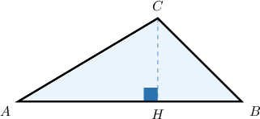
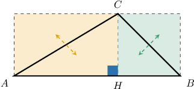

# Areas of Triangles

Source: https://www.mathacademy.com/topics/1397?courseId=37
Topic ID: 1397

## Prerequisites

- [Areas of Rectangles and Squares](./1352-areas-of-rectangles-and-squares.md)
- [Heights of Triangles](./1644-heights-of-triangles.md)

## Lesson

### Introduction

The **area of a triangle** can be computed using the formula

$$

\mathcal{A} = \dfrac{b \cdot h}{2},

$$

where $b$ is a *base* of the triangle and $h$ is the corresponding *height*.

To demonstrate, let's compute the area of the triangle with base $b = 4$ and the corresponding height is $h = 8,$ as shown below.

The area is

$$

\begin{aligned}A & =\frac{𝑏⋅ℎ}{2} \\ & =\frac{4⋅8}{2} \\ & =\frac{32}{2} \\ & =16.\end{aligned}

$$

**Note:** At the end of the lesson, we'll demonstrate where the formula comes from. But first, let's get some practice using it.

### Example: Calculating the Area of a Triangle

#### Question

Find the area of the triangle $\triangle ABC.$

#### Explanation

The formula for the area of the triangle is

$$

\mathcal{A} = \dfrac{b \cdot h}{2},

$$

where $b$ is a base and $h$ is the corresponding height.

From the diagram, we see that the base is

$$

\begin{aligned}𝑏 & =𝐴𝐵 \\ & =𝐴𝐻+𝐻𝐵 \\ & =6+3 \\ & =9\end{aligned}

$$

and the corresponding height is

$$

h={CH} = 4 .

$$

Therefore, the area is

$$

\begin{aligned}A & =\frac{𝑏⋅ℎ}{2} \\ & =\frac{9⋅4}{2} \\ & =\frac{36}{2} \\ & =18.\end{aligned}

$$

### Example: Calculating the Area of an Isosceles Right Triangle

#### Question

What is the area of the right triangle $ABC$ shown below?

#### Explanation

Since $m\angle{A}=m\angle{C},$ we have an isosceles triangle, where $AB=BC.$

Therefore, the area of the triangle is

$$

\begin{aligned}A & =\frac{1}{2}𝐴𝐵⋅𝐵𝐶 \\ & =\frac{1}{2}⋅8⋅8 \\ & =\frac{1}{2}⋅8^{2} \\ & =\frac{1}{2}⋅64 \\ & =32.\end{aligned}

$$

### Example: Finding the Base or the Height of a Triangle Given Its Area

#### Question

Consider the triangles $\triangle ABC$ and $\triangle CDE$ shown below. If the area of $\triangle CDE$ is $25 \text{cm}^2,$ find the area of $\triangle ABC.$

#### Explanation

Let's consider $\triangle CDE.$ We can see that $\overline{CD}$ is the height corresponding to the base $\overline{DE}$ and that $DE=10\text{cm}.$

Since the area of $\triangle CDE$ is $25\text{cm}^2,$ we get

$$

\begin{aligned}A & =\frac{𝑏⋅ℎ}{2} \\ 25 & =\frac{10⋅𝐶𝐷}{2} \\ 25 & =5⋅𝐶𝐷 \\ 𝐶𝐷 & =5 cm.\end{aligned}

$$

Now, notice that $\overline{CD}$ is also the height of $\triangle ABC$ corresponding to the base $\overline{AB}.$

Therefore, we find the area of $\triangle ABC$ as follows:

$$

\begin{aligned}A & =\frac{𝑏⋅ℎ}{2} \\ & =\frac{𝐴𝐵⋅𝐶𝐷}{2} \\ & =\frac{6⋅5}{2} \\ & =15 cm^{2}.\end{aligned}

$$

### Proof of the Formula

We know that the area formula for a triangle is

$$

\mathcal{A} = \dfrac{b \cdot h}{2},

$$

where $b$ is a base and $h$ is the corresponding height.

But where does this formula come from?

To understand where the formula comes from, consider $\triangle{ABC}$ below.

Let's draw a rectangle around $\triangle{ABC},$ as follows:

We have two pairs of right triangles with equal areas (each pair is indicated with arrows).

So, the area of $\triangle{ABC}$ is exactly half of the area of the rectangle. This gives

$$

\mathcal{A}_{ABC} = \dfrac{AB \cdot CH}{2}.

$$
