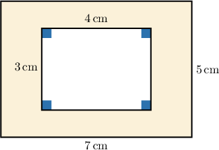
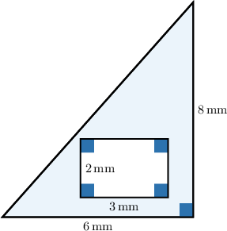
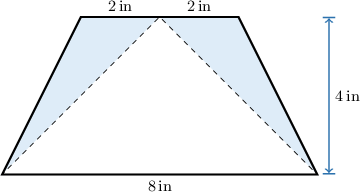
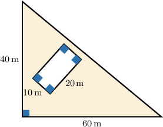
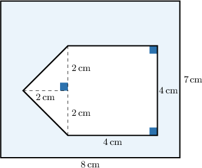

# The Area Between Two Shapes

Source: https://www.mathacademy.com/topics/1435?courseId=37
Topic ID: 1435

## Prerequisites

- [Areas of Parallelograms](./1399-areas-of-parallelograms.md)
- [Areas and Perimeters of Composite Shapes](./1468-areas-and-perimeters-of-composite-shapes.md)

## Lesson

### Introduction

In the picture below, we have a rectangle with a smaller rectangular hole. How can we find the area of the shaded region?

First, we must work out the areas of the outer and inner rectangles. Then, we subtract the area of the inner rectangle from the area of the outer rectangle.

The outer rectangle has sides of length $7\,\text{cm}$ and $5\,\text{cm}.$ So, its area is

$$

\mathcal{A}_{O} = 7 \cdot 5 =35\,\text{cm}^2.

$$

The inner rectangle has sides of length $4\,\text{in}$ and $3\,\text{in}.$ So, its area is

$$

\mathcal{A}_{I} = 4 \cdot 3 =12\,\text{cm}^2.

$$

Finally, the area of the shaded region is the difference between the areas of the outer and inner rectangles:

$$

\begin{aligned}A & =A_{𝑂}−A_{𝐼} \\ & =35−12 \\ & =23\,cm^{2}\end{aligned}

$$

### Example: Calculating the Area Between Two Shapes

#### Question

Find the area of the shaded region shown above.

#### Explanation

To find the area of the shaded region, we calculate the areas of the outer and inner shapes and then subtract the results.

The outer shape is a triangle with a base of $6\,\text{mm}$ and a height of $8\,\text{mm}.$ Therefore, its area is

$$

\mathcal{A}_{O} = \dfrac{6 \cdot 8}{2} = 24\,\text{mm}^2.

$$

The inner shape is a rectangle with sides of length $2\,\text{mm}$ and $3\,\text{mm}.$ Therefore, its area is

$$

\mathcal{A}_{I} = 2 \cdot 3 = 6\,\text{mm}^2.

$$

Finally, the area of the shaded shape is the difference between the areas of the outer and inner shapes:

$$

\begin{aligned}A & =A_{𝑂}−A_{𝐼} \\ & =24−6 \\ & =18\,mm^{2}\end{aligned}

$$

### Example: Calculating the Area Between Shapes When the Inner Shape Touches the Border of the Outer Shape

#### Question

What is the area of the shaded region shown below?

#### Explanation

To find the area of the shaded region, we calculate the areas of the outer and inner shapes and then subtract the results.

The outer shape is a trapezoid with bases of length $8\,\text{in}$ and $2+2=4\,\text{in}$, and a height of $4\,\text{in}.$ Therefore, its area is

$$

\mathcal{A}_{O} = \dfrac{(8+4) \cdot 4}{2} = 24\,\text{in}^2.

$$

The inner shape is a triangle with a base of $8\,\text{in}$ and a height of $4\,\text{in}.$ Therefore, its area is

$$

\mathcal{A}_{I} = \dfrac{8 \cdot 4}{2} = 16\,\text{in}^2.

$$

Finally, the area of the shaded shape is the difference between the areas of the outer and inner shapes:

$$

\begin{aligned}A & =A_{𝑂}−A_{𝐼} \\ & =24−16 \\ & =8\,in^{2}\end{aligned}

$$

### Example: Calculating the Area Between Two Shapes: Word Problems

#### Question

A farmer wants to grow corn in a triangular field around his rectangular house, as shown below. What is the total area that is available for growing corn?

#### Explanation

The area of the field that the farmer will use for planting corresponds to the shaded region.

To find the area of the shaded region, we calculate the areas of the outer and inner shapes and then subtract the results.

The outer shape is a triangle with base $60\,\text{m}$ and height $40\,\text{m}.$ So, the area is

$$

\mathcal{A}_{O} = \dfrac{60 \cdot 40}{2} =1\, 200\,\text{m}^2.

$$

The inner shape is the rectangle with sides $10\,\text{m}$ and $20\,\text{m}.$ So, the area is

$$

\mathcal{A}_{I} = 10 \cdot 20= 200\,\text{m}^2.

$$

Finally, the area of the shaded shape is the difference between the areas of the outer and inner shapes:

$$

\begin{aligned}A & =A_{𝑂}−A_{𝐼} \\ & =1\,200−200 \\ & =1\,000\,m^{2}\end{aligned}

$$

So, the total area available for growing corn is $1\,000\,\text{m}^2.$

### Example: Calculating the Area Between Outer and Inner Composite Shapes

#### Question

What is the area of the shaded region shown below?

#### Explanation

To find the area of the shaded region, we calculate the areas of the outer and inner shapes and then subtract the results.

The outer shape is a rectangle with sides of $8\,\text{cm}$ and $7\,\text{cm}.$ So, its area is

$$

\mathcal{A}_{O} = 8 \cdot 7 =56\, \text{cm}^2.

$$

The inner shape consists of two parts.

- The first part is the isosceles triangle (on the left) with a base of $2+2=4\,\text{cm}$ and a height of $2\,\text{cm}.$ So, its area is

- The second part is a square (on the right) with a side of length $4\,\text{cm}.$ So, its the corresponding is

Therefore, we obtain the inner area

$$

\begin{aligned}A_{𝐼} & =A_{𝐼_{1}}+A_{𝐼_{2}} \\ & =4+16 \\ & =20\,cm^{2}.\end{aligned}

$$

Finally, the area of the shaded shape is the difference between the areas of the outer and inner shapes:

$$

\begin{aligned}A & =A_{𝑂}−A_{𝐼} \\ & =56−20 \\ & =36\,cm^{2}\end{aligned}

$$
