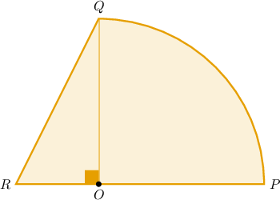
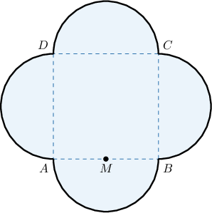
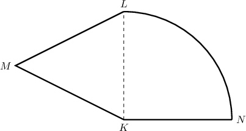
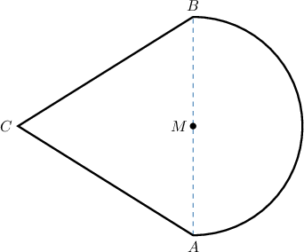
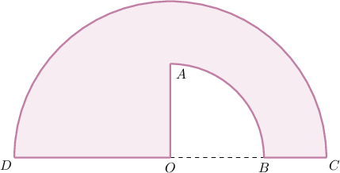
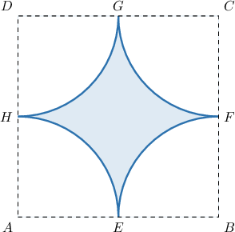

# Composite Shapes With Circles

Source: https://www.mathacademy.com/topics/1476?courseId=37
Topic ID: 1476

## Prerequisites

- [The Area Between Two Shapes](./1435-the-area-between-two-shapes.md)
- [Finding Areas and Perimeters of Part-Circles](./1648-finding-areas-and-perimeters-of-part-circles.md)

## Lesson

### Introduction

In this topic, we'll learn how to work with shapes that include parts of circles and polygons.

First, we consider finding the areas.

For example, the shape below consists of a right triangle and a quarter circle. Given that $OP = 6$ and $OR = 3$, let's find the total area of the given shape.

Notice that the radius of the circle is

$$

OP = OQ = 6.

$$

Now, we compute the areas of the parts:

- The area of the quarter circle is

- The area of the right triangle $\triangle ROQ$ is

Therefore, the area of the composite shape is

$$

\begin{aligned}A & =A_{𝑆}+A_{𝑇} \\ & ≈28.26+9 \\ & =37.26.\end{aligned}

$$

### Example: Determining the Area of a Composite Shape Containing Parts of Circles

#### Question

The shape above consists of a square and four semicircles. Given that $AB = 10$, find the total area of the given shape. Use the approximation $\pi \approx 3.14.$

#### Explanation

Notice that the radius of each semicircle is

$$

AM=\dfrac{AB}{2} = \dfrac{10}{2} = 5.

$$

Now, we compute the areas of the parts:

- The area of one semicircle is

- The area of the square $ABCD$ is

Therefore, the area of the composite shape is

$$

\begin{aligned}A & =4A_{𝑆}+A_{𝑅} \\ & ≈4⋅39.25+100 \\ & =157+100 \\ & =257.\end{aligned}

$$

### Perimeters of Composite Shapes

We can also find perimeters of composite shapes that involve parts of circles.

For example, the shape below consists of an equilateral triangle and a quarter of a circle.

Given that $KL=8\:\text{yd},$ find the perimeter of the shape.

Here, the perimeter consists of

- the segments $\overline{LM},$ $\overline{MK},$ and $\overline{KN},$ and

- a quarter of the circumference.

Since $\triangle KLM$ is an equilateral triangle, we have that $KL = LM = MK = 8 \: \text{yd}.$

Notice that the radius of the quarter circle is

$$

KL = KN = 8 \: \text{yd}.

$$

So, a quarter of the circumference is

$$

\begin{aligned}𝑝_{𝑆} & =\frac{1}{4}⋅2𝜋⋅𝐾𝐿 \\ & =\frac{1}{2}⋅𝜋⋅𝐾𝐿 \\ & ≈\frac{1}{2}⋅3.14⋅8 \\ & =3.14⋅4 \\ & =12.56\,yd.\end{aligned}

$$

Therefore, the perimeter of the composite shape is

$$

\begin{aligned}𝑝 & =𝐿𝑀+𝑀𝐾+𝐾𝑁+𝑝_{𝑆} \\ & ≈8+8+8+12.56 \\ & =36.56\,yd.\end{aligned}

$$

### Example: Determining the Perimeter of a Composite Shape Containing Parts of Circles

#### Question

The shape above consists of an equilateral triangle and a semicircle. Given that $AB = 10\:\text{m},$ find the perimeter of the shape. Use the approximation $\pi \approx 3.14.$

#### Explanation

The perimeter consists of

- the segments $\overline{AC}$ and $\overline{BC},$

- half of the circumference.

Since $\triangle ABC$ is an equilateral triangle, we have that $AC = BC = AB = 10 \: \text{m}.$

Notice that the radius of the semicircle is

$$

AM=\dfrac{AB}{2} = \dfrac{10}{2} = 5 \: \text{m}.

$$

So, half of the circumference is

$$

\begin{aligned}𝑝_{𝑆} & =\frac{1}{2}⋅2𝜋⋅𝐴𝑀 \\ & =𝜋⋅𝐴𝑀 \\ & ≈3.14⋅5 \\ & =15.70\,m.\end{aligned}

$$

Therefore, the perimeter of the composite shape is

$$

\begin{aligned}𝑝 & =𝐴𝐶+𝐵𝐶+𝑝_{𝑆} \\ & ≈10+10+15.70 \\ & =35.70\,m.\end{aligned}

$$

### Areas Between Shapes

Finally, we'll learn how to deal with areas between shapes involving circles.

Suppose a quarter circle is cut from a semicircle, as shown below. Let's calculate the area of the shaded region given that $OA=3$ and $OD=5.$

The area of the shaded shape is the area of the semicircle minus the area of the quarter circle.

- The radius of the semicircle is $OD=5.$ So, the area of the semicircle is

- The radius of the quarter circle is $OA=3.$ So, the area of the quarter circle is

Therefore, the area of the shaded shape is

$$

\begin{aligned}A & =A_{𝑆}−A_{𝑄} \\ & ≈39.25−7.065 \\ & =32.185.\end{aligned}

$$

### Example: Determining the Area Between Two Shapes Involving Parts of Circles

#### Question

Suppose four quarter circles are cut from a square, as shown above. Calculate the area of the shaded region given that $AB=6.$ Use the approximation $\pi \approx 3.14.$

#### Explanation

The area of the shaded shape is the area of the square minus the area of the four quarter circles.

- The side of the square is $AB=6.$ So, the area of the square is

- The radius of a quarter circle is So, the area of the quarter circle is

Therefore, the area of the shaded shape is

$$

\begin{aligned}A & =A_{𝑆}−4⋅A_{𝑄} \\ & ≈36−4⋅7.065 \\ & =36−28.26 \\ & =7.74.\end{aligned}

$$
