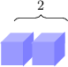
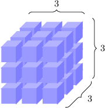
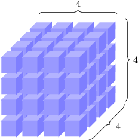

# Cubing Rational Numbers

Source: https://www.mathacademy.com/topics/2195?courseId=37
Topic ID: 2195

## Prerequisites

- [Squaring Rational Numbers](./2174-squaring-rational-numbers.md)

## Lesson

### Introduction

To **cube** a number means to multiply that number by itself and then multiply the result by the original number once more.

For example, to "cube $2$", we need to multiply $2$ by $2$ to make $4,$ and then multiply this result by $2$ once more. We write the "cube of $2$" as $2^3,$ so we have

$$

2^3 = \underbrace{2\cdot 2}_{\large 4} \cdot 2 = 4 \cdot 2 = 8.

$$

We would then say that "the cube of $2$ is $8$". We could also say "$2$ cubed equals $8$".

The number ${\color{blue}3}$ in the expression $2^{\color{blue}3}$ is called the power (or exponent).

The act of cubing a number can be represented geometrically. For example, let's start by representing the number $2$ with the following collection of two items:

Then we can picture $2^3$ by creating a bigger shape (called a **cube**) with length, width and height all equal to $2\mathbin{:}$

There are $8$ items in total in our big cube (one little cube is hiding behind the others), indicating that $2^3=8.$

Clearly, $1^3=1\cdot1\cdot1={\color{blue}1}.$ The next few first basic cubes are shown below:

The cubes of our usual counting numbers are called **cube numbers** or **perfect cubes**. We can write them as follows:

$$

1^3, 2^3, 3^3, 4^3, 5^3, 6^3, \ldots \qquad \text{or} \qquad {\color{blue}1}, {\color{blue}8}, {\color{blue}27}, {\color{blue}64}, {\color{blue}125}, {\color{blue}216}, \ldots

$$

### Example: Calculating the Cube of a Number

#### Question

What is the value of $70^3?$

#### Explanation

To work out $70^3,$ we multiply $70$ by itself and then multiply the result by $70$ once more:

$$

\begin{aligned}70^{3} & =70⋅70⋅70 & \\ & =4\,900⋅70 & \\ & =343\,000 & \end{aligned}

$$

### The Cube of a Negative Number

Cubing a negative number *always* results in another negative number.

This is because a negative times a negative gives a positive value, and then a positive times a negative is a negative again:

$$

\begin{aligned}(−)\,⋅\,(−)\,⋅\,(−)\,=\,\underset{(+)}{\underset{}{(−)\,⋅\,(−)}}\,⋅\,(−)\,=\,(+)\,⋅\,(−)\,=\,(−)\end{aligned}

$$

For example,

$$

({\color{red}-5})^3 = \underbrace{({\color{red}-5}) \cdot ({\color{red}-5})}_{\large {\color{blue}25}} \cdot ({\color{red}-5}) = {\color{blue}25} \cdot ({\color{red}-5}) = {\color{red}-125}.

$$

### Example: Calculating the Cube of a Negative Number

#### Question

Calculate the value of $\left(-13\right)^3.$

#### Explanation

To work out $\left(-13\right)^3,$ we multiply $-13$ by itself and then multiply the result by $-13$ again:

$$

\begin{aligned}(−13)^{3} & =\overset{\overset{(−13)⋅(−13)}{}}{169}⋅(−13) \\ & =169⋅(−13) \\ & =−2\,197\end{aligned}

$$

### Example: Calculating the Cube of a Fraction

#### Question

Find the value of $\dfrac{3}{5}$ cubed.

#### Explanation

To work out $\left(\dfrac{3}{5}\right)^3,$ we multiply $\dfrac{3}{5}$ by itself and then multiply the result by $\dfrac{3}{5}$ again:

$$

\begin{aligned}(\frac{3}{5})^{3} & =\frac{3}{5}⋅\frac{3}{5}⋅\frac{3}{5} \\ & =\frac{3⋅3⋅3}{5⋅5⋅5} \\ & =\frac{27}{125}\end{aligned}

$$

### Example: Calculating the Cube of a Decimal

#### Question

What is the cube of $(-0.5)?$

#### Explanation

To work out $\left(-0.5\right)^3,$ we multiply $-0.5$ by itself and then multiply the result by $-0.5$ once more:

$$

\begin{aligned}(−0.5)^{3} & =\overset{\overset{(−0.5)⋅(−0.5)}{}}{0.25}⋅(−0.5) \\ & =0.25⋅(−0.5) \\ & =−0.125\end{aligned}

$$
