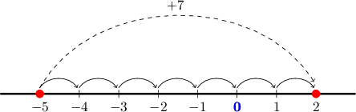
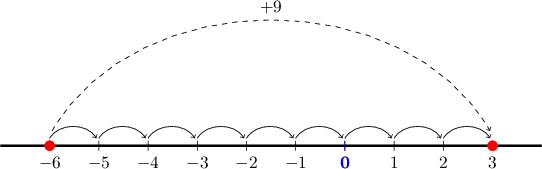
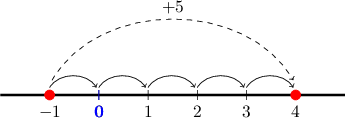
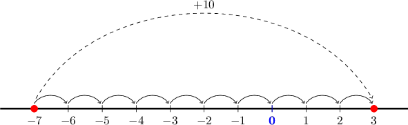

# Adding a Positive Number to a Negative Number

Source: https://www.mathacademy.com/topics/329?courseId=37
Topic ID: 329

## Prerequisites

- [Subtracting a Positive Fraction From a Smaller Fraction](./3679-subtracting-a-positive-fraction-from-a-smaller-fraction.md)
- [Subtracting a Positive Decimal From a Smaller Decimal](./3680-subtracting-a-positive-decimal-from-a-smaller-decimal.md)

## Lesson

### Introduction

There are two ways to add a positive number to a negative number. Let's work out the value of $-5+7$ using both methods.

**Method 1 - Picturing a Number Line**

When we add, we move to the right on the number line.

So, to add $7$ to $-5,$ we start at $-5$ on a number line and move $7$ spaces to the right.

When we do this, we land at $2.$ Therefore, $-5+7 =2.$

**Method 2 - Subtraction in Reverse**

Adding a positive number to a negative number is like *subtraction in reverse*. To turn the addition into a subtraction, we must switch the numbers around.

So, to work out ${\color{red}{-5}} + {\color{blue}{7}},$ we can switch the numbers around to get $\,{\color{blue}{7}} {\color{red}{\,-\,5}} =2.$

We're allowed to swap the numbers because addition is **commutative**, which means the order in which we add two numbers does not matter.

### Example: Adding a Positive Number to a Negative Number

#### Question

What is the value of $-6 + 9?$

#### Explanation

****

To add $9$ to $-6,$ we start at $-6$ on a number line and move $9$ spaces to the right.

We end up at $3.$ So, $-6+9=3.$

****

We can swap the order of the numbers and then compute the resulting subtraction:

$$

-6+9 = 9-6 = 3

$$

### Example: Adding a Positive Decimal to a Negative Decimal

#### Question

What is $-3.5 + 6.5?$

#### Explanation

We can swap the order of the numbers and then compute the resulting subtraction:

$$

-3.5 + 6.5 = 6.5 - 3.5 = 3

$$

### Adding a Positive Fraction to a Negative Fraction

Suppose that we want to calculate $-\dfrac 1 3 + \dfrac 5 3.$

Since both fractions have a common denominator of $3,$ we can combine them to form one fraction:

$$

-\dfrac{1}{3} + \dfrac{5}{3} =\dfrac{-1+5}{3}

$$

To compute the numerator, we can use either method that we've learned.

**Method 1 - Picturing a Number Line**

To add $5$ to $-1,$ we start at $-1$ on a number line and move $5$ spaces to the right.

We end up at $4.$ So $-1+5=4,$ and therefore

$$

\dfrac{-1+5}{3} = \dfrac{4}{3}.

$$

**Method 2 - Subtraction in Reverse**

We can swap the order of the numbers in the numerator and then compute the resulting subtraction:

$$

\begin{aligned}\frac{−1+5}{3}=\frac{5−1}{3}=\frac{4}{3}\end{aligned}

$$

So, we conclude that $-\dfrac1 3 + \dfrac 5 3 = \dfrac{4}{3}.$

**Note:** If two fractions have different denominators, we need to put them over a common denominator *first* and *then* subtract!

### Example: Adding a Positive Fraction to a Negative Fraction

#### Question

Find the value of $-\dfrac{7}{6} + \dfrac{5}{3}.$

#### Explanation

We put both fractions over a common denominator of $6$ and then add the numerators. This gives

$$

-\dfrac{7}{6} + \dfrac{5}{3} = -\dfrac{7}{6} + \dfrac{10}{6} = \dfrac{-7+10}{6}.

$$

To compute the numerator, we can use either Method 1 or Method 2, shown below.

****

To add $10$ to $-7,$ we start at $-7$ on a number line and move $10$ spaces to the right.

So, $-7 + 10 = 3.$ Therefore,

$$

\dfrac{-7 + 10}{6} = \dfrac{3}{6} = \dfrac{1}{2}.

$$

****

We can swap the order of the numbers in the numerator, and we get

$$

\dfrac{-7 + 10}{6} = \dfrac{10 - 7}{6} = \dfrac{3}{6} = \dfrac{1}{2}.

$$

So, we conclude that $-\dfrac{7}{6} + \dfrac{5}{3} = \dfrac{1}{2}.$
