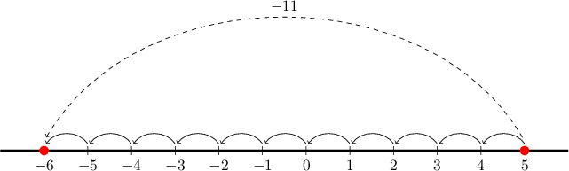
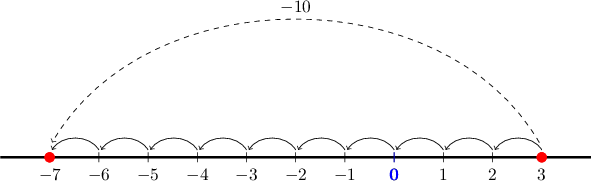
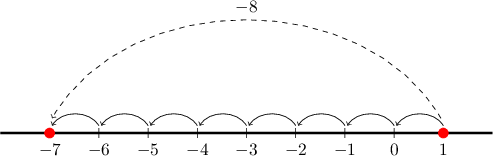

# Subtracting a Positive Fraction From a Smaller Fraction

Source: https://www.mathacademy.com/topics/3679?courseId=37
Topic ID: 3679

## Prerequisites

- [Subtracting a Positive Number From a Smaller Positive Number](./327-subtracting-a-positive-number-from-a-smaller-positive-number.md)
- [Subtracting Mixed Numbers With Unlike Denominators Using Improper Fractions](../../../elementary-school/lessons/grade-5/525-subtracting-mixed-numbers-with-unlike-denominators-using-improper-fractions.md)
- [Subtracting a Positive Number From a Negative Number](./3720-subtracting-a-positive-number-from-a-negative-number.md)

## Lesson

### Introduction

How can we subtract fractions, like $\dfrac{2}{4} - \dfrac{5}{4}?$

Since both fractions have the same denominator ($4$), we can combine them into one fraction.

$$

\begin{aligned}\frac{2}{4}−\frac{5}{4} & =\frac{2−5}{4}\end{aligned}

$$

Now, we work out $2-5$ using our number line:

We get $2-5=-3,$ and therefore

$$

\begin{aligned}\frac{2−5}{4}=\frac{−3}{4}=−\frac{3}{4}.\end{aligned}

$$

**Note:** If two fractions have different denominators, we need to put them over a common denominator *first* and *then* subtract!

### Example: Subtracting a Positive Fraction From a Fraction

#### Question

Find the value of $\dfrac{5}{12} - \dfrac{11}{12}.$

#### Explanation

Since both fractions have the same denominators, we can combine them into one fraction, which gives

$$

\dfrac{5}{12} - \dfrac{11}{12} = \dfrac{5 - 11}{12}.

$$

Now, we work out $5 - 11$ using a number line:

So, we get

$$

\dfrac{5 - 11}{12} = \dfrac{-6}{12} = -\dfrac{6}{12}.

$$

Finally, we simplify:

$$

-\dfrac{6}{12} = -\dfrac{6 \div 6}{12 \div 6} = -\dfrac{1}{2}

$$

Therefore, we conclude that

$$

\dfrac{5}{12} - \dfrac{11}{12} = -\dfrac{1}{2}.

$$

### Example: Subtracting a Positive Fraction From a Fraction: Unlike Denominators

#### Question

Calculate the value of $\dfrac{1}{3} - \dfrac{5}{6}.$

#### Explanation

We write $\dfrac{1}{3}$ as $\dfrac{2}{6}$ and then we simply subtract the numerators. This gives

$$

\dfrac{2}{6} - \dfrac{5}{6} = \dfrac{2 - 5}{6}.

$$

Now, we work out $2 - 5$ using a number line:

So we get

$$

\dfrac{2 - 5}{6} = \dfrac{-3}{6} = -\dfrac{3}{6}.

$$

Finally, we simplify:

$$

-\dfrac{3}{6} = -\dfrac{3 \div 3}{6 \div 3} =-\dfrac{1}{2}

$$

Therefore, we conclude that

$$

\dfrac{1}{3} - \dfrac{5}{6} = -\dfrac{1}{2}.

$$

### Example: Subtracting a Positive Fraction From a Fraction: Unlike Denominators That Are Not Multiples

#### Question

Calculate the value of $\dfrac{1}{4} - \dfrac{5}{6}.$

#### Explanation

We write $\dfrac{1}{4}$ as $\dfrac{3}{12}$ and $\dfrac{5}{6}$ as $\dfrac{10}{12},$ and then we simply subtract the numerators. This gives

$$

\dfrac{3}{12} - \dfrac{10}{12} = \dfrac{3 - 10}{12}.

$$

Now, we work out $3 - 10$ using a number line:

So, we get

$$

\dfrac{3 - 10}{12} = \dfrac{-7}{12} = -\dfrac{7}{12}.

$$

### Example: Subtracting a Positive Fraction From a Fraction: Mixed Numbers

#### Question

Find the value of $\dfrac{1}{3} - 2\,\dfrac{2}{3}.$

#### Explanation

First, we write $2 \, \dfrac{2}{3}$ as an improper fraction:

$$

2 \,\dfrac{2}{3} = \dfrac{(2 \times 3) + 2}{3} = \dfrac{8}{3}

$$

Since both fractions have the same denominators, we can combine them into one fraction, which gives

$$

\dfrac{1}{3} - \dfrac{8}{3} = \dfrac{1 - 8}{3}.

$$

Now, we work out $1 - 8$ using a number line:

So, we get

$$

\dfrac{1 - 8}{3} = \dfrac{-7}{3} = -\dfrac{7}{3}.

$$

Finally, we write the resulting improper fraction as a mixed number:

$$

-\dfrac{7}{3} = -2 \, \dfrac{1}{3}

$$
