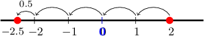
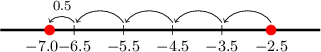

# Subtracting a Positive Decimal From a Smaller Decimal

Source: https://www.mathacademy.com/topics/3680?courseId=37
Topic ID: 3680

## Prerequisites

- [Subtracting a Positive Number From a Smaller Positive Number](./327-subtracting-a-positive-number-from-a-smaller-positive-number.md)
- [Subtraction With Unequal Numbers of Decimals](../../../elementary-school/lessons/grade-5/2340-subtraction-with-unequal-numbers-of-decimals.md)
- [Subtracting a Positive Number From a Negative Number](./3720-subtracting-a-positive-number-from-a-negative-number.md)

## Lesson

### Introduction

Suppose we want to solve the following subtraction problem:

$$

2 - 4.5

$$

We can solve this problem using a number line.

To subtract $4.5$ from $2,$ we break up $4.5$ into its whole number part ($4$) and its decimal part ($0.5$) and proceed in two steps.

- First, we subtract the whole number part. We start at $2$ on the number line and move $4$ places to the left, which brings us to $-2.$

- Then, we subtract the decimal part. We move the remaining $0.5$ places to the left, leaving us at $-2.5.$

Therefore, we conclude that

$$

2 - 4.5 = -2.5.

$$

### Example: Subtracting Positive Decimals From Decimals With Halves

#### Question

What is $-2.5 - 4.5?$

#### Explanation

To subtract $4.5$ from $-2.5,$ we break up $4.5$ into its whole number part ($4$) and its decimal part ($0.5$) and proceed in two steps.

- First, we subtract the whole number part. We start at $-2.5$ on the number line and move $4$ places to the left, which brings us to $-6.5.$

- Then, we subtract the decimal part. We move the remaining $0.5$ places to the left, leaving us at $-7.$

This gives $-2.5 - 4.5 = -7.0.$

### Subtracting Positive Decimals From Positive Decimals

We can use the same methods that we learned to subtract whole numbers in more complicated situations.

As an example, let's consider the following problem:

$$

{\color{red}{3.5}} - {\color{blue}{9.8}}

$$

We're subtracting a *positive* decimal from a smaller *positive* decimal. So the final answer must be negative.

We start by solving the following easier problem, which is to carry out the subtraction *in the reverse order*:

$$

{\color{blue}{9.8}} - {\color{red}{3.5}} = 6.3

$$

However, since our final answer must be negative, we conclude that

$$

{\color{red}{3.5}} - {\color{blue}{9.8}} = -6.3

$$

### Subtracting Positive Decimals From Negative Decimals

Now suppose we have the following problem:

$$

-3.2 - 6.4

$$

In this case, we're subtracting a *positive* decimal from a *negative* decimal. So the final answer must be negative.

We start by solving the following easier problem, which is to *add their absolute values*:

$$

3.2+6.4 = 9.6

$$

However, since our final answer must be negative, we conclude that

$$

-3.2 - 6.4 = -9.6

$$

**Remember**

- When we subtract a *positive* number from a smaller *positive* number, we carry out the subtraction *in the reverse order* and then make the final answer negative.

- When we subtract a *positive* number from a *negative* number, we *add their absolute values* and then make the final answer negative.

### Example: Subtracting Positive Decimals From Decimals

#### Question

What is the value of $4.6-7.7?$

#### Explanation

Since $7.7$ is larger than $4.6,$ the answer will be negative.

We start by solving an easier problem, which is to carry out the subtraction in the reverse order:

$$

7.7 - 4.6 = 3.1

$$

However, since our answer must be negative, we need to change the sign of the answer above.

Therefore, we conclude that

$$

4.6-7.7 = -3.1

$$

### Example: Subtracting Positive Decimals From Decimals With Unequal Numbers of Decimals

#### Question

What is the value of $-1.25-3.3?$

#### Explanation

Since $3.3$ is larger than $1.25,$ the answer will be negative.

We start by solving an easier problem, which is to add their absolute values:

$$

1.25+3.3 = 4.55

$$

However, since our answer must be negative, we need to change the sign of the answer above.

Therefore, we conclude that

$$

-1.25-3.3 = -4.55

$$
