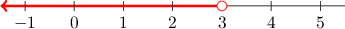

# Solving One-Step Linear Inequalities

Source: https://www.mathacademy.com/topics/38?courseId=37
Topic ID: 38

## Prerequisites

- [Solving One-Step Multiplication and Division Equations](./40-solving-one-step-multiplication-and-division-equations.md)
- [Solving One-Step Addition and Subtraction Equations](./65-solving-one-step-addition-and-subtraction-equations.md)
- [Verifying Solutions of Linear Inequalities](./387-verifying-solutions-of-linear-inequalities.md)

## Lesson

### Introduction

Let's consider the following inequality:

$$

x + 4 < 7

$$

To **solve** this inequality, we need to isolate the variable $x$ on one side.

Inequalities are just like equations because they can be solved using the addition and multiplication principles.

So, to solve this inequality, we subtract $4$ from both sides:

$$

\begin{aligned}𝑥+4 & <7 \\ 𝑥+4−4 & <7−4 \\ 𝑥 & <3\end{aligned}

$$

The solution is $x < 3.$ This tells us that any value of $x$ smaller than $3$ satisfies the original inequality.

We can represent the solution to this inequality using a number line as follows:

Let's take a look at an inequality that we can solve using the multiplication principle.

### Example: Solving a One-Step Inequality

#### Question

What is the solution to $7z \lt -21?$

#### Explanation

The variable $z$ is being ** by $7.$ To isolate $z$, we perform the ** operation, which is ** by $7.$ Remember to perform the same operation on both sides.

$$

\begin{aligned}7𝑧 & <−21 \\ \frac{7𝑧}{7} & <\frac{−21}{7} \\ \frac{7𝑧}{7} & <−3\end{aligned}

$$

Now, we can cancel a common factor of $7$ from the numerator and denominator.

$$

\begin{aligned}\frac{7𝑧}{7} & <−3 \\ \frac{7𝑧}{7} & <−3 \\ 𝑧 & <−3\end{aligned}

$$

Therefore, the solution is $z \lt -3.$

### Multiplying or Dividing an Inequality by a Negative Number

We've seen that solving linear inequalities is similar to solving linear equations.

However, there is one additional rule that we need to remember when solving inequalities:

*When multiplying or dividing both sides by a ****, we flip the inequality sign.*

When we "flip the inequality sign," we switch the direction of the inequality symbol. For example:

- "$\color{blue}<$" becomes "$\color{red}>$" and vice versa

- "$\color{blue}\leq$" becomes "$\color{red}\geq$" and vice versa

To illustrate, consider the following inequality:

$$

- 3x \gt 9

$$

We can solve this inequality using the multiplication principle. However, when we divide both sides by $-3,$ we have to flip the inequality sign.

$$

\begin{aligned}−3𝑥\,\, & >\,\,9 \\ \frac{−3𝑥}{−3}\,\, & <\,\,\frac{9}{−3} \\ \frac{−3𝑥}{−3}\,\, & <\,\,−3 \\ \frac{−3𝑥}{−3}\,\, & <\,\,−3 \\ 𝑥\,\, & <\,\,−3\end{aligned}

$$

Therefore, the solution is $x \lt -3.$

We'll discuss why we need to flip the inequality sign at the end of the lesson. But for now, let's get some practice at applying this idea.

### Example: Solving a One-Step Inequality When Flipping Is Required

#### Question

Solve the inequality $-6x \leq -7.$

#### Explanation

The variable $x$ is being ** by $-6.$ To isolate $x,$ we perform the ** operation, which is ** by $-6.$ Remember to perform the same operation on both sides.

Also, when multiplying or dividing an inequality by a negative number, we need to flip the inequality sign:

$$

\begin{aligned}−6𝑥\,\, & ≤\,\,−7 \\ \frac{−6𝑥}{−6}\,\, & ≥\,\,\frac{−7}{−6} \\ \frac{−6𝑥}{−6}\,\, & ≥\,\,\frac{7}{6}\end{aligned}

$$

Now, we can cancel a common factor of $-6$ from both the numerator and denominator.

$$

\begin{aligned}\frac{−6𝑥}{−6} & ≥\frac{7}{6} \\ \frac{−6𝑥}{−6} & ≥\frac{7}{6} \\ 𝑥 & ≥\frac{7}{6}\end{aligned}

$$

Therefore, the solution is $x \geq \dfrac{7}{6}.$

### Example: Solving a One-Step Inequality With Fractions When Flipping Is Required

#### Question

Solve the inequality $-\dfrac{y}{8} \leq -4.$

#### Explanation

The variable $y$ is being ** by $8.$ To isolate $y$ and remove the negative sign, we ** by $-8.$

Remember, when multiplying or dividing an inequality by a negative number, we need to flip the inequality sign:

$$

\begin{aligned}−\frac{𝑦}{8}\,\, & ≤\,\,−4 \\ (−8)⋅(−\frac{𝑦}{8})\,\, & ≥\,\,(−8)⋅(−4) \\ (−8)⋅(−\frac{𝑦}{8})\,\, & ≥\,\,32\end{aligned}

$$

Since two negative numbers multiply to give a positive number, we first cancel the negatives:

$$

\begin{aligned}(−8)⋅(−\frac{𝑦}{8}) & ≥32 \\ (−8)⋅(−\frac{𝑦}{8}) & ≥32 \\ 8⋅\frac{𝑦}{8} & ≥32\end{aligned}

$$

Now, we can cancel a common factor of $8$ from both the numerator and denominator.

$$

\begin{aligned}8⋅\frac{𝑦}{8} & ≥32 \\ \frac{8𝑦}{8} & ≥32 \\ \frac{8𝑦}{8} & ≥32 \\ 𝑦 & ≥32\end{aligned}

$$

Therefore, the solution is $y \geq 32.$

### Example: Solving an Inequality and Adjusting the Final Result

#### Question

Solve the inequality $-9 \leq -3z.$

#### Explanation

The variable $z$ is being ** by $-3.$ To isolate $z,$ we can perform the ** operation, which is ** by $-3.$ Remember to perform the same operation on both sides.

Also, when multiplying or dividing an inequality by a negative number, we need to flip the inequality sign:

$$

\begin{aligned}−9\,\, & ≤\,\,−3𝑧 \\ \frac{−9}{−3}\,\, & ≥\,\,\frac{−3𝑧}{−3} \\ 3\,\, & ≥\,\,\frac{−3𝑧}{−3}\end{aligned}

$$

Now, we can cancel the common factor $-3$ from both the numerator and denominator.

$$

\begin{aligned}3 & ≥\frac{−3𝑧}{−3} \\ 3 & ≥\frac{−3𝑧}{−3} \\ 3 & ≥𝑧\end{aligned}

$$

Finally, we rewrite the inequality with the variable on the left-hand side:

$$

z \leq 3

$$

Therefore, the solution is $z \leq 3.$

### Why We Flip the Inequality Sign

We'll now learn why we must flip the inequality sign when multiplying or dividing an inequality by a negative number.

To help us, let's consider the following inequality:

$$

6 > 0

$$

This is a true statement, and it remains true if we multiply or divide both sides by a positive number.

For example:

- Multiplying the inequality by $2$ gives $12 > 0,$ which is *true*.$\quad{\color{green}{\checkmark}}$

- Dividing the inequality by $2$ gives $3 > 0,$ which is also *true*. $\quad{\color{green}{\checkmark}}$

However, if we multiply or divide both sides by a negative number, *without* flipping the inequality sign, we get a false statement.

For example:

- Multiplying the inequality by $-2$ *without flipping the inequality sign* gives $-12 > 0,$ which is *false*. $\quad{\color{red}{\times}}$

- Dividing the inequality by $-2$ *without flipping the inequality sign* gives $-3 > 0,$ which is also *false*. $\quad{\color{red}{\times}}$

So, whenever we multiply or divide by a negative number, we need to flip the sign of the inequality for it to remain true.

- Multiplying the inequality by $-2$ *and flipping the inequality sign* gives $-12 < 0,$ which is *true*. $\quad{\color{green}{\checkmark}}$

- Dividing the inequality by $-2$ *and flipping the sign* gives $-3 < 0,$ which is also *true*. $\quad{\color{green}{\checkmark}}$
