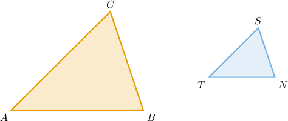
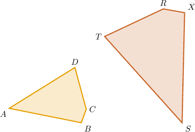
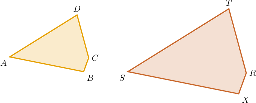
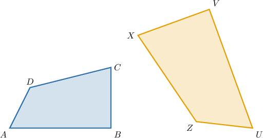
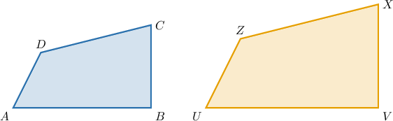
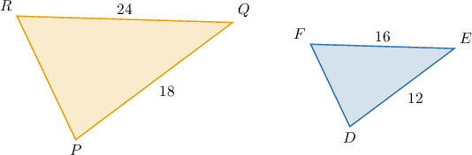
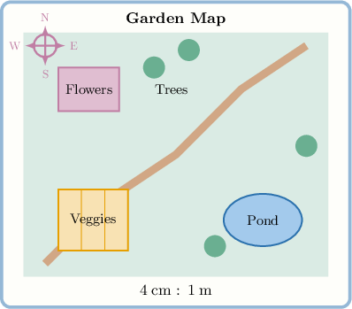

# Introduction to Scale Drawings

Source: https://www.mathacademy.com/topics/509?courseId=37
Topic ID: 509

## Prerequisites

- [Converting Metric Units of Length to Smaller Units](../../../elementary-school/lessons/grade-4/2427-converting-metric-units-of-length-to-smaller-units.md)
- [Solving Unit Rate Problems Using Ratios of Mixed Numbers](./3578-solving-unit-rate-problems-using-ratios-of-mixed-numbers.md)
- [Rectangles, Rhombuses, and Squares](../../../elementary-school/lessons/grade-5/3751-rectangles-rhombuses-and-squares.md)
- [Converting Customary Units of Length to Smaller Units](../../../elementary-school/lessons/grade-4/3994-converting-customary-units-of-length-to-smaller-units.md)

## Lesson

### Introduction

A **scaling** changes the size of a figure by multiplying all lengths by the same number.

Scale drawings are useful because they let us represent large or small real objects at a convenient size while keeping the same shape. To understand scale drawings, we first need to identify which parts of one figure match the parts of its scaled copy.

For example, consider the figure below, where the triangle on the right is a scaled (shrunk) copy of the triangle on the left.

This means each vertex in the left triangle has a corresponding vertex in the right triangle.

From the diagram, we can match the corresponding vertices:

- $A$ corresponds to $T$

- $B$ corresponds to $N$

- $C$ corresponds to $S$

Let's see more examples.

### Example: Identifying Corresponding Points and Sides

#### Question

The polygon on the right is a scaled copy of the polygon on the left. Which side in the right polygon corresponds to side in the left polygon?

#### Explanation

The polygon on the right is a scaled copy of the polygon on the left. This means each vertex in the left polygon has a corresponding vertex in the right polygon.

From the diagram, we can match the corresponding vertices:

- corresponds to

- corresponds to

- corresponds to

- corresponds to

Now, consider side in the left polygon. This side connects points and

In the scaled polygon, the corresponding points are (for) and (for).

Therefore, the side in the right polygon that corresponds to is

### Scaling With Changed Orientation

Sometimes, *scaled* copies may appear to be turned or rotated compared to the original figure.

Even though the orientation changes, the two figures still represent the same shape. Each vertex and side in the original polygon still has a *corresponding vertex* and *side* in the scaled copy.

For example, suppose the polygon on the right is a scaled copy of the polygon on the left.

To identify corresponding vertices more easily, we can imagine rotating or repositioning the second polygon so that it has the same orientation as the first one. Once the shapes are aligned this way, the matching vertices and sides become easier to see.

From the diagram, we can match the corresponding vertices:

- $A$ corresponds to $S$

- $B$ corresponds to $X$

- $C$ corresponds to $R$

- $D$ corresponds to $T$

### Example: Identifying Corresponding Elements for Shapes With Different Orientations

#### Question

The polygon on the right is a scaled copy of the polygon on the left. Which side in the right polygon corresponds to side $\overline{AB}$ in the left polygon?

#### Explanation

The polygon on the right is a ** of the polygon on the left. This means each vertex in the left polygon has a ** in the right polygon.

First, we redraw the second polygon so that it has the same orientation as the first one.

From the diagram, we can match the corresponding vertices:

- $A$ corresponds to $U$

- $B$ corresponds to $V$

- $C$ corresponds to $X$

- $D$ corresponds to $Z$

Now, consider side $\overline{AB}$ in the left polygon. This side connects points $A$ and $B.$

In the scaled polygon, the corresponding points are $U$ (for $A$) and $V$ (for $B$).

Therefore, the side in the right polygon that corresponds to $\overline{AB}$ is

$$

\overline{UV}.

$$

### Scale Factor

When a figure is scaled, every length in the figure is multiplied by the same number. This number is called the **scale factor**.

The scale factor tells us how much larger or smaller the scaled copy is compared to the original figure.

If two polygons are scaled copies, then all pairs of corresponding side lengths have the same ratio.

To find the scale factor, we compare the length of a side in the scaled copy with the length of the corresponding side in the original figure.

$$

\text{Scale Factor} = \frac{\text{Length in Scaled Copy}}{\text{Length in Original Figure}}.

$$

This ratio will be the same for every pair of corresponding sides.

Let's see some examples.

### Example: Identifying the Scale Factor

#### Question

The triangle on the right is a scaled copy of the triangle on the left. What is the scale factor from the left triangle to the right triangle?

#### Explanation

The triangle on the right is a ** of the triangle on the left. This means that corresponding side lengths are multiplied by the same **.

To find the scale factor, we compare a pair of corresponding sides. From the diagram:

- Side $\overline{RQ}$ in the left triangle has length $24.$

- The corresponding side $\overline{FE}$ in the right triangle has length $16.$

Therefore, the scale factor is

$$

\begin{aligned}Scale Factor & =\frac{𝐹𝐸}{𝑅𝑄} \\ & =\frac{16}{24} \\ & =\frac{16÷8}{24÷8} \\ & =\frac{2}{3}.\end{aligned}

$$

### Scale Factor on Maps

Scale drawings are often used in real-world situations such as maps, blueprints, and models.

In these situations, the scale tells us how a length in the drawing compares to a length in real life.

To find the *scale factor*, we compare the drawing length to the real length. But first, both measurements must be written in the same unit. Once the units match, we compute

$$

\text{Scale Factor} = \frac{\text{Map Length}}{\text{Actual Length}}.

$$

This tells us how much the real object has been reduced (or enlarged) in the drawing.

For example, suppose we drew a map of a botanical garden. On the map, $4$ centimeters represent $1$ meter in real life. What is the scale factor from the real garden to the map?

First, we express both measurements in the same unit. Since

$$

1\:\text{m} = 100\:\text{cm},

$$

the scale relationship becomes

$$

4\:\text{cm on the map} = 100\:\text{cm in reality}.

$$

Therefore, the scale factor is

$$

\begin{aligned}Scale Factor & =\frac{Map Length}{Actual Length} \\ & =\frac{4}{100} \\ & =\frac{1}{25}.\end{aligned}

$$

### Example: Identifying the Scale Factor in Word Problems

#### Question

Marcus drew a map of his neighborhood park. On the map, $3$ inches represent $1$ yard in real life. What is the scale factor from the real park to the map?

**

#### Explanation

The ** compares a length in the drawing to the corresponding length in reality.

First, we express both measurements in the same unit. Since

$$

1\:\text{yd} = 36\:\text{in},

$$

the scale relationship becomes

$$

3\:\text{inches on the map} = 36\:\text{inches in reality}.

$$

Therefore, the scale factor is

$$

\begin{aligned}Scale Factor & =\frac{Map Length}{Actual Length} \\ & =\frac{3}{36} \\ & =\frac{1}{12}.\end{aligned}

$$
