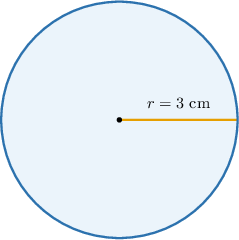
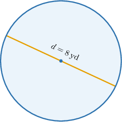
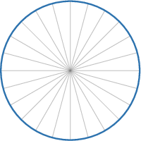
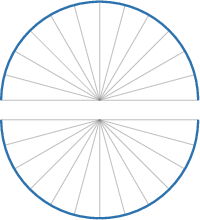
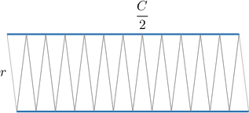

# The Area of a Circle

Source: https://www.mathacademy.com/topics/522?courseId=37
Topic ID: 522

## Prerequisites

- [Squaring Rational Numbers](./2174-squaring-rational-numbers.md)
- [Units of Area and Volume](../../../elementary-school/lessons/grade-5/3872-units-of-area-and-volume.md)
- [Introduction to Circles](./7211-introduction-to-circles.md)

## Lesson

### Introduction

The area of a circle with radius $r$ is given by the formula

$$

\mathcal{A}=\pi r^2.

$$

To demonstrate, let's find the area of a circle that has a radius of $3\text{cm}.$

Using $\pi \approx 3.14,$ the area is

$$

\begin{aligned}A & =𝜋𝑟^{2} \\ & =𝜋⋅3^{2} \\ & ≈3.14⋅9 \\ & =28.26\,cm^{2}.\end{aligned}

$$

### Example: Calculating the Area of a Circle Given the Radius

#### Question

Using the approximation of $\pi \approx 3.14,$ find the area of a circle with a radius of $9\:\text{cm}.$

#### Explanation

The area of a circle is given by

$$

\mathcal{A}=\pi r^2,

$$

where $r$ is the radius.

Using that $\pi \approx 3.14,$ we have

$$

\begin{aligned}A & =𝜋𝑟^{2} \\ & ≈3.14⋅9^{2} \\ & =3.14⋅81 \\ & =254.34\,cm^{2}.\end{aligned}

$$

Therefore, the area is approximately $254.34 \: \text{cm}^2.$

### Formula for the Area Given the Diameter

We can also find the area of a circle given its diameter.

For example, using the approximation of $\pi \approx 3.14,$ let's find the area of a circle with a diameter of $8\:\text{yd},$ shown below.

Recall that the area of a circle is given by

$$

\mathcal{A}=\pi r^2,

$$

where $r$ is the radius.

The radius of a circle is half the diameter. So, the radius of our circle is

$$

r=\dfrac{8}{2}=4 \: \text{yd}.

$$

Using $\pi \approx 3.14,$ we have

$$

\begin{aligned}A & =𝜋𝑟^{2} \\ & ≈3.14⋅4^{2} \\ & =3.14⋅16 \\ & =50.24\,yd^{2}.\end{aligned}

$$

Therefore, the area is approximately $50.24 \: \text{yd}^2.$

### Example: Calculating the Area of a Circle Given the Diameter

#### Question

Using the approximation of $\pi \approx 3.14,$ find the area of a circle with a diameter of $14\:\text{cm}.$

#### Explanation

The area of a circle is given by

$$

\mathcal{A}=\pi r^2,

$$

where $r$ is the radius.

The radius of a circle is half the diameter. So, the radius of our circle is

$$

r=\dfrac{14}{2}=7 \: \text{cm}.

$$

Using that $\pi \approx 3.14,$ we have

$$

\begin{aligned}A & =𝜋𝑟^{2} \\ & ≈3.14⋅7^{2} \\ & =3.14⋅49 \\ & =153.86\,cm^{2}.\end{aligned}

$$

Therefore, the area is approximately $153.86 \: \text{cm}^2.$

### Area of a Circle in Real World Context

Now, let's see an application of the above in a real-world context.

Suppose a circular garden has a radius of $12\:\text{ft}.$ Let's find the area of the garden.

Recall that the area of a circle is given by

$$

\mathcal{A}=\pi r^2,

$$

where $r$ is the radius.

We are given that the radius of the garden is $r=12\:\text{ft}.$

Using $\pi \approx 3.14,$ we have

$$

\begin{aligned}A & =𝜋𝑟^{2} \\ & ≈3.14⋅12^{2} \\ & =3.14⋅144 \\ & =452.16\,ft^{2}.\end{aligned}

$$

Therefore, the area is approximately $452.16 \: \text{ft}^2.$

### Example: Calculating the Area of a Circle in Word Problems

#### Question

A circular trampoline has a diameter of $16\:\text{ft}.$

Using the approximation of $\pi \approx 3.14,$ find the area of the trampoline.

#### Explanation

The area of a circle is given by

$$

\mathcal{A}=\pi r^2,

$$

where $r$ is the radius.

We are given that the diameter of the trampoline is $d=16\:\text{ft}.$

The radius of a circle is half the diameter. So, the radius of our circle is

$$

r=\dfrac{16}{2}=8 \: \text{ft}.

$$

Using that $\pi \approx 3.14,$ we have

$$

\begin{aligned}A & =𝜋𝑟^{2} \\ & ≈3.14⋅8^{2} \\ & =3.14⋅64 \\ & =200.96\,ft^{2}.\end{aligned}

$$

Therefore, the area is approximately $200.96 \: \text{ft}^2.$

### Relationship Between the Circumference and Area of a Circle

Consider a circle of radius $r.$ Let $C$ and $\mathcal{A}$ denote the circumference and the area of the circle, respectively.

To get an informal derivation of the relationship between the circumference and area of the circle, we proceed as follows:

**Step 1.** We split the circle into many small, equal-sized wedges, like slices of a pizza.

**Step 2.** We cut the circle in half:

**Step 3.** Cut each part and unfold as depicted below.

**Step 4.** Merge the two figures, as shown below.

The obtained shape is a parallelogram, but if we cut the circle into more slices, the resulting shape will become more and more similar to a rectangle.

This "rectangle" has

- a length of $\dfrac{C}{2},$ and

- a height of $r.$

So, the area of the rectangle is $\dfrac{C}{2} \cdot r.$ On the other hand, the "rectangle" is just a rearranged circle. Therefore, we get the following formula for the area of the circle:

$$

\mathcal{A} = \dfrac{Cr}{2}

$$

### Algebraical Proof of the Formula

We can also prove this formula algebraically using the standard equations for the area and circumference of a circle. Recall that:

$$

\mathcal{A}=\pi r^2 \qquad\text{and}\qquad C=2\pi r.

$$

From the circumference equation, we can divide both sides by $2$ to isolate $\pi r$:

$$

\pi r = \dfrac{C}{2}

$$

Now, we can expand the area formula and substitute this value in:

$$

\begin{aligned}A & =𝜋𝑟^{2} \\ & =(𝜋𝑟)⋅𝑟 \\ & =(\frac{𝐶}{2})⋅𝑟 \\ & =\frac{𝐶𝑟}{2}\end{aligned}

$$
