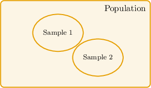
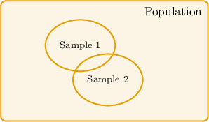

# Interpreting Survey Results

Source: https://www.mathacademy.com/topics/6215?courseId=37
Topic ID: 6215

## Prerequisites

- [Estimation From Samples](./6214-estimation-from-samples.md)

## Lesson

### Introduction

When we use data from a random sample to make predictions about an entire population, our results are *estimates*, not exact values. Even if the sample is chosen carefully, there is always some uncertainty about how the results generalize to the entire population, because we are not measuring every individual in the population.

For this reason, we often speak in terms of a **best estimate**. The best estimate uses the information from the sample to predict what is most likely true for the population, while recognizing that the actual population value may differ.

For example, suppose $2,500$ people visited a flea market. The staff randomly asked $125$ visitors whether they bought jewelry, and found that $25$ of them did. What is the most appropriate conclusion we can draw from this result?

From the random sample, the proportion who bought jewelry is

$$

\dfrac{25}{125} = 0.20 = 20\%.

$$

So, $20\%$ of those sampled bought jewelry.

To estimate how many of the $2,500$ visitors bought jewelry, we scale by this proportion:

$$

\begin{aligned}2,500⋅20\% & =2,500⋅0.20 \\ & =500.\end{aligned}

$$

Because this estimate is based on a sample, we cannot say that *exactly* $500$ people bought jewelry. Instead, the most appropriate conclusion is:

*"The best estimate for the number of visitors who bought jewelry is $500.$"*

This example highlights the key idea: sample-based predictions are *approximate*, not certain. We use phrases like *best estimate* to emphasize this vital distinction.

### Example: Best Estimates of Population Parameters

#### Question

At a beach event, $2{,}900$ people attended. The organizer randomly surveyed $145$ of them and found that $29$ bought sunglasses. Which of the following is the most appropriate conclusion?

1. Exactly $580$ attendees must have bought sunglasses.

2. Exactly $290$ attendees must have bought sunglasses.

3. The best estimate for the number of attendees who bought sunglasses is $580.$

4. The best estimate for the number of attendees who bought sunglasses is $290.$

#### Explanation

From the random sample, the proportion who bought sunglasses is

$$

\frac{29}{145} = 0.20 = 20\%.

$$

So, $20\%$ of those sampled bought sunglasses.

To estimate how many of the $2{,}900$ attendees bought sunglasses, we scale by this proportion:

$$

\begin{aligned}2,900⋅20\% & =2,900⋅0.20 \\ & =580.\end{aligned}

$$

Because this is based on a sample, we report it as a ** not an exact count.

Therefore, the most appropriate conclusion is, "The best estimate for the number of attendees who bought sunglasses is $580.$"

### Generalizing Sample Results to Different Populations

When we use sample data to make a prediction about a population, it is crucial to remember that our results *are limited to the population from which the sample was drawn*. We cannot stretch our conclusions to include people or units outside that original population.

Let's demonstrate this idea with an example.

Suppose a survey was conducted using a sample of bank tellers randomly selected from Arizona credit unions. The tellers surveyed were asked about the average number of transactions they process daily. What is the largest population to which the results of the survey can be generalized?

Because the sample was randomly selected from *bank tellers in Arizona credit unions*, the sampling frame only includes members of this group. So, any inference should be limited to this same population. Therefore, the largest population to which the survey results can be generalized is "All bank tellers in Arizona credit unions."

We cannot generalize to other populations. For example:

- We *cannot* generalize to all credit union employees in Arizona, because the survey only included bank tellers. This is an example of a larger population that contains the original population, as shown below.

- We *cannot* generalize to all bank tellers in Utah credit unions, because the survey only included those in Arizona (Arizona and Utah are two separate US states). This is an example of when the other population has no intersection with the original population, as shown below.

### Example: Generalizing Sample Results

#### Question

A survey was conducted using a sample of truck drivers randomly selected from shipping companies in Georgia. The drivers surveyed were asked about the average number of miles they drive each week. What is the largest population to which the results of the survey can be generalized?

1. All truck drivers in Georgia shipping companies

2. All truck drivers in the United States

3. All truck drivers in Georgia

4. All transportation workers in the United States

#### Explanation

Because the sample was ** from **, the sampling frame only includes members of this group. Therefore, any inference should be limited to this same population.

- We ** generalize to all truck drivers in Georgia, because the survey only included those working for **.

- We ** generalize to all truck drivers in the United States, because the survey only included those in Georgia.

- We ** generalize to all transportation workers in the United States for the same reason.

The largest population to which the survey results can be generalized is, "All truck drivers in Georgia shipping companies."

### Example: Further Generalizing Sample Results

#### Question

An environmental group randomly surveyed $500$ hikers who reported supporting wilderness protection policies and showed them a new promotional video about forest fire prevention. Of those surveyed, $62\%$ said they disliked the video. Which of the following inferences can appropriately be drawn from this survey result?

1. Most hikers who support wilderness protection will dislike the video.

2. At least $62\%$ of all residents will dislike the video.

3. At least $62\%$ of all hikers will dislike the video.

4. Most hikers who oppose wilderness protection will like the video.

#### Explanation

Because the sample is ** and drawn only from hikers who support wilderness protection, any inference we make should describe the population of hikers who support wilderness protection, not all hikers or all residents.

We are told that $62\%$ of the surveyed hikers disliked the video. This supports the statement that most hikers who support wilderness protection dislike the forest fire prevention video.

Note that the other inferences are not supported by the data:

- The sampling frame excludes hikers who do not support wilderness protection, so we cannot generalize to all hikers.

- Because the result is based on a sample, the correct language is “approximately” (or “best estimate”), not an exact claim.

Therefore, the conclusion best supported by the data is that "Most hikers who support wilderness protection will dislike the video."

### Resampling From the Same Population

So far, we have emphasized that when we draw a random sample, we can use it to make a "best estimate" for the entire population from which the sample is drawn. However, it’s important to recognize another key idea.

If we take a second random sample from the same population, it is *very unlikely* to yield *exactly* the same results as the first.

This is not because the sampling method used was incorrect; it’s simply due to the natural variability that comes from sampling. Each random sample captures a slightly different slice of the population.

The sampling units between the two samples could overlap. But even in this case, there will still be natural variability between the two samples.

For example, suppose we randomly select $100$ students from a large university and find that $64\%$ of them report studying at least $10$ hours per week. If we take a new random sample of $100$ students from the *same university*, we might find that $61\%$ study at least $10$ hours, or $67\%$, or perhaps $63\%.$

- The results will not be precisely the same, because the individuals chosen are different.

- However, the results will *usually* be close to each other, because both samples are drawn at random from the same population.

This idea—that sample results vary from sample to sample but tend to cluster around the true population value—is at the heart of statistical reasoning. It’s why we talk about estimates rather than exact values, and why larger, well-chosen samples generally give us more reliable predictions.

### Example: Identifying True Statements About Resampling

#### Question

A nonprofit surveyed $600$ volunteers who were selected at random from its membership list and asked, “Do you plan to volunteer at least once in the next three months?” Of those surveyed, $35\%$ responded “no”.

Based on this result, which of the following conclusions are appropriate?

1. Of all volunteers in the nonprofit, exactly $35\%$ do not plan to volunteer at least once in the next three months.

2. If another $600$ volunteers selected at random from the nonprofit were surveyed, the proportion who say “no” is likely to be close to $35\%.$

3. If $600$ volunteers selected at random from a different nonprofit were surveyed, the proportion who say “no” is likely to be close to $35\%.$

#### Explanation

Because the $600$ volunteers were chosen ** from the nonprofit, the $35\%$ is a ** that serves as a ** for the population proportion in this nonprofit. The exact value for the whole population is unknown, but another random sample from the ** would be expected to give a result close to $35\%$ (though not necessarily exactly $35\%$).

- Statement I is not an appropriate conclusion. The true proportion in the nonprofit may differ slightly from $35\%$ due to sampling variability.

- Statement II is an appropriate conclusion. Repeating the sampling process with the same method and sample size from the same nonprofit would likely produce a proportion close to $35\%.$

- Statement III is not an appropriate conclusion. The inference applies only to this nonprofit, not to a different nonprofit that could have a different population proportion.

Therefore, the correct answer is “II only.”
