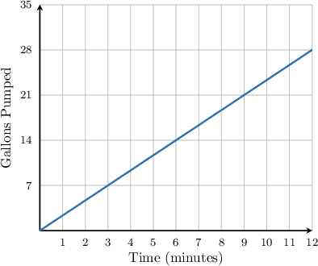

# Interpreting Data From Proportional Relationships

Source: https://www.mathacademy.com/topics/6814?courseId=37
Topic ID: 6814

## Prerequisites

- [Understanding Proportional Relationships Using Graphs](./2552-understanding-proportional-relationships-using-graphs.md)
- [Understanding Proportional Relationships From Descriptions](./2554-understanding-proportional-relationships-from-descriptions.md)

## Lesson

### Introduction

When two quantities have a proportional relationship, we can learn a lot by interpreting specific pairs in the relationship.

In particular:

- the pair $(0,0)$ tells us what happens when the input quantity is $0,$ and

- the pair $(1,k)$ tells us the unit rate.

Let’s look at an example.

Jill likes to listen to music while she runs. The following table shows a proportional relationship between the distance $d$ (in kilometers) she runs and the number of songs $s$ she listens to.

We're told that $d$ and $s$ have a proportional relationship.

To find the constant of proportionality, we first need to choose a point $(d,s)$ from the table. Let's choose the point $(2,3),$ which corresponds to the first row of the table.

We can find the constant of proportionality as follows:

$$

k = \dfrac{s}{d} = \dfrac{3}{2}

$$

The units of $k$ are "songs per kilometer" since we divided the number of songs $s$ by the distance $d.$ Therefore, the relationship between $d$ and $s$ is

$$

s = \dfrac{3}{2}d.

$$

### Interpreting Important Points

Let's continue with our example of Jill's run. The relationship between the distance she runs ($d$) and the number of songs she listens to ($s$) is

$$

s = \dfrac{3}{2}d.

$$

Now, let’s interpret two important points. Since we are comparing distance to songs, we will write our points as $(d, s)$.

- First, consider the point $(0,0).$ If Jill runs $0$ kilometers, then So, the point $(0,0)$ means that if Jill does not run at all ($d=0$), then she listens to $0$ songs ($s=0$).

- Next, consider the point $\left(1,\dfrac{3}{2}\right).$ If Jill runs $1$ kilometer, then So, the point $\left(1,\dfrac{3}{2}\right)$ means that if Jill runs $1$ kilometer ($d=1$), then she listens to $\dfrac{3}{2}$ songs ($s=\dfrac{3}{2}$). This also tells us that the unit rate is $\dfrac{3}{2}$ songs per kilometer.

Let's see more examples.

### Example: Interpreting Data From Tables

#### Question

Jill likes to listen to music while she runs. The following table shows a proportional relationship between the distance $d$ (in kilometers) she runs and the number of songs $s$ she listens to.

Which of the following statements are true?

1. The unit rate is $\dfrac32$ songs per kilometer.

2. If Jill runs for $1$ kilometer, she'll listen to $1.5$ songs.

3. If Jill runs for $12$ kilometers, she'll listen to $15$ songs.

#### Explanation

We're told that $d$ and $s$ have a proportional relationship.

To find the constant of proportionality, we first need to choose a point $(d,s)$ from the table. Let's choose the point $(2,3),$ which corresponds to the first row of the table.

We can find the constant of proportionality as follows:

$$

k = \dfrac{s}{d} = \dfrac{3}{2}

$$

The units of $k$ are "songs per kilometer" since we divided the number of songs $s$ by the distance $d.$ Therefore, the relationship between $d$ and $s$ is

$$

s=\dfrac32 d.

$$

With that in mind, let's look at each statement.

- Statement I is true. We found above that $k =\dfrac32$ songs per kilometer.

- Statement II is true. We know that $k=\dfrac32,$ which means that if Jill runs for $1$ kilometer, she'll listen to songs.

- Statement III is false. If we substitute $d=12$ into the relationship $s=\dfrac32 d,$ we get which means that she'll listen to $18$ songs if she runs for $12$ kilometers.

Therefore, the correct answer is "I and II only."

### Example: Interpreting Data From Graphs

#### Question

The graph above shows a proportional relationship between the time $t$ (in minutes) that a water pump runs and the amount of water $g$ (in gallons) that it pumps.

Which of the following statements are true?

1. There are $2$ gallons of water pumped when the pump starts running.

2. The unit rate is $\dfrac{7}{3}$ gallons per minute.

3. The pump moves $28$ gallons of water in $12$ minutes.

#### Explanation

We're told that $t$ and $g$ have a proportional relationship.

To compute the constant of proportionality, we first need to choose a point $(t,g)$ on the graph. Here, let's choose the point $(3,7).$

Now, we can find the constant of proportionality by computing the ratio of the $g$-coordinate to the $t$-coordinate, as follows:

$$

k = \dfrac{g}{t} = \dfrac{7}{3}

$$

The units of $k$ are "gallons per minute" since we divided the number of gallons $g$ by the time $t$ in minutes. Therefore, the relationship between $t$ and $g$ is

$$

g = \dfrac{7}{3}t.

$$

Now, with that in mind, let's look at each statement.

- Statement I is false. When the pump starts running, $t=0.$ At this moment, we have gallons pumped. This corresponds to the point $(0,0)$ on the graph.

- Statement II is true. We know that $k=\dfrac{7}{3},$ which means that the unit rate is $\dfrac{7}{3}$ gallons per minute. This corresponds to the point $\left(1,\dfrac{7}{3}\right)$ on the graph.

- Statement III is true. Indeed, if we substitute $t=12$ into the relationship, we get which means that the pump moves $28$ gallons of water in $12$ minutes.

Therefore, the correct answer is "II and III only".

### Example: Interpreting Data From Descriptions

#### Question

A candle burns at a constant rate. There is a proportional relationship between the time $t$ (in hours) that the candle burns and the amount of wax $w$ (in centimeters) that melts. After $10$ hours, $4$ centimeters of wax have melted.

Which of the following statements are true?

1. Four centimeters of wax have melted when the candle starts burning.

2. The unit rate is $\dfrac{2}{5}$ centimeters per hour.

3. After $15$ hours, $6$ centimeters of wax have melted.

#### Explanation

We're told that $t$ and $w$ have a proportional relationship.

We can find the constant of proportionality by computing the ratio of the $w$-value to the $t$-value, as follows:

$$

k = \dfrac{w}{t} = \dfrac{4}{10} = \dfrac{2}{5}

$$

The units of $k$ are "centimeters per hour" since we divided the number of centimeters $w$ by the number of hours $t.$ Therefore, the relationship between $w$ and $t$ is

$$

w = \dfrac{2}{5}t.

$$

Now, with that in mind, let's look at each statement.

- Statement I is false. When the candle starts burning, $t=0.$ At this moment, the amount of wax melted is centimeters.

- Statement II is true. We know that $k=\dfrac{2}{5},$ which means that the unit rate is $\dfrac{2}{5}$ centimeters per hour.

- Statement III is true. Indeed, if we substitute $t=15$ into the relationship, we get which means that $6$ centimeters of wax have melted after $15$ hours.

Therefore, the correct answer is "II and III only".
