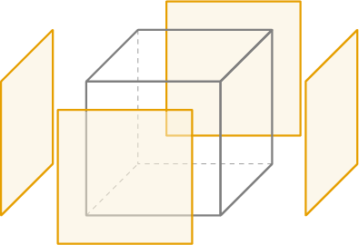
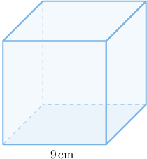

# Surface Areas of Cubes

Source: https://www.mathacademy.com/topics/7214?courseId=37
Topic ID: 7214

## Prerequisites

- [Areas of Rectangles and Squares](./1352-areas-of-rectangles-and-squares.md)
- [Working With Unit Prices](./6818-working-with-unit-prices.md)
- [Finding Surface Areas Using Nets](../grade-6/7208-finding-surface-areas-using-nets.md)

## Lesson

### Introduction

In this lesson, we'll learn how to find the **surface area** of a cube.

For example, suppose we want to find the surface area of a cube whose edges are $3\,\text{cm}$ in length, like the one shown below.

The surface area of the cube is the area of all the faces combined. In general, for a cube with edges of length $s,$ there are $6$ faces, each with area $\mathcal A = s^2.$ So, the surface area is given by

$$

S = 6\mathcal A =6 s^2.

$$

To find the surface area of the cube above, we substitute $s=3 \: \text{cm}$ into the formula. This gives

$$

S = 6(3\, \text{cm})^2 = 54 \,\text{cm}^2.

$$

Therefore, the surface area of the cube is $54\,\text{cm}^2.$

### Example: Finding the Surface Area of a Cube Given a Side Length

#### Question

Find the surface area of the cube whose sides each have length $7\, \text{m}.$

#### Explanation

The surface area $S$ of a cube can be found using the formula

$$

S = 6s^2,

$$

where $s$ is the side length of the cube.

Substituting $s = 7\,\text{m}$ into the formula, we get

$$

S = 6(7\, \text{m})^2 = 294\,\text{m}^2 .

$$

### Lateral Surface Areas of Cubes

The **lateral surface area** of a cube is the surface area of the side faces alone. In other words, it's the surface area that does not include the area of the top or bottom faces.

Since a cube has $4$ lateral faces and each is a square with an area of $s^2$, the lateral surface area $S_L$ can be found using the formula:

$$

S_L = 4s^2,

$$

where $s$ is the length of a side.

### Example: Calculating the Lateral Surface Area of a Cube Given a Side Length

#### Question

Determine the ** surface area for the cube above.

#### Explanation

The lateral surface area $S_L$ of a cube can be found using the formula

$$

S_L = 4s^2,

$$

where $s$ is the side length of the cube.

Substituting $s = 9\,\text{cm}$ into the formula, we get

$$

S_L = 4(9\, \text{cm})^2 = 324 \,\text{cm}^2.

$$

### Problems Involving Surface Areas of Cubes

Surface areas of cubes naturally arise in real-world contexts.

For example, suppose a cube-shaped storage container has a side length of $5\:\text{m}.$ A worker covers $4$ square meters using one liter of sealant. How many liters of sealant are needed to cover the *lateral* surface of the container?

Recall that the lateral surface area $S_L$ of a cube is given by

$$

S_L = 4s^2.

$$

Substituting $s = 5\,\text{m},$ we get

$$

S_L = 4(5\,\text{m})^2 = 4(25\,\text{m}^2) = 100 \,\text{m}^2.

$$

A worker covers $4$ square meters using one liter of sealant, so the amount of sealant needed is

$$

100 \div 4 = 25.

$$

Let's check the units:

$$

 \text{m}^2 \div \dfrac{\text{m}^2}{\text{liter}} = \text{m}^2 \cdot \dfrac{\text{liter}}{\text{m}^2} = \text{liter} \:\: {\color{darkgreen}\checkmark}

$$

Therefore, the total amount of sealant needed is $25 \text{liters}.$

Let's see another example.

### Example: Solving Problems Involving the Surface Areas of Cubes

#### Question

A company charges $0.03$ per $\text{cm}^2$ to cover a cube-shaped box with protective film. Each side of the box has a length of $8\: \text{cm}.$ What is the total cost to cover the box?

#### Explanation

We first find the surface area of the cube. The surface area $S$ of a cube can be found using the formula

$$

S = 6s^2,

$$

where $s$ is the side length of the cube.

Substituting $s = 8\,\text{cm}$ into the formula, we get

$$

S = 6 (8\, \text{cm})^2 = 6 \cdot 64 = 384\,\text{cm}^2.

$$

Now, we compute the total cost. The company charges $0.03$ per $\text{cm}^2,$ so we get

$$

384 \cdot 0.03 = 11.52.

$$

Therefore, the total cost is $11.52.$
