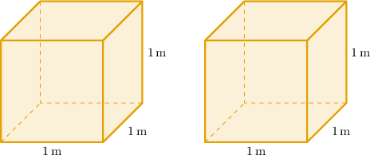
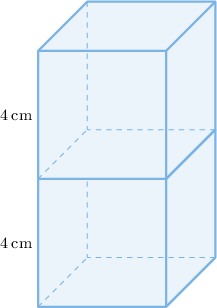
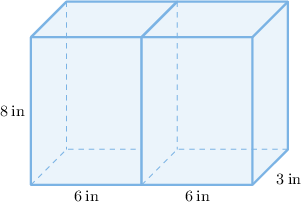
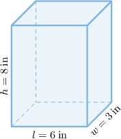
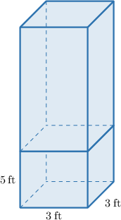

# Surface Areas of Combined Rectangular Prisms

Source: https://www.mathacademy.com/topics/7217?courseId=37
Topic ID: 7217

## Prerequisites

- [Surface Areas of Rectangular Solids](./7216-surface-areas-of-rectangular-solids.md)

## Lesson

### Introduction

In this topic, we'll learn how to compute the surface area of solids formed by gluing prisms or cylinders along congruent faces. This is useful in real-world settings, for example, estimating materials, cost, or coverage (paint/wrap) when separate pieces are joined.

For instance, consider two identical cubes with a side length of $1$ meter.

First, let's find the total surface area of these cubes before they are joined.

If $a$ denotes the side length of a cube, then its surface area is given by

$$

\begin{aligned}𝑆 & =6⋅(face area) \\ & =6⋅𝑎^{2} \\ & =6𝑎^{2}.\end{aligned}

$$

Therefore, the surface area of a single cube of side length $a=1\,\text{m}$ is

$$

\begin{aligned}𝑆 & =6(1)^{2} \\ & =6⋅1 \\ & =6\,m^{2}.\end{aligned}

$$

This means that the total surface area of both cubes (before joining) is

$$

2S = 2\cdot 6 = 12\,\text{m}^2.

$$

### Combining Rectangular Prisms

Suppose the cubes are joined together by gluing one of their square faces together, as shown below.

Let's find the surface area, in square meters, of the combined solid.

When the two cubes are glued together at their square faces, *one face from each is hidden.* In other words, a total of *two square faces are hidden*. This reduces the total surface area by

$$

2a^2=2(1)^2 = 2\,\text{m}^2.

$$

Recall that the surface area of one unit cube is $S = 6\,\text{m}^2$. Therefore, the surface area of the combined solid is

$$

\begin{aligned}2𝑆−2𝑎^{2} & =12−2 \\ & =10\,m^{2}.\end{aligned}

$$

### Example: Finding the Combined Surface Area of Two Cubes

#### Question

Two identical cubes have a side length of $4$ centimeters. The cubes are joined together by gluing one of their square faces together, as shown below. Find the surface area of the combined solid.

#### Explanation

If $a$ denotes the side length of a cube, then its surface area is given by

$$

\begin{aligned}𝑆 & =6⋅(face area) \\ & =6⋅𝑎^{2} \\ & =6𝑎^{2}.\end{aligned}

$$

Therefore, the surface area of a single cube of side length $a=4\,\text{cm}$ (before joining them) is

$$

\begin{aligned}𝑆 & =6(4)^{2} \\ & =6⋅16 \\ & =96\,cm^{2}.\end{aligned}

$$

This means that the surface area of both cubes (before joining) is

$$

2S = 2\cdot 96 = 192\,\text{cm}^2.

$$

When the two cubes are glued together at their square faces, one face from each is hidden, reducing the total surface area by

$$

2a^2=2(4)^2 = 32\,\text{cm}^2.

$$

Therefore, the surface area of the combined solid is

$$

\begin{aligned}2𝑆−2𝑎^{2} & =192−32 \\ & =160\,cm^{2}.\end{aligned}

$$

### Example: Finding the Combined Surface Area of Two Identical Rectangular Solids

#### Question

Two identical right rectangular prisms have a length of $6$ inches, a width of $3$ inches, and a height of $8$ inches. The prisms are joined together by gluing one of their faces, as shown above (not drawn to scale). Find the surface area of the combined solid.

#### Explanation

Recall that the surface area of a rectangular prism is given by

$$

S = 2(lw+lh+wh),

$$

where $l,$ $w,$ and $h$ are the length, width, and height of the prism.

For our rectangular prism, we have

$$

l = 6\:\text{in}, \qquad w=3\:\text{in}, \qquad h=8\:\text{in}.

$$

Substituting this into the formula above, we get that the surface area of a single prism (before joining them) is

$$

\begin{aligned}𝑆 & =2(6⋅3+6⋅8+3⋅8) \\ & =2(18+48+24) \\ & =2(90) \\ & =180\,in^{2}.\end{aligned}

$$

This means that the surface area of both prisms (before joining) is

$$

2S = 2 \cdot 180 = 360\,\text{in}^2.

$$

When the two prisms are glued together, one face from each is hidden, reducing the total surface area by

$$

2wh=2(3)(8)=48\:\text{in}^2.

$$

Therefore, the surface area of the combined solid is

$$

\begin{aligned}2𝑆−2𝑤ℎ & =360−48 \\ & =312\,in^{2}.\end{aligned}

$$

### Example: Finding the Combined Surface Area of Two Rectangular Solids

#### Question

A square-based right rectangular prism has a height of $5$ feet and a base side length of $3$ feet. A second square-based right rectangular prism has an identical square base but is three times as tall as the first one. The prisms are joined together by gluing one of their square bases together, as shown above (not drawn to scale). Find the surface area of the combined solid.

#### Explanation

Recall that the surface area of a rectangular prism is given by

$$

S = 2(lw+lh+wh),

$$

where $l,$ $w,$ and $h$ are the length, width, and height of the prism.

- For the smaller prism, we have Substituting this into the formula above, we get that the surface area of the prism is

- For the larger prism, we have Substituting this into the formula above, we get that the surface area of the prism is

When the two prisms are glued together, one face from each is hidden, reducing the total surface area by

$$

2lw=2(3)(3)=18\:\text{ft}^2.

$$

Therefore, the surface area of the combined solid is

$$

\begin{aligned}(𝑆_{1}+𝑆_{2})−2𝑙𝑤 & =(78+198)−18 \\ & =276−18 \\ & =258\,ft^{2}.\end{aligned}

$$
