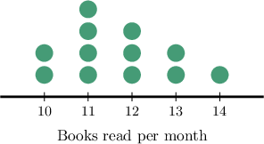

# Using Experimental Probability to Make Predictions

Source: https://www.mathacademy.com/topics/7220?courseId=37
Topic ID: 7220

## Prerequisites

- [Experimental Probability](./130-experimental-probability.md)
- [Multiplying a Decimal by a Multi-Digit Whole Number](../../../elementary-school/lessons/grade-5/2347-multiplying-a-decimal-by-a-multi-digit-whole-number.md)

## Lesson

### Introduction

Once we've calculated the experimental probability of an event, we can use it to predict how often the event will occur in a different experiment.

The estimated number of times an event occurs is the product of the total number of trials and the experimental probability of the event occurring:

$$

\text{estimated number of event occurrences} = \text{total number of trials} \cdot P(\text{Event})

$$

For example, suppose a game is played $40$ times, and a player wins $14$ of those games. Then the experimental probability of winning is

$$

P(\text{win}) = \dfrac{14}{40} = 0.35.

$$

Now suppose the game will be played $200$ times. To estimate how many wins to expect, we multiply the new number of games $(200)$ by the experimental probability $(0.35)$ as follows:

$$

n = 200\cdot P(\text{win}) = 200\cdot 0.35 = 70

$$

So, based on the experimental probability, we predict that the player will win about $70$ of the $200$ games.

This method works whenever we assume that future outcomes will follow a similar pattern to past results.

### Example: Predicting Future Outcomes Using Experimental Probability

#### Question

A carnival game is played $25$ times, and a player wins a prize on $8$ of those plays. The game is then played $150$ times at another carnival. Assuming that the results will follow a similar pattern, estimate the number of times a player wins a prize at the second carnival.

#### Explanation

The estimated number of times an event occurs is the product of the total number of trials and the experimental probability of the event occurring:

$$

\text{estimated number of event occurrences} = \text{total number of trials} \cdot P(\text{Event})

$$

First, to calculate the experimental probability, we divide the number of times a prize was won $(8)$ by the total number of plays $(25).$ This gives

$$

P(\textrm{prize}) = \dfrac{8}{25}.

$$

Therefore, the estimated number of times that a prize is won at the second carnival in $150$ plays is

$$

n=150 \cdot P(\textrm{prize}) = 150 \cdot \dfrac{8}{25} = 48.

$$

Since this is an estimate, the actual number may be close to $48,$ but not necessarily exactly $48.$

### Example: Predicting Future Outcomes From a Data Representation

#### Question

Martin surveyed $200$ students in New Hampton School to observe the distribution of students' eye colors. The table below shows the results of his survey.

In Brewster Academy, there are $350$ students. Assuming that the eye color distribution is the same for both schools, estimate the number of students with blue eyes in Brewster Academy.

#### Explanation

The estimated number of times an event occurs is the product of the total number of trials and the experimental probability of the event occurring:

$$

\text{estimated number of event occurrences} = \text{total number of trials} \cdot P(\text{Event})

$$

First, to calculate the experimental probability, we divide the number of students with blue eyes $(36)$ by the total number of students surveyed $(200).$ This gives

$$

P(\text{blue eyes}) = \dfrac{36}{200} = 0.18.

$$

Therefore, the estimated number of students with blue eyes in Brewster Academy is

$$

n = 350\cdot P(\text{blue eyes}) = 350\cdot 0.18 = 63.

$$

Since this is an estimate, the actual number may be close to $63,$ but not necessarily exactly $63.$

### The Interpretation of Future Outcomes Using Probability

When we use experimental probability to make a prediction, the result is an estimate, not an exact value.

Recall the previous example, where a player won $14$ out of $40$ games. The experimental probability was

$$

P(\text{win}) = 0.35,

$$

and we predicted that in $200$ games, we expect the player to win about $200 \cdot 0.35 = 70$ games.

However, the actual number of wins may not be exactly $70.$ It could be slightly more or slightly less.

So, when interpreting predictions:

- The result tells us what the outcome should be *close to*.

- The actual result is not guaranteed to be *exactly equal* to the prediction.

This happens because experimental probability is based on past results, and outcomes in future trials can vary.

### Example: Interpreting Future Outcomes Using Experimental Probability

#### Question

A librarian recorded how many books students read in a month. The diagram above shows the results of this survey. There are $60$ students at another school. Assuming that the distribution is the same, complete the following statements.

$\qquad$According to the plot, the experimental probability that a student reads $11$ books in a month is $\boxed{\phantom{\dfrac{4}{12}}}.$

$\qquad$We expect that the actual number of students who read $11$ books will be $\boxed{\phantom{\textrm{close to}\, 20}}.$

#### Explanation

The estimated number of times an event occurs is the product of the total number of trials and the experimental probability of the event occurring:

$$

\text{estimated number of event occurrences} = \text{total number of trials} \cdot P(\text{Event})

$$

The total number of students surveyed is

$$

2+4+3+2+1 = 12.

$$

Out of the $12$ students that were surveyed, $4$ of those students read $11$ books. So, the experimental probability that a student reads $11$ books is

$$

11

$$

Therefore, the estimated number of students who read $11$ books at the second school is

$$

11

$$

Since this is an estimate, the actual number may be $\boxed{\textrm{close to}\,\, 20},$ but not necessarily exactly $20.$
