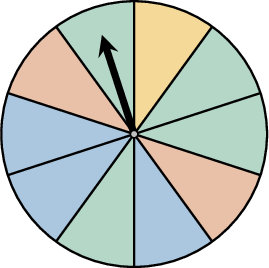

# Analyzing Probability Models

Source: https://www.mathacademy.com/topics/7225?courseId=37
Topic ID: 7225

## Prerequisites

- [Using Probability to Make Predictions](./7222-using-probability-to-make-predictions.md)

## Lesson

### Introduction

A **probability model** is a mathematical description that lists all possible outcomes of a probability experiment and the probability of each outcome.

For example, consider a game where a player can win different prizes with the following probabilities:

This table is a probability model because it lists all possible outcomes and their probabilities.

As before, we can use a probability model to make predictions about how often an event is expected to occur. To do this, we multiply the probability of the event by the number of trials:

$$

\text{Expected number of occurrences} = \text{Number of trials} \cdot P(\text{Event})

$$

From the model, the probability of winning a coupon is

$$

P(\text{coupon}) = \dfrac{1}{6}.

$$

If the game is played $90$ times, the expected number of times a coupon is won is

$$

90 \cdot \dfrac{1}{6} = 15.

$$

So, we expect that a coupon will be won about $15$ times.

### Example: Using a Probability Model

#### Question

The probability model for the outcome of spinning a fair $5$-section spinner is given above. Estimate the number of $4$s obtained when spinning the spinner $150$ times.

#### Explanation

A probability model is a mathematical description listing all possible outcomes of a probability experiment and their corresponding probabilities.

From the given probability model, the probability of landing on a $4$ is

$$

P(4) = \dfrac{1}{5}.

$$

We find an estimate by multiplying this probability by the number of trials:

$$

150 \cdot \dfrac{1}{5} = 30

$$

Therefore, the estimated number of times a $4$ will be obtained in $150$ spins is $30.$

### Constructing Probability Models

To construct a probability model, we first identify all possible outcomes of an experiment, and then determine the probability associated with each outcome.

For example, suppose a school tracks how students get to school. Of those surveyed, $24$ walk, $18$ take the bus, and $18$ are driven by car. Let's construct the probability model for how a randomly selected student gets to school.

Since the student is chosen at random, each student is equally likely to be selected. There are $24 + 18 + 18 = 60$ students in total.

The probability of choosing a student for each method of travel is the fraction of students who use that method out of the total number of students:

$$

P(\text{walk}) = \dfrac{24}{60} = \dfrac{2}{5}, \qquad P(\text{bus}) = \dfrac{18}{60} = \dfrac{3}{10}, \qquad P(\text{car}) = \dfrac{18}{60} = \dfrac{3}{10}.

$$

These probabilities are then placed into the model:

In this way, a probability model is constructed by listing outcomes and assigning each one a probability based on the given information.

### Example: Creating a Probability Model

#### Question

Construct the probability model for the color on which the spinner above lands.

#### Explanation

A probability model is a mathematical description listing all possible outcomes of a probability experiment and their corresponding probabilities.

Since the spinner is divided into equal sections, each section is equally likely to be landed on.

From the spinner, there are:

- $2$ red sections,

- $3$ blue sections,

- $1$ orange section, and

- $4$ green sections.

So, there are a total of $2 + 3 + 1 + 4 = 10$ sections.

The probability of landing on each color is the fraction of sections of that color out of the total number of sections:

$$

P(\text{red}) = \dfrac{2}{10} = \dfrac{1}{5}, \qquad P(\text{blue}) = \dfrac{3}{10}, \qquad P(\text{orange}) = \dfrac{1}{10}, \qquad P(\text{green}) = \dfrac{4}{10} = \dfrac{2}{5}.

$$

Therefore, the probability model is as shown below.

### Example: Creating a Probability Model From Experimental Data

#### Question

A survey is conducted to find students’ preferred type of after-school activity. Out of $40$ students, $18$ choose sports, $12$ choose music, and $10$ choose art. Based on this experimental data, construct a probability model for the type of activity selected.

#### Explanation

A probability model is a mathematical description listing all possible outcomes of a probability experiment and their corresponding probabilities.

Since this probability model is based on experimental data, we use the fraction of times each outcome occurred.

From the survey:

- $18$ students chose sports,

- $12$ students chose music, and

- $10$ students chose art.

So, there were a total of $18 + 12 + 10 = 40$ students.

The probability of each outcome is the fraction of times that outcome occurred out of the total number of trials:

$$

P(\text{sports}) = \dfrac{18}{40} = \dfrac{9}{20} = 45\%, \qquad P(\text{music}) = \dfrac{12}{40} = \dfrac{3}{10} = 30\%,

$$

$$

P(\text{art}) = \dfrac{10}{40} = \dfrac{1}{4} = 25\%.

$$

Therefore, the probability model is as shown below.

### The Difference Between Expected and Observed Frequencies

When we use a probability model to make predictions, we are finding **expected values**. These are the results we would anticipate based on the model.

However, when we actually perform an experiment, we get **observed frequencies**, which may not match the expected values exactly.

This difference happens because real-world results are influenced by variation.

For example, suppose a game has the following probability model:

If the game is played $40$ times, the expected number of wins is

$$

40 \cdot \dfrac{3}{4} = 30.

$$

But suppose the player actually wins $27$ times. This observed result is close to, but not exactly the same as, the expected value.

This difference can be explained by **random variation**, which occurs due to chance when experiments are repeated.

If the difference between expected and observed values is small, it is usually reasonable to attribute it to random variation.

However, if the difference is large, it may suggest that the probability model does not accurately describe the situation. In that case, the model may be **incorrect**, possibly due to bias or incorrect assumptions.

Understanding the difference between expected and observed results helps us evaluate whether a probability model is a good fit for real-world data.

### Example: Comparing a Probability Model to Observed Frequencies

#### Question

A spinner has $3$ equal sections colored red, blue, and green. A student predicts that each color has an equal chance of being landed on. The spinner is spun $180$ times. The results are shown in the frequency table below.

Complete the statements below.

$\qquad$The expected number of times the spinner lands on blue in $180$ spins is $\boxed{\phantom{60}}.$

$\qquad$The experimental probability of landing on blue is $\boxed{\phantom{\dfrac{1}{10}}}.$

$\qquad$The difference between the model and the results may be explained by $\boxed{\phantom{\text{the model being incorrect}}}$ due to $\boxed{\phantom{\text{bias}}}.$

#### Explanation

A probability model is a mathematical description listing all possible outcomes of a probability experiment and their corresponding probabilities.

Differences in expected values and experimental observations can occur for various reasons.

- Random variation: Even if a model is correct, results will not match it exactly, especially in a smaller number of trials. Outcomes vary naturally due to chance.

- Incorrect model: The assumed probabilities may not match reality, for example, due to an unknown bias.

- Other reasons, such as mistakes in recording data, changing conditions, etc.

Since the spinner has $3$ equal sections, the probability model predicts that each color has probability $\dfrac{1}{3}.$

We find an estimate by multiplying the probability by the number of trials:

$$

180 \cdot P(\text{blue}) = 180 \cdot \dfrac{1}{3} = 60

$$

So, the expected number of times blue is selected in $180$ spins is $\boxed{60}.$

From the experiment, blue was selected $18$ times out of $180$ spins. So, the experimental probability is

$$

P(\text{blue}) = \dfrac{18}{180} = \dfrac{1}{10} = \boxed{\dfrac{1}{10}}.

$$

The experimental result $(18)$ differs significantly from the expected value $(60).$ This suggests that the model may not accurately describe the situation. This may be explained by $\boxed{\text{the model being incorrect}}$ due to $\boxed{\text{bias}}.$
