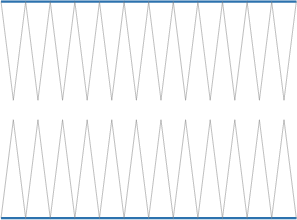
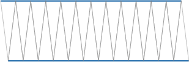

# Relating the Circumference and Area of a Circle

Source: https://www.mathacademy.com/topics/7802?courseId=37
Topic ID: 7802

## Prerequisites

- [Solving Systems of Equations by Substitution](./487-solving-systems-of-equations-by-substitution.md)
- [The Circumference of a Circle](./520-the-circumference-of-a-circle.md)
- [The Area of a Circle](./522-the-area-of-a-circle.md)
- [Areas of Rectangles and Squares](./1352-areas-of-rectangles-and-squares.md)

## Lesson

### Introduction

In this lesson, we will relate the circumference $C$ and area $\mathcal{A}$ of a circle. We will see that the area can be written in terms of the circumference and radius as

$$

\mathcal{A}=\dfrac{1}{2}Cr.

$$

This relationship is useful because it connects two important circle formulas and helps us understand why the area formula for a circle makes sense.

But to understand this relationship, we first need to learn how to rearrange a circle into a shape whose area formula we already know.

### Rearranging a Circle into a Rectangle

To rearrange a circle into a rectangle-like shape, we proceed as follows:

First, we split the circle into many equal-sized wedges.

Then, we cut the circle in half.

Next, we cut each half along the radii and unfold the pieces. This turns each half into a long jagged strip.

Now, we merge the two unfolded figures into a parallelogram.

Notice that the obtained shape is a parallelogram, but if we cut the circle into more slices, the resulting shape will become more and more similar to a rectangle. So, we can think of this shape as being almost a rectangle.

The length of this rectangle is $\dfrac{C}{2},$ where $C$ is the circumference of the circle, and the height is $r.$

Notice that this rectangle is just a rearranged circle. Therefore, the area of the circle must be the same as the area of the rectangle. Thus, the area of the circle is

$$

\mathcal{A}=\dfrac{1}{2}Cr.

$$

Since we know that the circumference is $C = 2\pi r,$ we can substitute this into our area formula:

$$

\mathcal{A} = \dfrac{1}{2}(2\pi r)r = \pi r^2

$$

Let's do more practice.

### Example: Rearranging a Circle to Model Its Area

#### Question

Consider a circle of radius $r.$ Let $C$ and $\mathcal{A}$ denote the circumference and the area of the circle, respectively. Rearrange a circle into a rectangle-like shape.

#### Explanation

We proceed as follows:

**** We split the circle into many equal-sized wedges.

**** We cut the circle in half.

**** Cut each part along radii and unfold.

**** Merge the two figures into a parallelogram.

**** Assume that the parallelogram is almost a rectangle.

Notice that the obtained shape is a parallelogram, but if we cut the circle into more slices, the resulting shape will become more and more similar to a "rectangle".

**** The rectangle has a length of $\dfrac{C}{2}$ and a height of $r.$

**** The area of the circle is

$$

\mathcal{A}=\dfrac{1}{2}Cr.

$$

Notice that our "rectangle" is just a rearranged circle. Therefore, the areas of the circle and the obtained "rectangle" must be the same.

### Algebraic Proof of the Relationship

Previously, we showed how to get the relationship between the circumference and area using geometric intuition. Let's now see if we can obtain the formula algebraically, given the formulas for the circumference and area:

$$

\mathcal{A}=\pi r^2 \qquad\text{and}\qquad C=2\pi r

$$

From the circumference equation, we can divide both sides by $2$ to isolate $\pi r$:

$$

\pi r = \dfrac{C}{2}

$$

Now, we can expand the area formula and substitute this value in:

$$

\begin{aligned}A & =𝜋𝑟^{2} \\ & =(𝜋𝑟)⋅𝑟 \\ & =(\frac{𝐶}{2})⋅𝑟 \\ & =\frac{1}{2}𝐶𝑟\end{aligned}

$$

### Example: Relating the Area Formula to the Circumference Formula

#### Question

Consider the proof of the relationship between the circumference and the area of a circle.

$\text{L1}{:}\:$ $C=2\pi r$

$\text{L2}{:}\:$ $\pi r = \dfrac{C}{2}$

$\text{L3}{:}\:$ $\mathcal{A}=\pi r^2$

$\text{L4}{:}\:$ $\mathcal{A}=(\pi r) \cdot r$

$\text{L5}{:}\:$ $\mathcal{A}=\left(\dfrac{C}{2}\right) \cdot r$

$\text{L6}{:}\:$ $\mathcal{A}=\dfrac{1}{2}Cr$

Select the correct options in the following reasoning.

Line $\text{L4}$ follows from line $\text{L3}$ by rewriting $r^2$ as $\boxed{\phantom{AAAA}}.$

Line $\text{L5}$ follows from lines $\boxed{\phantom{AAAAAAAA}}$ by substituting $\boxed{\phantom{AAAA}}$ with $\dfrac{C}{2}.$

Line $\text{L6}$ follows from line $\boxed{\phantom{AAAA}}$ by simplifying the expression.

#### Explanation

Let's examine each statement in turn.

- First, we consider lines $\text{L3}$ and $\text{L4}.$ From $\text{L3},$ we have By rewriting $r^2$ as $\boxed{r \cdot r},$ we get $\text{L4}{:}$

- Next, we consider line $\text{L5}.$ It follows from $\boxed{\text{L2} \text{and} \text{L4}}$ by substituting $\boxed{\pi r}$ with $\dfrac{C}{2}{:}$

- Finally, we consider line $\text{L6}.$ It follows by simplifying the expression from $\boxed{\text{L5}}{:}$
