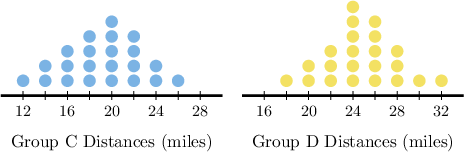
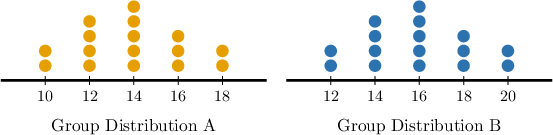
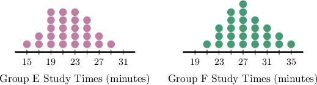
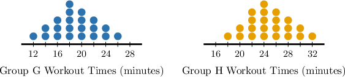

# Assessing Visual Overlap of Data Distributions

Source: https://www.mathacademy.com/topics/7803?courseId=37
Topic ID: 7803

## Prerequisites

- [Writing Ratios Using Fractions](../prealgebra/552-writing-ratios-using-fractions.md)
- [Range, Quartiles, and IQR](../prealgebra/2480-range-quartiles-and-iqr.md)
- [Mean Absolute Deviation](../prealgebra/2481-mean-absolute-deviation.md)
- [Measuring Centrality From Dot Plots](../prealgebra/2500-measuring-centrality-from-dot-plots.md)

## Lesson

### Introduction

When we compare two data distributions, we want to understand two key features:

- where the data is centered, and

- how spread out the data is.

We can estimate both of these directly from a dot plot without doing calculations.

First, look at the center of each distribution.

The center is the point where the dots balance on either side. This is where the mean or median would be located.

- In Distribution $\text{A},$ the middle of the dots appears around $14.$

- In Distribution $\text{B},$ the middle of the dots appears around $16.$

This means Distribution $\text{B}$ is shifted to the right of Distribution $\text{A}.$

Next, look at the spread of each distribution.

Spread describes how far the data values extend from the center and how tightly the dots are clustered. In both dot plots:

- The shapes are the same.

- The dots spread out in a similar way on both sides.

This tells us that the two distributions have about the same variability. So, even though the centers are different, the overall shape and spread are similar.

When two distributions have the same spread but different centers, we say that one distribution is **shifted** relative to the other.

### Example: Comparing Centers of Similar Data Distributions

#### Question

Two groups, $\text{C}$ and $\text{D},$ record the number of miles they walk each week. Their distances are shown on the dot plots above. Complete the following sentence.

$\quad$Since the median distance of Group $\text{D}$ is to the $\boxed{\phantom{\mathrm{right}}}$ of the median distance of Group $\text{C}$, we conclude that Group $\text{D}$ has a $\boxed{\phantom{\mathrm{greater}}}$ median distance.

#### Explanation

We can estimate measures of center by looking at where the "middle" of each dot plot falls.

Each group has the same number of data points, so the median will be around the point where about half the dots are on each side.

- For Group $\text{C},$ the dots are centered around the low $20$s, with the middle of the distribution appearing near $20.$

- For Group $\text{D},$ the entire distribution is shifted to the right, and the middle of the dots appears closer to about $24.$

Since the median distance of Group $\text{D}$ is to the $\boxed{\text{right}}$ of the median distance of Group $\text{C},$ we conclude that Group $\text{D}$ has a $\boxed{\text{greater}}$ median distance.

### Overlaps of Data Distributions

When comparing two data distributions, we can describe their visual overlap more precisely by comparing how far apart their centers are relative to their spread.

To do this, we use the ratio:

$$

\frac{\text{difference between centers}}{\text{measure of variability}}

$$

This ratio tells us how many "spreads" apart the centers are.

Let's go back to our previous example shown below, where the MAD for each is approximately $2.$

In these dot plots, the centers appear close together.

- The mean of Distribution $\text{A}$ is about $14.$

- The mean of Distribution $\text{B}$ is about $16.$

So, the difference between the centers is about $16 - 14 = 2.$ Since the MAD for both distributions is approximately $2,$ the ratio is about

$$

\dfrac{2}{2} = 1.

$$

This means the centers are about $1$ measure of variability apart. This number helps us describe how much the two distributions overlap.

As a rule of thumb, for data with centers:

- about $1$ measure of variability apart, substantial overlap is still likely,

- about $2$ measures of variability apart, overlap is less substantial, and separation is more noticeable, and

- $3$ or more measures of variability apart, there is very little overlap.

**NOTE**: When comparing two data distributions, the measure of variability should match the way the center is measured.

- Use the mean absolute deviation (MAD) when comparing means. MAD measures the typical distance from the mean.

- Use the interquartile range (IQR) when comparing medians. IQR describes the spread of the middle half of the data, which matches the median.

### Example: Comparing Differences in Centers to Measures of Variability

#### Question

Two groups, $\text{E}$ and $\text{F},$ record how many minutes they study each day. Their study times are shown on the dot plots above. The interquartile range of both distributions is approximately $6$ minutes. Estimate how many interquartile ranges apart the medians of the two distributions are.

#### Explanation

We can estimate measures of center by looking at where the "middle" of each dot plot falls.

- For Group $\text{E},$ the middle of the distribution appears to be around $21$ minutes.

- For Group $\text{F},$ the middle of the distribution appears to be around $27$ minutes.

So, the difference between the medians is about $27 - 21 = 6$ minutes.

Since the interquartile range is about $6$ minutes, the medians are about

$$

\dfrac{6}{6} = 1.00

$$

interquartile range apart.

### Example: Assessing Visual Overlap on Dot Plots

#### Question

Two groups, $\text{G}$ and $\text{H},$ record how many minutes they spend working out each day. Their workout times are shown on the dot plots above. The mean absolute deviation of both distributions is approximately $3$ minutes. Which of the following statements are true?

1. The mean workout time for Group $\text{G}$ is greater than the mean workout time for Group $\text{H}.$

2. The difference between the means is about $2$ mean absolute deviations.

3. The two distributions show substantial visual overlap.

#### Explanation

As a rule of thumb, for data with centers:

- about $1$ measure of variability apart, substantial overlap is still likely,

- about $2$ measures of variability apart, overlap is less substantial, and separation is more noticeable, and

- $3$ or more measures of variability apart, there is very little overlap.

With this in mind, let's consider each statement in turn.

- Statement I is false. The center of Group $\text{G}$ appears to be around $19$ minutes, while the center of Group $\text{H}$ appears to be around $25$ minutes. So, the mean workout time for Group $\text{G}$ is less than the mean workout time for Group $\text{H}.$

- Statement II is true. The difference between the centers is about $25 - 19 = 6$ minutes. Since the mean absolute deviation is about $3$ minutes, the difference between the means is about mean absolute deviations.

- Statement III is false. Since the centers are about $2$ measures of variability apart, we would expect a less substantial visual overlap and a more noticeable separation. That is what we see here: while they share some values, the bulk of each distribution is separated, and the visual overlap is not substantial.

In conclusion, the correct answer is "II only".
