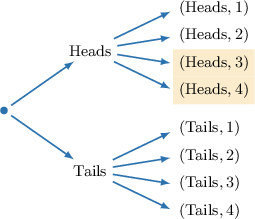
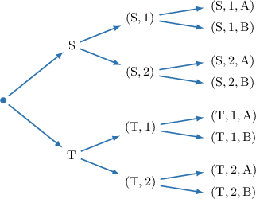
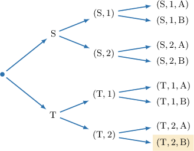

# Computing Probabilities of Compound Events

Source: https://www.mathacademy.com/topics/7804?courseId=37
Topic ID: 7804

## Prerequisites

- [Sample Spaces for Compound Events](./800-sample-spaces-for-compound-events.md)

## Lesson

### Introduction

A compound event is an experiment that consists of two or more events occurring in sequence. Each outcome of a compound event is formed by combining one outcome from each event.

To count the total number of outcomes, we use the **counting principle**.

If one event has $m$ possible outcomes and another event has $n$ possible outcomes, then there are

$$

m \times n

$$

total outcomes for the compound event.

For example, suppose an experiment consists of two steps:

- The first event has $3$ possible outcomes.

- The second event has $2$ possible outcomes.

Each outcome of the compound event is formed by pairing one outcome from the first event with one outcome from the second event.

So, the total number of outcomes is

$$

3 \times 2 = 6.

$$

We can extend this idea to more events. For example, if a third event has $4$ possible outcomes, then the total number of outcomes is

$$

3 \times 2 \times 4 = 24.

$$

Each outcome represents one possible result of the entire sequence of events.

Later, we will use these outcomes to compute probabilities.

### Example: Counting Outcomes of Compound Events

#### Question

A code lock opens using one letter from $\text{A}, \text{B}, \text{C}, \text{D},$ one digit from $1$ through $5,$ and one symbol from $\#, ,$ or $\%.$ How many different codes are possible?

#### Explanation

If there are $m$ outcomes to one event, and $n$ outcomes to another, then the counting principle says that there are $m \times n$ outcomes for the compound event. Multiplication works for any number of events.

In this case, there are

- $4$ ways to choose a letter,

- $5$ ways to choose a digit, and

- $3$ ways to choose a symbol.

Therefore, there are

$$

4 \times 5 \times 3 = \boxed{60}

$$

different codes.

### Probabilities of Compound Events

Recall that the probability of an event when all outcomes are equally likely is given by

$$

P(\textrm{Event}) = \frac{\textrm{Number of favorable outcomes}}{\textrm{Total number of outcomes}}.

$$

We can still use this formula for equally likely compound events.

- We find the total number of outcomes using the counting principle.

- We find the number of favorable outcomes using the sample space.

For example, suppose an experiment consists of flipping a coin and rolling a $4$-sided die. We want to find the probability of flipping Heads and rolling a number greater than $2.$

There are $2$ coin outcomes and $4$ die outcomes, so there are

$$

2 \times 4 = 8

$$

total outcomes.

We've seen previously how to organize these outcomes using a sample space table, where each cell represents one outcome.

So, we can identify the favorable outcomes in the sample space using this table. In this case, there are $2$ outcomes where Heads is flipped *and* a number greater than $2$ is rolled: $(\text{Heads},3)$ and $(\text{Heads},4).$

So, the probability of flipping Heads and rolling a number greater than $2$ is

$$

>2

$$

We can also represent the same outcomes using a tree diagram, where each path corresponds to an outcome.

No matter how we represent the sample space, the probability is found by comparing the number of favorable outcomes to the total number of outcomes.

### Example: Computing the Probability of Two Events Using a Table

#### Question

A customer chooses an ice cream flavor (Vanilla, Chocolate, or Strawberry) and a serving type (Cone or Cup). The table above shows the sample space for all possible combinations. If choices are made at random, what is the probability of choosing Chocolate and getting a Cup?

#### Explanation

The probability of an event when all outcomes are equally likely is given by

$$

P(\textrm{Event}) = \frac{\textrm{Number of favorable outcomes}}{\textrm{Total number of outcomes}}.

$$

There are $3$ flavor outcomes and $2$ serving outcomes. So, there are a total of

$$

3 \times 2 = 6

$$

different compound outcomes.

Looking at the sample space table, we see that there is $1$ outcome in which Chocolate is chosen ** a Cup is selected.

Since each outcome is equally likely, the probability of choosing Chocolate and getting a Cup is

$$

P(\text{Chocolate and Cup}) = \dfrac{1}{6}.

$$

### Example: Computing the Probability of Three Events Using a Tree Diagram

#### Question

A student selects a snack size, either Small $\text{(S)}$ or Tall $\text{(T)}.$ Then, the student chooses the number of items, either $1$ or $2,$ and finally picks a topping, either $\text{A}$ or $\text{B}.$ The tree above shows the sample space for all possible compound events. If choices are made at random, what is the probability of choosing Tall, then $2,$ and then topping $\text{B}?$

#### Explanation

The probability of an event when all outcomes are equally likely is given by

$$

P(\textrm{Event}) = \frac{\textrm{Number of favorable outcomes}}{\textrm{Total number of outcomes}}.

$$

There are $2$ choices for size, $2$ choices for number, and $2$ choices for topping. So, there are a total of

$$

2 \times 2 \times 2 = 8

$$

different compound outcomes.

Looking at the sample space tree, we see that there is $1$ outcome that matches Tall, $2,$ and topping $\text{B}.$

Since each outcome is equally likely, the probability of choosing Tall, then $2,$ and then topping $\text{B}$ is

$$

P(\text{Tall, 2, and B}) = \dfrac{1}{8}.

$$
