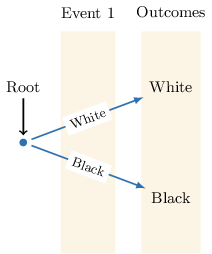
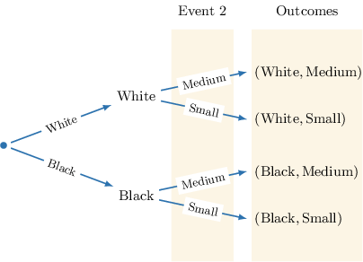
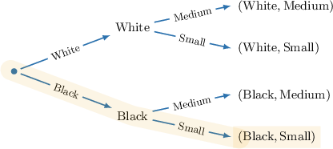
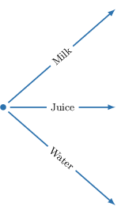
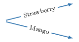
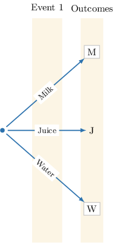

# Sample Spaces for Compound Events

Source: https://www.mathacademy.com/topics/800?courseId=37
Topic ID: 800

## Prerequisites

- [Single Events in Probability](./709-single-events-in-probability.md)
- [Probability of Single Events](./783-probability-of-single-events.md)

## Lesson

### Introduction

A **compound event** is an event that involves two (or more) single events happening together.

For example, consider an experiment where a spinner has outcomes Red and Blue, and a coin has outcomes Heads and Tails. Recording the results of spinning the spinner and then tossing the coin is a compound event.

Recall that a sample space is the collection of all possible outcomes of an experiment.

For a compound event, each outcome is written as an ordered list wrapped in parentheses, where the order shows the result of each event in the sequence.

In this experiment, the first event is spinning the spinner, and the second event is tossing a coin.

We list outcomes by recording the result of the first event, followed by the result of the second event.

- If the spinner lands on Red and the coin lands on Heads, the outcome is $(\text{Red},\text{Heads}).$

- If the spinner lands on Red and the coin lands on Tails, the outcome is $(\text{Red},\text{Tails}).$

- If the spinner lands on Blue and the coin lands on Heads, the outcome is $(\text{Blue},\text{Heads}).$

- If the spinner lands on Blue and the coin lands on Tails, the outcome is $(\text{Blue},\text{Tails}).$

Putting it all together, the complete sample space for this compound event is

$$

\big\{ (\text{Red},\text{Heads}), (\text{Red},\text{Tails}), (\text{Blue},\text{Heads}), (\text{Blue},\text{Tails}) \big\}.

$$

Notice that order matters. The outcome $(\text{Red},\text{Heads})$ is different from $(\text{Heads},\text{Red})$ because the first value always represents the result of the spinner, and the second value represents the result of the coin.

### Example: Identifying Elements of the Sample Space

#### Question

A coach is assigning three different positions (Captain, Assistant, and Manager) to three players: Diego $(\text{D}),$ Elena $(\text{E}),$ and Farah $(\text{F}).$ The coach assigns one position at a time without replacement. Which of the following are elements of the sample space of this selection?

1. $(\text{D},\text{E},\text{F})$

2. $(\text{E},\text{F},\text{E})$

3. $(\text{F},\text{D},\text{E})$

#### Explanation

Compound events involve two (or more) single events happening together. Outcomes of compound events are written in ordered lists wrapped in parentheses.

The sample space is the collection of all possible outcomes of the experiment.

Now, let's check each ordered list.

- Ordered list I is part of the sample space. It represents the valid assignment where Diego $(\text{D})$ is Captain, Elena $(\text{E})$ is Assistant, and Farah $(\text{F})$ is Manager.

- Ordered list II is ** part of the sample space. Since the assignment is made without replacement, Elena $(\text{E})$ cannot be assigned to more than one position.

- Ordered list III is part of the sample space. It represents the valid assignment where Farah $(\text{F})$ is Captain, Diego $(\text{D})$ is Assistant, and Elena $(\text{E})$ is Manager.

In conclusion, the correct answer is "I and III only".

### Compound Events From Tables

To organize the sample space of a compound event, we can use different visual aids.

For example, we can place the sample space of a compound event in a **sample space table**:

- Each column represents one outcome of the first event.

- Each row represents one outcome of the second event.

- Each cell combines a column label and a row label to form an ordered outcome.

Consider an experiment where a customer chooses a drink size (Small or Large) and a flavor (Chocolate or Vanilla).

In this experiment, the first event is choosing a size, and the second event is choosing a flavor.

In a sample space table, an outcome is written as an ordered pair: $(\text{column},\text{row}).$

We write each outcome as follows:

- In the column Small and row Chocolate, the outcome is $(\text{Small},\text{Chocolate}).$

- In the column Small and row Vanilla, the outcome is $(\text{Small},\text{Vanilla}).$

- In the column Large and row Chocolate, the outcome is $(\text{Large},\text{Chocolate}).$

- In the column Large and row Vanilla, the outcome is $(\text{Large},\text{Vanilla}).$

### Example: Identifying Sample Spaces From Tables

#### Question

One turn of a game requires a player to spin a spinner with colors Yellow $(\text{Y}),$ Purple $(\text{P}),$ and Orange $(\text{O}),$ and then roll a fair $3$-sided die labeled $1, 2,$ and $3.$ Complete the table below summarizing the sample space of one turn.

#### Explanation

In a sample space table, an outcome is written as an ordered pair: (Column Label, Row Label).

From left to right:

- The first missing cell is in Column "Yellow" and Row $1,$ so the outcome is $(\text{Y},1).$

- The second missing cell is in Column "Purple" and Row $2,$ so the outcome is $(\text{P},2).$

- The third missing cell is in Column "Orange" and Row $3,$ so the outcome is $(\text{O},3).$

We obtain the following completed table.

### Compound Events From Tree Diagrams

To organize the sample space of a compound event, we can also use a **tree diagram**:

- Each branch represents one outcome of an event.

- Each path represents one ordered outcome.

For example, consider an experiment in which a student chooses a shirt color (Black or White) and then a size (Small or Medium).

In this experiment, the first event is choosing a color, and the second event is choosing a size.

We build the tree by starting with the outcomes of the first event. From a **root** (a dot), we draw one **branch** (arrow) for each outcome of the first event.

From each of these outcomes, we draw new branches to represent the outcomes of the second event.

The tree is now complete. Each complete path from the start of the tree to an endpoint represents one ordered outcome in the sample space. For instance, following the path Black → Small gives the outcome $(\text{Black},\text{Small}).$

Similarly:

- Following the path Black → Medium gives the outcome $(\text{Black},\text{Medium}).$

- Following the path White → Small gives the outcome $(\text{White},\text{Small}).$

- Following the path White → Medium gives the outcome $(\text{White},\text{Medium}).$

### Example: Identifying Sample Spaces From Tree Diagrams

#### Question

A smoothie shop lets customers create a drink by choosing one base: Milk $(\text{M}),$ Juice $(\text{J}),$ or Water $(\text{W}),$ and one flavor: Strawberry $(\text{S})$ or Mango $(\text{G}).$ Complete the tree diagram below summarizing the sample space of a customer's selection.

#### Explanation

A compound event tree diagram is a visual tool used to map out all possible outcomes of a compound event.

We build a tree by considering each event in turn.

The first event is selecting a base. There are three outcomes: Milk $(\text{M}),$ Juice $(\text{J}),$ and Water $(\text{W}).$ In the tree diagram, these form the primary branches starting from the root node, labeled $\boxed{\text{M}},$ $\text{J},$ and $\boxed{\text{W}}$ on the ends of the branches labeled "Milk", "Juice", and "Water", respectively.

Now, we consider the second event: selecting a flavor. For each outcome of the first event, the second event has two outcomes: Strawberry $(\text{S})$ and Mango $(\text{G}).$

- First, we consider the case where the outcome of the first event is $\text{M}.$ Following the "Milk" branch, we see sub-branches for "Strawberry" and "Mango". For each path, we write the corresponding outcomes as an ordered list: $\boxed{(\text{M},\text{S})}$ and $\boxed{(\text{M},\text{G})}.$

- Similarly, for the path following the "Juice" branch, we have sub-branches for "Strawberry" and "Mango". We write the corresponding outcomes as the ordered lists: $(\text{J},\text{S})$ and $\boxed{(\text{J},\text{G})}.$

- Finally, for the path following the "Water" branch, we have sub-branches for "Strawberry" and "Mango". We write the corresponding outcomes as the ordered lists: $\boxed{(\text{W},\text{S})}$ and $(\text{W},\text{G}).$
