# Regular Polygons

Source: https://www.mathacademy.com/topics/1322?courseId=39
Topic ID: 1322

## Prerequisites

- [Exterior Angles of Polygons](./1321-exterior-angles-of-polygons.md)
- [Congruent Segments](../prealgebra/1462-congruent-segments.md)

## Lesson

### Introduction

A **regular polygon** is a polygon where all sides are congruent (have the same length), and all interior angles are congruent (have the same measure).

Some examples of regular polygons are shown below.

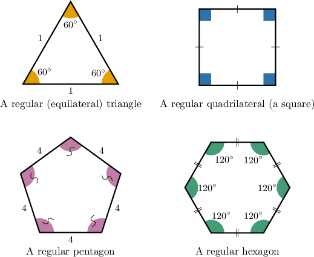

Some examples of polygons that are **NOT** regular are as follows:

- The rectangle below is **NOT** regular since the sides are not all congruent.

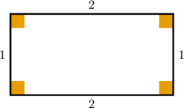

- The rhombus below is **NOT** regular since the interior angles are not all congruent.

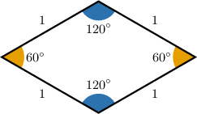

- A $30^\circ$-$60^\circ$-$90^\circ$ triangle is **NOT** regular since neither the sides nor the angles are all congruent.

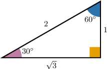

### Example: Identifying Regular Polygons

#### Question

Which of the shapes below is a regular polygon?

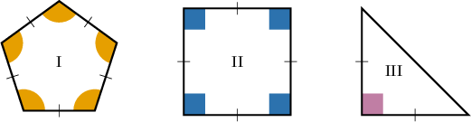

#### Explanation

A regular polygon is a polygon that has the following properties:

- All sides have the same length (i.e., congruent).

- All angles have the same measure (i.e., congruent).

With that in mind, let's look at each polygon in turn:

- Polygon I is regular. Its sides and angles are all congruent.

- Polygon II is regular. Its sides and angles are all congruent.

- Polygon III is not regular. Its sides and angles are ** all congruent.

Therefore the answer is "I and II only."

### Interior Angles of Regular Polygons

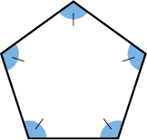

Consider the regular pentagon above. What is the measure of each interior angle?

Recall that the sum of the interior angles of a polygon with $n$ sides equals $180^\circ \cdot (n-2).$

All interior angles in a regular polygon are congruent. So, to calculate the measure of each interior angle, we find the sum of the interior angles and divide by the number of angles.

A pentagon has $n=5$ sides. Therefore, the sum of its interior angles is

$$

180^\circ \times (5 - 2) = 540^\circ.

$$

Therefore, the measure of each interior angle is

$$

\dfrac{540^\circ}{5} = 108^\circ,

$$

as shown below.

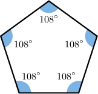

### Example: Finding the Interior Angles of a Regular Polygon

#### Question

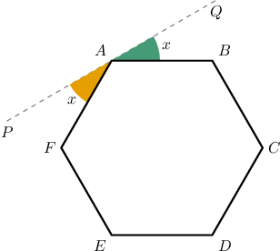

The hexagon $ABCDEF$ is regular. Find the value of $x.$

#### Explanation

A regular hexagon is a $6$-sided polygon where all the interior angles have the same measure.

The sum of the measures of its interior angles is

$$

180^\circ \times (6 - 2) = 720^\circ.

$$

Therefore, the measure of $\angle BAF$ is

$$

m\angle BAF = \dfrac{720^\circ}{6} = 120^\circ.

$$

The angles $\angle QAB,$ $\angle BAF,$ and $\angle FAP$ form a straight angle. Therefore,

$$

\begin{aligned}𝑚∠𝑄𝐴𝐵+𝑚∠𝐵𝐴𝐹+𝑚∠𝐹𝐴𝑃 & =180^{∘} \\ 𝑥+𝑚∠𝐵𝐴𝐹+𝑥 & =180^{∘} \\ 2𝑥+120^{∘} & =180^{∘} \\ 𝑥 & =30^{∘}.\end{aligned}

$$

### Exterior Angles of Regular Polygons

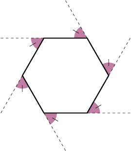

Consider the regular hexagon above. What is the measure of each *exterior* angle?

Note the following:

- The exterior angles in a regular polygon are all congruent.

- The sum of the exterior angles of *any* convex polygon equals $360^\circ.$

So, to find the measure of the exterior angles of a regular polygon, we divide $360^\circ$ by the number of sides.

Since a regular hexagon has $n=6$ sides, the measure of each exterior angle is

$$

\dfrac{360^\circ}{6} = 60^\circ,

$$

as shown below.

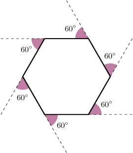

### Example: Finding the Exterior Angles of a Regular Polygon

#### Question

In a regular polygon, all the exterior angles have a measure of $20^\circ.$ How many sides does the polygon have?

#### Explanation

The sum of the exterior angles of any polygon is $360^\circ.$

For a regular polygon, all exterior angles have the same measure.

Therefore, the number of exterior angles is

$$

\dfrac{360^\circ}{20^\circ} = 18\,.

$$

The number of sides, then, is also $18.$

### Example: Finding Exterior Angles With Multiple Polygons

#### Question

The diagram shows a regular octagon and a regular triangle. Find the measure of the shaded angle.

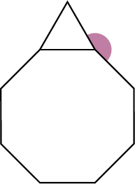

#### Explanation

The shaded angle is the sum of the measures of exterior angles of a regular octagon and a regular triangle.

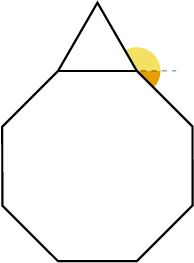

For any polygon, the exterior angles sum to $360^\circ.$ In a regular octagon, there are $8$ equivalent exterior angles, so each has a measure of

$$

\dfrac{360^\circ}{8} = 45^\circ .

$$

Likewise, in a regular triangle, there are $3$ equivalent exterior angles, so each has a measure of

$$

\dfrac{360^\circ}{3} = 120^\circ .

$$

Therefore, the given angle has the following measure:

$$

45^\circ + 120^\circ = 165^\circ

$$
