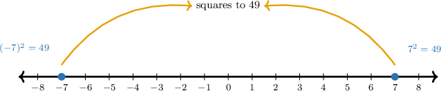

# Solving Equations Using Square Roots

Source: https://www.mathacademy.com/topics/2280?courseId=39
Topic ID: 2280

## Prerequisites

- [Solving Two-Step Equations](../prealgebra/66-solving-two-step-equations.md)
- [Evaluating Expressions With Positive Integer Exponents](../prealgebra/121-evaluating-expressions-with-positive-integer-exponents.md)
- [Rationalizing Denominators](./1318-rationalizing-denominators.md)
- [The Square Root of a Perfect Square](./1822-the-square-root-of-a-perfect-square.md)

## Lesson

### Introduction

When a quantity is squared, a square root helps us undo the square. A **squared expression** is a quantity raised to the power such as or

The key idea is that two opposite numbers can have the same square. For example, both and

So, when we solve we must include both roots:

Let's see how this works when the squared term is not isolated yet. Solve First, we isolate by subtracting from both sides:

Now, we take the square root of both sides. Since both and square to we get

Written in increasing order, the solutions are and In the next example, we will use the same idea after adding or subtracting to isolate the squared term.

### Example: Solving an Equation Using the Addition Principle and Square Roots

#### Question

Find all values of that satisfy Give the solutions in increasing order.

#### Explanation

To solve the equation for we first need to isolate the term on the left-hand side.

We apply the addition principle, adding to both sides of the equation:

Next, we take the square root of both sides of the equation to solve for Since both and we must consider both the positive and negative roots:

This gives us two solutions: and

Written in increasing order, the solutions are and

### Isolating the Squared Term Using Multiplication or Division

Sometimes the squared term is being multiplied or divided by a number. We still start by isolating the squared term, but now the inverse operation is multiplication or division.

Solve Here, is being multiplied by so we divide both sides by

Now, the equation has the familiar form We take the square root of both sides and include both roots:

So, the solutions are and

**Watch out!** Dividing by does not give It gives and we still need the square root step.

### Example: Solving an Equation Using the Multiplication Principle and Square Roots

#### Question

Find all values of that satisfy Give the solutions in increasing order.

#### Explanation

To isolate, we first need to isolate the squared term, In the equation, is being ** by We can perform the ** operation, which is ** by So, we multiply both sides of the equation by

Now, we can cancel a common factor of from the numerator and denominator.

Next, we take the square root of both sides to solve for Because squaring either a positive or a negative number yields a positive result, we must include both the positive and negative square roots:

Therefore, in increasing order, the solutions are and

### Solving Two-Step Equations With Square Roots

For a two-step equation, we use inverse operations in the order that isolates the squared term first. Usually, that means we undo addition or subtraction, then undo multiplication or division.

Solve First, we subtract from both sides:

Next, we divide both sides by:

Finally, we take the square root of both sides. Since is positive, there are two possible solutions:

Therefore, written in increasing order, the solutions are and The same sequence works whenever a squared term must be isolated before taking square roots.

### Example: Solving an Equation Using the Addition and Multiplication Principles and Square Roots

#### Question

Find all values of that satisfy Give the solutions in increasing order.

#### Explanation

First, we apply the addition principle, adding to both sides:

Second, we apply the multiplication principle, dividing both sides by

Finally, we take the square root of both sides. Since is a positive number, there are two possible solutions—one positive and one negative:

This gives and.

Therefore, in increasing order, the solutions are and.

### Checking Solutions

After we find possible solutions, we can check them by substituting each value back into the original equation. This is especially helpful because square roots often give two candidates.

Suppose we solved an equation and found the candidates and for

We check each candidate in the original equation, not just in the simplified equation.

For we get

For we get

Both candidates satisfy the original equation, so both are solutions. In the next slide, we will use the same checking idea when the whole expression inside parentheses is squared.

### Solving Equations With a Squared Binomial

A **squared binomial** is a two-term expression that is squared, such as We do not need to expand it first. Instead, we take the square root to isolate the expression inside the parentheses.

Solve Taking the square root of both sides gives two cases because both and equal

Now, we solve the two resulting equations.

- If then adding to both sides gives

- If then adding to both sides gives

So, the possible solutions are and A quick check confirms both: and

Therefore, written in increasing order, the solutions are and

### Example: Solving an Equation Using Square Roots

#### Question

Find all values of that satisfy Give the solutions in increasing order.

#### Explanation

To solve the equation, we first take the square root of both sides to isolate the expression inside the parentheses. Then, we solve for

Taking the square root of both sides of we must consider both the positive and negative roots since squaring either gives

This gives us two separate equations to solve.

- If we apply the addition principle by adding to both sides to get

- If we apply the addition principle by adding to both sides to get

We must verify each candidate by substituting it back into the original equation.

- For

- For

Both values satisfy the original equation. Therefore, written in increasing order, the solutions are and
