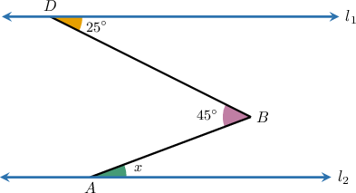
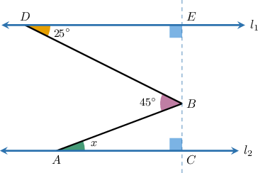
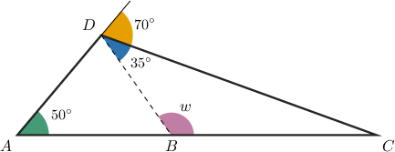
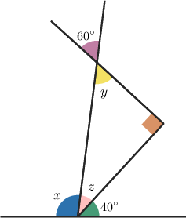

# Problem Solving With Angles of Triangles

Source: https://www.mathacademy.com/topics/3731?courseId=39
Topic ID: 3731

## Prerequisites

- [Interior Angles of Triangles](../prealgebra/496-interior-angles-of-triangles.md)
- [Segment Bisectors and the Perpendicular Bisector Theorem](../prealgebra/521-segment-bisectors-and-the-perpendicular-bisector-theorem.md)
- [Consecutive Angles](./4104-consecutive-angles.md)

## Lesson

### Introduction

In some geometry problems involving triangles, we have to apply a mix of different theorems to find the solution.

For example, consider the diagram below, where $l_1 \parallel l_2.$ What is the value of $x?$

Since $l_1 \parallel l_2$, we can draw a line perpendicular to both. Let's draw that line passing through the point $B,$ as shown below.

The sum of the measures of the interior angles of a triangle is $180^\circ.$ Therefore, for $\triangle BED,$ we have

$$

\begin{aligned}25^{∘}+90^{∘}+𝑚∠𝐷𝐵𝐸 & =180^{∘} \\ 115^{∘}+𝑚∠𝐷𝐵𝐸 & =180^{∘} \\ 𝑚∠𝐷𝐵𝐸 & =65^{∘}.\end{aligned}

$$

Since the straight angle $\angle CBE$ must have a measure of $180^\circ,$ we have

$$

\begin{aligned}𝑚∠𝐷𝐵𝐸+45^{∘}+𝑚∠𝐴𝐵𝐶 & =180^{∘} \\ 65^{∘}+45^{∘}+𝑚∠𝐴𝐵𝐶 & =180^{∘} \\ 110^{∘}+𝑚∠𝐴𝐵𝐶 & =180^{∘} \\ 𝑚∠𝐴𝐵𝐶 & =70^{∘}.\end{aligned}

$$

Finally, in $\triangle ACB,$ we have

$$

\begin{aligned}𝑥+90^{∘}+𝑚∠𝐴𝐵𝐶 & =180^{∘} \\ 𝑥+90^{∘}+70^{∘} & =180^{∘} \\ 𝑥+160^{∘} & =180^{∘} \\ 𝑥 & =20^{∘}.\end{aligned}

$$

### Example: Calculating the Measure of an Angle Using Multiple Theorems: Simple Cases

#### Question

Find the value of $w.$

#### Explanation

First, we note that

$$

\begin{aligned}70^{∘}+35^{∘}+𝑚∠𝐴𝐷𝐵 & =180^{∘} \\ 105^{∘}+𝑚∠𝐴𝐷𝐵 & =180^{∘} \\ 𝑚∠𝐴𝐷𝐵 & =75^{∘}.\end{aligned}

$$

In $\triangle{ADB},$ the interior angles must sum to $180^\circ.$ Therefore, we have

$$

\begin{aligned}𝑚∠𝐴+𝑚∠𝐴𝐷𝐵+𝑚∠𝐴𝐵𝐷 & =180^{∘} \\ 50^{∘}+75^{∘}+𝑚∠𝐴𝐵𝐷 & =180^{∘} \\ 125^{∘}+𝑚∠𝐴𝐵𝐷 & =180^{∘} \\ 𝑚∠𝐴𝐵𝐷 & =55^{∘}.\end{aligned}

$$

Finally, since $\angle ABC$ is straight, we have

$$

\begin{aligned}𝑤+𝑚∠𝐴𝐵𝐷 & =180^{∘} \\ 𝑤+55^{∘} & =180^{∘} \\ 𝑤 & =125^{∘}.\end{aligned}

$$

### Example: Calculating the Measure of an Angle Using Multiple Theorems

#### Question

Find the value of $x.$

#### Explanation

First, note that $y=60^\circ$ because vertical angles have the same measure.

Now, since the sum of the measures of the interior angles of a triangle is $180^\circ$, we have

$$

\begin{aligned}𝑦+𝑧+90^{∘} & =180^{∘} \\ 60^{∘}+𝑧+90^{∘} & =180^{∘} \\ 𝑧+150^{∘} & =180^{∘} \\ 𝑧 & =30^{∘}\,.\end{aligned}

$$

Since the straight angle shown in the diagram must have a measure of $180^\circ,$ we have

$$

\begin{aligned}𝑥+𝑧+40^{∘} & =180^{∘} \\ 𝑥+30^{∘}+40^{∘} & =180^{∘} \\ 𝑥+70^{∘} & =180^{∘} \\ 𝑥 & =110^{∘}.\end{aligned}

$$
