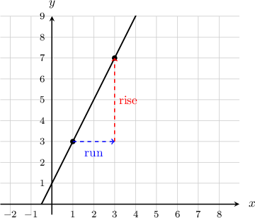
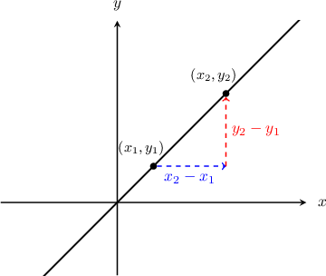
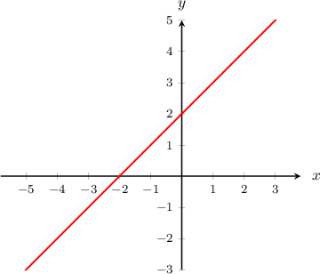
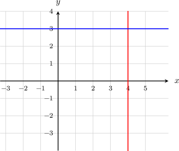
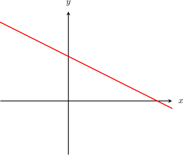

# Calculating Slopes of Straight Lines

Source: https://www.mathacademy.com/topics/396?courseId=39
Topic ID: 396

## Prerequisites

- [Horizontal and Vertical Lines](./97-horizontal-and-vertical-lines.md)
- [Unit Rates](../prealgebra/557-unit-rates.md)
- [Distances Between Points in the Coordinate Plane](../prealgebra/573-distances-between-points-in-the-coordinate-plane.md)
- [Evaluating Rational Expressions](../prealgebra/2183-evaluating-rational-expressions.md)

## Lesson

### Introduction

The **slope** of a line, denoted $m,$ measures how steep the line is. It is given by the following formula:

$$

m = \dfrac{\color{red}{\textrm{rise}}}{\color{blue}{\textrm{run}}}

$$

Let's calculate the slope of the line that passes through the points $(1, 3)$ and $(3, 7)$, as shown below.

Moving from $(1, 3)$ to $(3, 7)$, the line rises *vertically* by $\color{red}4$ units while running $\color{blue}2$ units *horizontally*. Therefore, the slope of this line is

$$

m = \dfrac{\color{red}{\textrm{rise}}}{\color{blue}{\textrm{run}}} = \dfrac{\color{red}{4}}{\color{blue}{2}} = 2.

$$

The slope $m = 2$ is a *unit rate.* It tells us the line rises *vertically* by $2$ units per unit of *horizontal* change.

Note the following:

- If a line moves upward as we move from left to right ($\nearrow$), its slope is **positive** because the line rises by a positive amount.

- If a line moves downward as we move from left to right ($\searrow$), its slope is **negative** because the line falls (meaning it rises by a negative amount).

### The General Formula for Slope

Suppose that $(x_1, y_1)$ and $(x_2, y_2)$ are two points on a straight line, as shown below.

The "rise" of the line is $\color{red}y_2 - y_1,$ and the "run" of the line is $\color{blue}x_2-x_1$. Therefore, we compute the slope $m$ of the line as follows:

$$

m = \dfrac {y_2 - y_1} {x_2 - x_1}

$$

For vertical lines, **the slope is undefined**. This is because $x_2 - x_1 = 0,$ which leads to division by zero in the above formula.

**Note**: We can pick *any* point on the line as our $(x_1,y_1)$ and any other point on the line as $(x_2,y_2).$ We will get the same answer for the slope no matter which pair of points we pick.

### Example: Calculating the Slope Given Two Points

#### Question

Calculate the slope of the line that passes through the points $(1, 5)$ and $(4, 2).$

#### Explanation

We let $(x_1,y_1) = (1,5)$ and $(x_2,y_2) = (4,2),$ and compute the slope using the formula:

$$

\begin{aligned} m &= \dfrac {y_2 - y_1} {x_2 - x_1} \\&= \dfrac {2 - 5} {4 - 1} \\&= \dfrac {-3}{3} \\&= -1 \end{aligned}

$$

Thus, the slope is $m=-1.$

### Example: Calculating the Slope of a Graphed Line

#### Question

Calculate the slope of the line shown below.

#### Explanation

Note that the line passes through the points $(-2,0)$ and $(0,2).$ So, we let $(x_1,y_1) = (-2,0)$ and $(x_2,y_2) = (0,2),$ and compute the slope using the formula:

$$

\begin{aligned}𝑚 & =\frac{𝑦_{2}−𝑦_{1}}{𝑥_{2}−𝑥_{1}} \\ & =\frac{2−0}{0−(−2)} \\ & =\frac{2}{2} \\ & =1\end{aligned}

$$

Therefore, the slope of the line is $m=1.$

### Example: Slopes of Horizontal and Vertical Lines

#### Question

Find the slope of each of the lines below.

#### Explanation

The slope of the vertical line is undefined. We can see this by choosing two points on the line, such as $(4,0)$ and $(4,1),$ and computing the slope between them:

$$

\begin{aligned}𝑚=\frac{𝑦_{2}−𝑦_{1}}{𝑥_{2}−𝑥_{1}}=\frac{1−0}{4−4}=\frac{1}{0}=undefined\end{aligned}

$$

On the other hand, the slope of the horizontal line is zero. We can see this by choosing two points on the line, such as $(0,3)$ and $(1,3),$ and computing the slope between them:

$$

\begin{aligned}𝑚=\frac{𝑦_{2}−𝑦_{1}}{𝑥_{2}−𝑥_{1}}=\frac{3−3}{1−0}=\frac{0}{1}=0\end{aligned}

$$

### Example: Inferring the Sign of the Slope of a Graphed Line

#### Question

Given the following graph, what can we say about the sign of the slope?

#### Explanation

Remember that slope is the amount the line rises vertically per unit that it runs horizontally.

Since the graph decreases ($\searrow$) as we go from left to right, the line rises by a negative amount.

Therefore, the slope of the line is negative.
