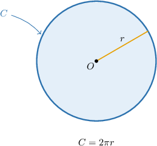
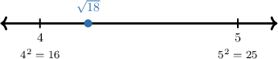

# Estimating Expressions With Irrational Numbers

Source: https://www.mathacademy.com/topics/7894?courseId=39
Topic ID: 7894

## Prerequisites

- [Approximating Square Roots and Cube Roots](./492-approximating-square-roots-and-cube-roots.md)
- [The Circumference of a Circle](../grade-7/520-the-circumference-of-a-circle.md)

## Lesson

### Introduction

Sometimes an expression contains a number like or a square root that does not have a neat exact decimal value. When that happens, we can still make a useful calculation by estimating.

An **estimate** is a reasonable approximate value. For an expression with irrational numbers, we usually estimate by replacing each difficult number with a nearby decimal or benchmark that is easy to use.

For example, suppose we want a quick estimate for Since is a little more than we know

If we need a more precise estimate, we can use so

The main goal is not to find the exact decimal forever. The goal is to choose an approximation that fits the question, do the arithmetic carefully, and check that the result is reasonable.

### Using Approximations for Pi

The number appears in circle formulas. When a problem gives we substitute wherever we see

For a circle with radius the circumference is given by Here, is the radius of the circle, and is the distance around the circle.

Before using the formula, it helps to notice the structure. The expression means we multiply and the radius.

Let's estimate using rounded to decimal place.

Now, we round to the nearest tenth. The tenths digit is and the hundredths digit is Since we round down:

So, In a circumference problem, we use the same idea after substituting the radius into

### Example: Estimating an Expression Involving Pi

#### Question

A circular fountain has a radius of Using the approximation estimate its circumference rounded to decimal place.

#### Explanation

To estimate the circumference, we substitute the radius and the approximation into the given expression

Next, we round the result to one decimal place (the nearest tenth). We start by locating the digit in the tenths place:

We then look one digit to the right and compare it to the number

Since is greater than or equal to we round up. To do this, we increase the tenths digit by one and remove all digits to the right:

Therefore, the circumference of the fountain is approximately

### Approximating Square Roots

To estimate a square root, we compare the number under the radical to nearby perfect squares.

For example, to estimate we use the perfect squares and Since we know

Because is much closer to than to should be a little more than We can test a nearby decimal:

Since is close to a reasonable estimate is

Now, suppose we want to estimate We substitute the estimate and then add:

The same plan works if the square root is multiplied by a coefficient, like or combined with subtraction. First estimate the square root, then use the operation in the expression.

### Example: Estimating an Expression Involving a Square Root

#### Question

Find the best estimate for

#### Explanation

First, we estimate the value of the square root.

Since we know that Because is very close to is just slightly less than

Next, we substitute this estimate into the expression. Multiplying by a number slightly less than results in a number slightly less than

Therefore, the best estimate is

### Estimating With Multiple Irrational Numbers

When an expression has more than one irrational number, we estimate each irrational part first. Then, we combine the approximations using the operations in the expression.

Let's estimate using

First, we approximate the term:

Next, we approximate the square root. Since we know Because is close to is just less than We can test a number close to

So, a good estimate is Now, we add:

Rounded to decimal place,

So, If an expression has two square roots and a term, we use the same process: estimate each term, add carefully, and check that the final size makes sense.

### Example: Estimating an Expression Involving Multiple Irrational Numbers

#### Question

Using estimate the value of rounded to decimal place.

#### Explanation

To estimate the value of the expression, we can approximate each irrational number before adding them.

First, we approximate The number is slightly less than the perfect square so is slightly less than We can test a number close to

Since is very close to a good estimate for is

Next, we approximate The number is slightly less than the perfect square so is slightly less than We can test numbers close to

Since is closer to than to a good estimate for is

We are given that

Now, we add these approximations together:

Rounding this sum to decimal place gives

Therefore, the value of the expression is approximately
