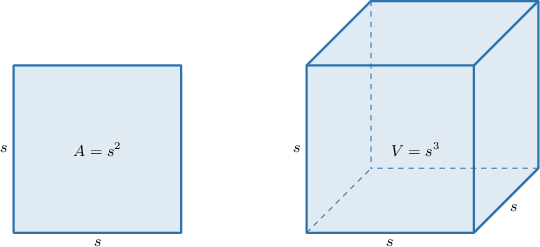
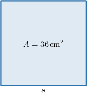
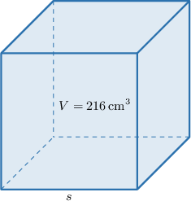
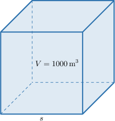
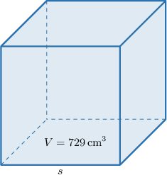

# Finding Side Lengths of Squares and Cubes From Area or Volume

Source: https://www.mathacademy.com/topics/7896?courseId=39
Topic ID: 7896

## Prerequisites

- [Areas of Rectangles and Squares](../prealgebra/1352-areas-of-rectangles-and-squares.md)
- [Solving Equations Using Square Roots](./2280-solving-equations-using-square-roots.md)
- [Volumes of Cubes](../grade-7/7213-volumes-of-cubes.md)
- [Solving Equations Using Cube Roots](./13765-solving-equations-using-cube-roots.md)

## Lesson

### Introduction

When a square or cube has all equal side lengths, its area or volume comes from using the same length repeatedly.

For a square, one side length is used twice. If is the side length, then the area is

For a cube, one edge length is used three times. If is the edge length, then the volume is

So, finding the missing side or edge length means undoing the power.

- To undo squaring, we take a square root.

- To undo cubing, we take a cube root.

We also keep the units straight. Area uses square units, such as but the side length uses length units, such as Volume uses cubic units, such as but the edge length still uses length units, such as

### Finding a Square's Side Length From Area

A square has equal sides, so its area is found by multiplying one side length by itself.

Suppose a square has area We want to find the side length

The area of a square is given by where is the length of a side.

Substituting gives

To find the side length, we take the positive square root of the area:

Therefore, the length of each side is

**Watch out!** The answer is not The number describes square units of area. The side length is the number that squares to make

### Example: Finding the Side Length of a Square Given Its Area

#### Question

The area of a square is Find the length of each side.

#### Explanation

The area of a square is given by where is the length of a side.

We are given that the area is so we have

To find we take the square root of the area:

Therefore, the length of each side is

### Finding a Cube's Edge Length From Volume

For a cube, every edge has the same length. The volume comes from multiplying that edge length by itself three times.

Suppose a cube has volume We want to find the edge length

The volume of a cube is given by where is the length of an edge.

Substituting gives

To find the edge length, we take the cube root of the volume:

Therefore, the length of each edge is

A quick check confirms the result, since

### Example: Finding the Edge Length of a Cube Given Its Volume

#### Question

The volume of a cube is Find the length of each edge.

#### Explanation

The volume of a cube with edge length is given by the formula

We are given that the volume is To find the edge length, we take the cube root of the volume, as follows:

Notice that is a perfect cube. We can express it as follows:

Therefore, the length of each edge is

### Choosing Square Roots or Cube Roots in Word Problems

In a word problem, we first decide what kind of measurement is given.

- If the problem gives the area of a square, use and take a square root.

- If the problem gives the volume of a cube, use and take a cube root.

For example, suppose a square poster has area Since area is given for a square, we solve Taking the positive square root gives So, each side of the poster is long.

Now, suppose a cubic container has volume Since volume is given for a cube, we solve Taking the cube root gives So, each edge of the container is long.

The units help us check the choice: square units point to area and square roots, while cubic units point to volume and cube roots.

### Example: Solving Word Problems Involving Square or Cube Side Lengths

#### Question

A cubic shipping crate holds a volume of What is the length of each edge of the crate?

#### Explanation

The volume of a cube is given by the formula where is the edge length.

We are given that the volume of the crate is Substituting into the formula, we get

To find the edge length, we solve for by taking the cube root of both sides:

Therefore, the length of each edge of the crate is
