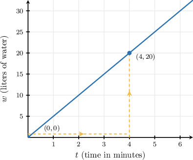
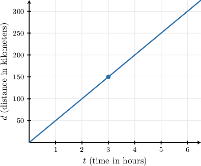
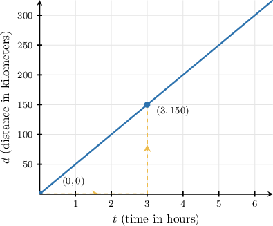
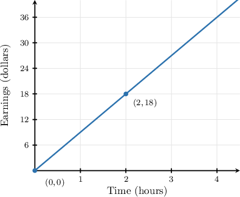
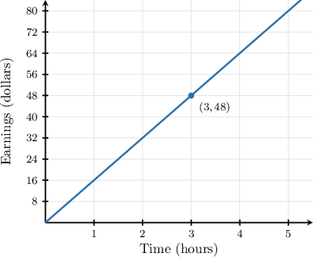
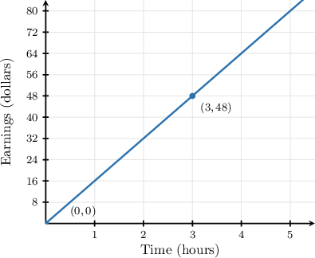
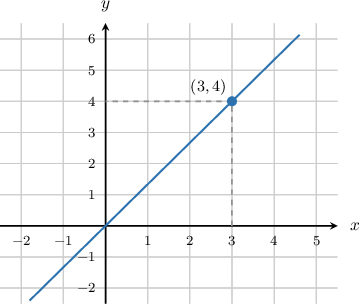
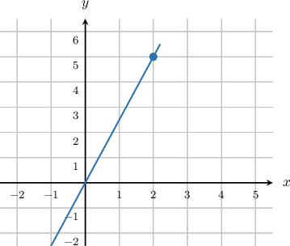
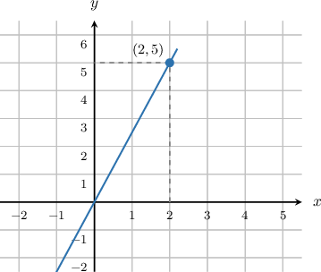

# Slope as a Unit Rate in Proportional Relationships

Source: https://www.mathacademy.com/topics/7897?courseId=39
Topic ID: 7897

## Prerequisites

- [Analyzing and Interpreting Graphs of Linear Equations](./1588-analyzing-and-interpreting-graphs-of-linear-equations.md)
- [Understanding Proportional Relationships Using Graphs](../prealgebra/2552-understanding-proportional-relationships-using-graphs.md)
- [Understanding Proportional Relationships From Descriptions](../prealgebra/2554-understanding-proportional-relationships-from-descriptions.md)

## Lesson

### Introduction

We already know how to find a slope from a graph and how to describe a unit rate. Now, we connect those ideas for proportional relationships.

A proportional relationship has a graph that is a straight line through the origin. If the horizontal axis is the input and the vertical axis is the output, then every point on the line shows a ratio between the two quantities.

For example, suppose a graph shows that a machine fills liters of water in minutes. Because the relationship is proportional, the amount filled per minute stays the same.

We find that "per minute" amount by dividing:

So, the machine fills liters per minute.

On the graph, that same number is the slope of the line. A greater unit rate makes a steeper proportional line, because the output increases by more for each -unit increase in the input.

### Slope as a Unit Rate

To find a unit rate from a proportional graph, we can use the slope. The units of the slope tell us the units of the rate.

Suppose the graph shows the number of liters of water, in a tank after minutes.

The line passes through the origin and the point The units of the slope are or liters per minute.

Now, we calculate the slope of the line:

The slope is which means the amount of water increases by liters for each additional minute.

So, the unit rate is liters per minute.

### Example: Identifying the Unit Rate as the Slope of a Proportional Graph

#### Question

The graph above shows a proportional relationship between the distance a train travels, in kilometers, and the time elapsed, in hours. Using the slope, find how many kilometers the train travels each hour.

#### Explanation

To find the number of kilometers the train travels each hour, notice that the units of the slope are or kilometers per hour. So, to calculate the number of kilometers traveled each hour, we need to calculate the slope of the line.

First, we identify two points on the line to calculate its slope. The line passes through the origin and the point

Let and Now, we calculate the slope of the line using the slope formula:

The slope of the line is which means the distance traveled increases by kilometers for each additional hour elapsed.

So, the train travels kilometers each hour.

### Comparing Unit Rates Across Representations

When two proportional relationships are shown in different ways, we compare them by finding each unit rate in the same units.

Suppose Worker 's earnings are shown on a graph, and Worker earns for hours of work.

First, we find Worker 's hourly rate from the graph. The line passes through and so

So, Worker earns per hour.

Next, we find Worker 's hourly rate by dividing total earnings by total hours:

Since Worker has the greater hourly rate, at per hour.

**Watch out!** Do not compare to directly. Those are total amounts for different numbers of hours, so we compare the unit rates instead.

### Example: Comparing Two Proportional Relationships Given Different Representations

#### Question

The graph above shows the earnings of Worker in dollars over hours worked. Worker earns for hours of work. Determine which worker has the greater hourly rate, and find that rate.

#### Explanation

First, we find the unit rate for Worker The units of the slope are or dollars per hour. So, to find Worker 's hourly rate, we can calculate the slope of the line.

From the graph, we can see that the line passes through the origin and the point

We find the slope as follows:

So, Worker 's hourly rate is per hour.

Next, we find the unit rate for Worker We are given that Worker earns for hours of work. We calculate the hourly rate by dividing the total earnings by the number of hours:

So, Worker 's hourly rate is per hour.

Finally, we compare the two rates. Since Worker earns more dollars per hour than Worker

Therefore, Worker has the greater hourly rate, at per hour.

### Writing y = mx From a Proportional Graph

For a proportional relationship between and the equation can be written as

Here, is the **constant of proportionality**, the number that multiplies each input to give the output On a proportional graph, this is also the slope.

Suppose a line through the origin contains the point

To find we use the ratio of the -coordinate to the -coordinate:

Now, we substitute into This gives

So, the equation of the proportional relationship is

### Example: Writing the Equation y = mx From a Proportional Graph

#### Question

The graph above shows a proportional relationship between and The equation of the line can be written in the form Find the value of

#### Explanation

The graph shows a proportional relationship, so its equation takes the form where is the constant of proportionality.

To find the value of we first need to choose a point on the graph. Here, let's choose the point

Now, we can find the value of by computing the ratio of the -coordinate to the -coordinate, as follows:

Therefore,
