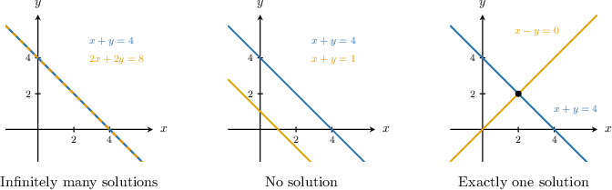
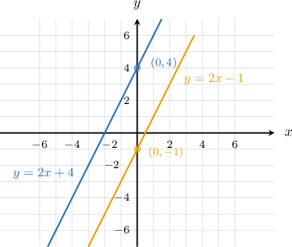
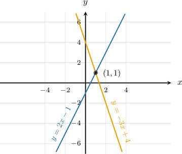

# Identifying the Number of Solutions to a System by Inspection

Source: https://www.mathacademy.com/topics/7898?courseId=39
Topic ID: 7898

## Prerequisites

- [Equations of Lines in Slope-Intercept Form](./1240-equations-of-lines-in-slope-intercept-form.md)
- [Introduction to Systems of Linear Equations](./2225-introduction-to-systems-of-linear-equations.md)
- [Parallel and Perpendicular Lines](../../../elementary-school/lessons/grade-4/3979-parallel-and-perpendicular-lines.md)
- [Determining the Number of Solutions of a Linear Equation](./13764-determining-the-number-of-solutions-of-a-linear-equation.md)

## Lesson

### Introduction

A system of two linear equations gives us two conditions at the same time. A solution is an ordered pair that makes *both* equations true.

Because each linear equation represents a line, the number of solutions to the system is the number of points where the two lines meet.

For example, consider A point that lies on both lines must have the same -value in both equations, so we can compare and

When we get so the two lines meet at This system has exactly one solution.

In this topic, we focus on deciding the **solution count** without always solving for the point. Deciding from the structure of the equations is called reasoning **by inspection**.

### The Three Possible Solution Counts

For a system of two linear equations, there are only three possible solution counts.

The graph gives the big idea: two lines can cross once, never cross, or lie exactly on top of each other.

We can recognize the same three cases from the equations.

- **Infinitely many solutions** means the equations represent the same line. One way this happens is when one equation is a scaled version of the other.

- **No solution** means the equations represent distinct parallel lines. They have the same direction but different starting positions.

- **Exactly one solution** means the equations represent lines that intersect at one point.

For instance, in the second equation is exactly times the first equation.

So, both equations describe the same line, and every point on that line is a solution to the system.

### Example: Recognizing Identical Equations as Having Infinitely Many Solutions

#### Question

Determine which of the following systems has infinitely many solutions.

#### Explanation

We want to identify which system has infinitely many solutions. A system of linear equations has infinitely many solutions when the two equations are equivalent and represent the same line. We can check this by seeing if one equation is a scaled version of the other.

Let's inspect each system in turn.

- For System I, notice that the second equation is exactly times the first equation: Because the equations are equivalent, they represent the same line. Therefore, this system has infinitely many solutions.

- For System II, notice that the left sides of the equations are identical, but the constants on the right sides are different: These equations have the same rates of change but different constants, so they represent distinct parallel lines. They will never intersect, so this system has no solution.

- For System III, notice that the left sides of the equations are not multiples of each other: Because the equations represent lines with different slopes, they will intersect at exactly one point. Therefore, this system has exactly one solution.

In conclusion, only System I has infinitely many solutions.

### No Solution: Parallel Lines

Now, let's inspect systems written in slope-intercept form, Here, is the slope and is the -intercept.

A system has **no solution** when the two lines are distinct and parallel. In slope-intercept form, that means the slopes match, but the -intercepts are different.

Consider

Both lines have slope so they rise at the same rate. But their -intercepts are different: and

Since the lines are parallel and not the same line, they never intersect. Therefore, the system has no solution.

**Watch out!** Same slope alone is not enough to say "no solution." If the slopes and the -intercepts are both the same, the equations represent the same line and the system has infinitely many solutions.

### Example: Recognizing Lines With the Same Slope but Different Y-Intercepts as Having No Solution

#### Question

Determine which of the following systems has no solution.

#### Explanation

A system of two linear equations has no solution if the equations represent distinct parallel lines. Parallel lines have the same slope but different -intercepts.

Let's examine the equations in each system. All of the equations are written in slope-intercept form, where is the slope and is the -intercept.

- In System I, the lines and have the same slope () but different -intercepts (and). Since they are distinct parallel lines, they never intersect. Therefore, this system has no solution.

- In System II, the lines and have different slopes (and). Lines with different slopes intersect at exactly one point. Therefore, this system has exactly one solution.

- In System III, the equations and are identical. They have the same slope () and the same -intercept (). Because the equations represent the same line, every point on the line is a solution. Therefore, this system has infinitely many solutions.

Therefore, the correct answer is "I only."

### Exactly One Solution: Different Slopes

Two nonparallel lines intersect at exactly one point. In slope-intercept form, this is easiest to see by comparing slopes.

Sometimes, we first need to rewrite an equation before comparing. Consider

The first equation already has slope We divide each term in the second equation by to write it in slope-intercept form.

Now, the slopes are and Since the lines have different slopes.

Because the lines have different slopes, they intersect at exactly one point. So, the system has exactly one solution.

This same inspection step is useful even when one equation needs a quick simplification before we compare it with the other equation.

### Example: Determining the Number of Solutions From the Equations of Two Lines

#### Question

Determine which of the following systems has exactly one solution.

#### Explanation

We can determine the number of solutions to a system of linear equations by inspecting the equations and reasoning about how the lines relate. When equations are written in slope-intercept form, we can compare their slopes, and -intercepts,

- If the lines have different slopes, they intersect at exactly one point, meaning there is ****.

- If the lines have the same slope but different -intercepts, they are parallel and never intersect, meaning there is ****.

- If the lines have the same slope and the same -intercept, they represent the same line, meaning there are ****.

Let's inspect each system to determine the number of solutions:

- Consider system I: Both equations are in slope-intercept form. They have the same slope, but different -intercepts (and). The lines are parallel, so system I has ****.

- Consider system II: These lines have different slopes (and). The lines intersect at exactly one point, so system II has ****.

- Consider system III: We can rewrite the second equation in slope-intercept form by dividing each term by The two equations are identical (and), meaning they represent the same line. System III has ****.

Therefore, only system II has exactly one solution. The correct answer is "II only".
