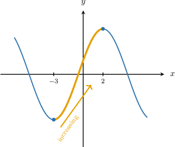
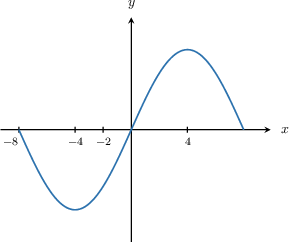
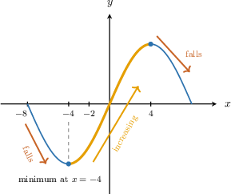
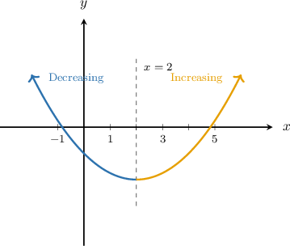
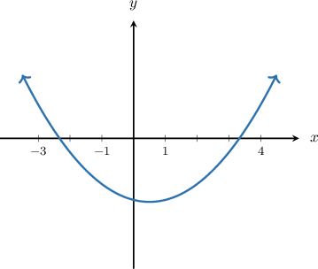
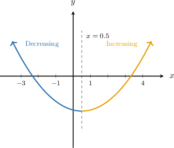
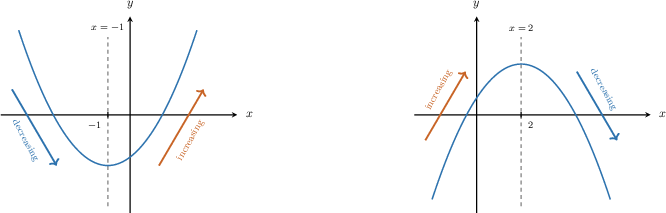
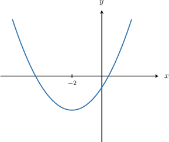
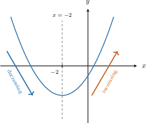

# Identifying Where a Function Is Increasing or Decreasing

Source: https://www.mathacademy.com/topics/7900?courseId=39
Topic ID: 7900

## Prerequisites

- [Graphs of Functions](./7939-graphs-of-functions.md)

## Lesson

### Introduction

We read a function’s graph from left to right, because moving right means the input, or -value, is increasing.

On the highlighted part of the graph, as moves from to the -values rise. A function is **increasing** on an interval if its output values get larger as the input values increase through that entire interval.

So, this graph is increasing for

**Watch out!** An interval is not increasing if the graph falls for part of that interval. For example, if a graph falls and then rises between two chosen -values, then it is not increasing over that whole interval.

### Example: Determining Whether a Function Is Increasing on a Region of Its Graph

#### Question

1. The function is increasing between and

2. The function is increasing between and

3. The function is increasing over its entire displayed domain.

#### Explanation

To determine where a function is increasing, we track its graph from left to right. A function is ** if its -values rise as the -values increase.

Let's examine the behavior of the given function to evaluate each statement.

- Statement I: Between and the graph first falls to reach a minimum at and then begins to rise. Because the function is decreasing for part of this interval, it is not increasing over the entire interval. This statement is false.

- Statement II: Between and the graph rises steadily from a minimum value to a maximum value. Since the graph never falls in this region, the function is increasing on this interval. This statement is true.

- Statement III: The graph contains sections where it rises and sections where it falls. Therefore, it is not increasing over its entire displayed domain. This statement is false.

In conclusion, only statement II is true.

### Decreasing on a Graph

The same left-to-right reading tells us when a graph is falling.

A function is **decreasing** on an interval if its output values get smaller as the input values increase through that entire interval. Graphically, this means the curve falls as we move to the right.

In the image, the lowest point is at To the left of the graph falls as we move right, so the function is decreasing there. To the right of the graph rises as we move right, so the function is not decreasing there.

For example, the function is decreasing between and but it is not decreasing between and

### Example: Determining Whether a Function Is Decreasing on a Region of Its Graph

#### Question

1. The function is decreasing between and

2. The function is decreasing between and

3. The function decreases over its entire displayed domain.

#### Explanation

To determine where the function is decreasing, we track how the output changes as we move from left to right along the -axis. A function is decreasing on an interval if its graph falls.

Looking at the given graph, the lowest point is at

- For the graph falls.

- For the graph rises.

Now, let's examine each statement.

- Statement I is false. Between and the graph is entirely on the right side of the lowest point. Since the graph rises on this interval, the function is increasing, not decreasing.

- Statement II is true. Between and the graph is entirely on the left side of the lowest point. Since the graph falls on this interval, the function is decreasing.

- Statement III is false. The graph falls only for and rises for Since it does not fall everywhere, it is not decreasing over its entire displayed domain.

In conclusion, only statement II is true.

### Describing Increasing and Decreasing Behavior

When we describe a graph in words, we need to say both where the behavior happens and how the output changes.

On the left panel, the graph has a lowest point at It falls to the left of and rises to the right of So, the function is decreasing to the left of and increasing to the right of

On the right panel, the graph has a highest point at It rises to the left of and falls to the right of So, the function is increasing to the left of and decreasing to the right of

A clear sentence uses this pattern: as the input increases, the output increases where the graph rises, and the output decreases where the graph falls.

### Example: Describing the Increasing and Decreasing Behavior of a Function in Plain Language

#### Question

The function is increasing on the part of the graph to the of and decreasing on the part of the graph to the of

Where the function is increasing, the output as the input increases.

Where the function is decreasing, the output as the input increases.

#### Explanation

To describe the behavior of the function, we follow the graph from left to right to see how the output (-value) changes as the input (-value) increases.

- On the part of the graph to the left of the graph falls. This means that as the input increases, the output **. We say the function is decreasing here.

- On the part of the graph to the right of the graph rises. This means that as the input increases, the output **. We say the function is increasing here.

The complete statements are as follows:

The function is increasing on the part of the graph to the of and decreasing on the part of the graph to the of

Where the function is increasing, the output as the input increases.

Where the function is decreasing, the output as the input increases.
